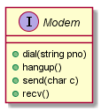
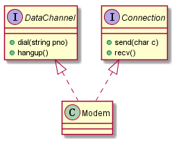

# 单一职责原则（SRP: Single Responsibility Principle）

定义：就一个类而言，应该仅有一个引起它变化的原因。如果我们能够想到多于一个动机去改变一个类，那么这个类就具有多于一个的职责。

考虑下面的Modem接口：



```
interface Modem
{
  public void dial(string pno);
  public void hangup();
  public void send(char c);
  public void recv();
}
```

这个接口显示出两个职责：连接管理和数据通信。这两个职责应该被分开吗？这依赖于应用程序变化的方式：

- 如果应用程序的变化总是导致这两个职责同时变化，那么是不必分离它们的。
- 如果应用程序的变化会导致连接函数的前名（signature），而使用连接函数的模块很多，这将导致重新部署的次数增多，那么这两个职责需要被分离。

单一职责目的是为了保证模块的内聚性（组成元素之间功能的相关性）。我们将如上的两个职责分离后可以得到：



这样将两种职责分开之后能够隔离它们之间的相互影响，但在这个设计里面同时将`DataChannel`和`Connection`耦合到了`Modem`里面，这是必要的，同时这样耦合所带来的关联性也是有限的，因为`Modem`的使用者比较单一。
