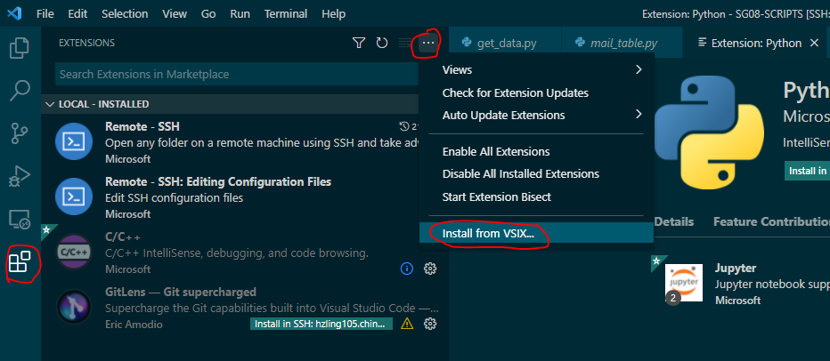
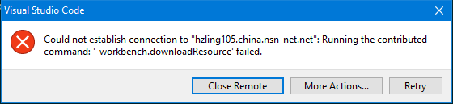
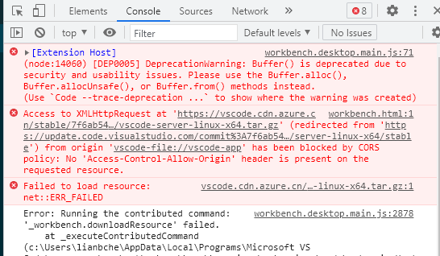

## 远程开发

## SSH远程开发和WSL（Windows Subsystem for Linux）开发

这两天使用VSCODE用SSH连接远端服务器进行开发，在阅读了解的过程中一直不明白用SSH远端开发和WSL有什么区别，感觉上是一样的啊？

在阅读了[WSL + VS Code Remote真香](https://juejin.cn/post/6844904021216460808)和[Remote Development with VS Code](https://code.visualstudio.com/blogs/2019/05/02/remote-development)之后有些理解了WSL相当于在Windows下面创建了虚拟机进行开发，即在Windows下面构建了Linux的开发环境。也就是：

- Remote-WSL：在Windows上面虚拟出Linux环境进行开发
- Remote-SSH: 连接到远端服务器进行开发
- Remote-Container：连接Docker容器进行开发

所以，我当前仅仅需要一个Remote-SSH就够了。


## 使用ssh登录远程服务器进行开发

官方使用说明在这里：[VS Code Remote Development](https://code.visualstudio.com/docs/remote/remote-overview)。

首先要做的是安装“Remote - SSH”插件，安装好了之后就可以连接远程的服务器，连接成功后在左下角会有状态展示。此时打开terminal也默认是远程的终端。


其次是设置ssh publickey，因为每次认证输入用户名密码比较麻烦。所以需要在远程服务器上添加客户端的publickey。在[这里](https://www.digitalocean.com/community/tutorials/how-to-configure-ssh-key-based-authentication-on-a-linux-server)找到了将客户端的publickey添加到远端服务器上的方式，最简单的方案是将客户端的id_rsa.pub里面的内容拷贝到服务器上的authorized_keys里面（如果没有就新建一个）。但执行后发现如下错误：

```
@@@@@@@@@@@@@@@@@@@@@@@@@@@@@@@@@@@@@@@@@@@@@@@@@@@@@@@@@@@
@         WARNING: UNPROTECTED PRIVATE KEY FILE!          @
@@@@@@@@@@@@@@@@@@@@@@@@@@@@@@@@@@@@@@@@@@@@@@@@@@@@@@@@@@@
Permissions for 'C:\\Users\\lianbche/.ssh/id_rsa' are too open.
It is required that your private key files are NOT accessible by others.
This private key will be ignored.
Load key "C:\\Users\\lianbche/.ssh/id_rsa": bad permissions
lianbche@ip_address's password:
```

在[Windows SSH: Permissions for 'private-key' are too open](https://superuser.com/questions/1296024/windows-ssh-permissions-for-private-key-are-too-open)找到答案，解决方式和上面的问题类似，也即是将`C:\Users\lianbche\.ssh\id_rsa`的权限先disable inheritance并删除所有的权限，然后仅仅给自己分配full control的权限即可。

其他参考：

- [Remote development over SSH](https://code.visualstudio.com/docs/remote/ssh-tutorial)

## Q&A

1）安装远程插件失败后如何进行手动安装？

今天尝试通过远端开发来调试脚本，在浏览Python代码的时候VSCODE提示remote安装Python插件，尝试安装的时候发现timeout并提示手动安装。

点击提示链接下载了一个名称为“ms-python.python-2021.9.1246542782.vsix”的插件文件。然后在插件说明上面查找链接并找到了[Install from a VSIX](https://code.visualstudio.com/docs/editor/extension-marketplace#_install-from-a-vsix)，这似乎就是我想要的手动安装指南。上面提供了下面几种安装方式：

- 在插件菜单选项里使用“Install from VSIX”命令
- 或者直接在Command Palette上使用“Extensions: Install from VSIX”命令
- 也可以直接使用VS CODE的“--install-extension”命令：`code --install-extension myextension.vsix`



然后定位到下载的vsix文件，安装即可。

2）Remote多次尝试连接失败，提示“If you continue to see this message, you can try toggling the remote.SSH.useFloc/Error: Running the contributed command: ‘_workbench.downloadResource‘ failed”

在[vscode ssh连接失败](https://blog.csdn.net/myWorld001/article/details/119443079)阅读到连接失败可能是因为remote server上无法下载更新文件，于是尝试将remote server上的`~/.vscode-server`目录删除后重新连接，提示：



看到确实是下载问题，所以再浏览到[Troubleshooting hanging or failing connections](https://code.visualstudio.com/docs/remote/troubleshooting#_troubleshooting-hanging-or-failing-connections)里面提到通过设置VSCODE的配置文件setting.json来让SSH一直使用本地网络下载，即配置`"remote.SSH.localServerDownload": "always"`,尝试之后发现还是不可以。

不过尽管有着如上的错误，但是无法进一步定位到是下载什么资源出错了，几番搜索之后找到[这里](https://github.com/microsoft/vscode-remote-release/issues/4743)里面提到了打开“Help > Toggle Developer Tools > Console”然后在里面看到了更详细的日志信息，发现是在下载vscode-server-linux-x64.tar.gz的时候有问题，不过我本地下载是可以的，那为什么我上面已经配置了"remote.SSH.localServerDownload": "always"还是不行呢？



仔细看了下terminal上的日志，发现已经是在尝试在本地下载，但是依然出错。

> [16:59:57.601] Got request to download on client for {"platform":"linux","arch":"x64","destFolder":"/home/lianbche/.vscode-server/bin/7f6ab5485bbc008386c4386d08766667e155244e"}
[16:59:57.602] Downloading VS Code server locally...
[16:59:58.815] Resolver error: Error: Running the contributed command: '_workbench.downloadResource' failed.
	at _executeContributedCommand (c:\Users\lianbche\AppData\Local\Programs\Microsoft VS Code\resources\app\out\vs\workbench\services\extensions\node\extensionHostProcess.js:94:111039)

后面仿照[VS Code的Error: Running the contributed command: ‘_workbench.downloadResource‘ failed解决](https://www.cnblogs.com/LiuYanYGZ/p/15030165.html)这篇文章来操作之后连接成功。有下面几步：

- step 1: 根据console里面的URL下载对应的软件包，比如这次的vscode-server-linux-x64.tar.gz
- step 2: 登录到remote server，进入`/home/my_account/.vscode-server/bin/seems-SHA1-named-folder`
- step 3：将vscode-server-linux-x64.tar.gz拷贝到上面的folder里面并解压。*注：如果解压后生成了新的名为vscode-server-linux-x64的目录，你需要将目录下所有文件拷贝到.vscode-vserver/bin/seems-SHA1-named-folder下面*
- step 4：重新连接，成功。
