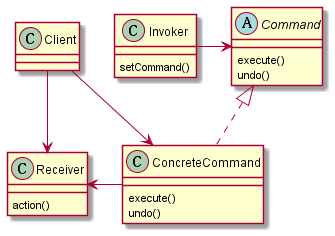

## 命令行模式

> 命令模式将“请求”封装成对象，以便使用不同的请求、队列或者日志来参数化其他对象。命令模式也支持可撤销的操作。

从定义中知道一个命令对象通过在特定接收者上绑定一组动作来封装一个请求（将动作和接收者都包进对象里），从外面来看，其他对象不知道究竟哪个接收者进行了哪些动作，只知道调用对应的方法（如execute()）就能够达到目的。

这种模式允许将“发出请求的对象”和“接受与执行这些请求的对象”分隔开来。

### 类图

### 实现

参看：[源代码](./src)

### 要点

1）命令模式将发出请求的对象和执行请求的对象解耦。在被解耦的两者之间是通过命令对象进行沟通的。命令对象封装了接收者和一个或一组动作。

2）调用者通过调用命令对象的execute()发出请求，这会使得接收者的动作被调用。

3）命令模式可以让你使用不同的请求、队列或者日志请求来参数化其他对象。
