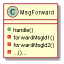
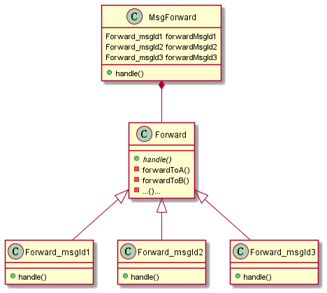

## 用模板实现常见消息转发框架

很多时候，多条消息需要走类似的流程。比如模块A作为统一的消息入口，然后模块A在收到消息之后会进行消息的转发，比如转发给B和C，但这些转发可能分多种情况进行处理。比如，有的只转发给B，有的需要同时转发给B和C。但为了更详细的梳理这种流程的建立，可以从易到难举例说明。


## 简单的方案：函数级别的分流

针对如上描述的功能，最简单的处理是在接收到消息的时候根据不同的消息类型分别编写不同的转发逻辑。



如上类图对应的示意代码如下：

```
// MsgForward
void handle(Event event)
{
  switch (event.msgId)
  {
    case msgId1: forward to A and B
    case msgId2: forward to B
    case msgId3: forward to A
    ...
  }
}
```

很显然，在这种简单的方案里针对每种消息的转发处理会重复，因为你必须针对每种消息类型创建一个单独的转发函数，而每种转发函数里面的逻辑都是大同小异。这些类似的过程可以通过将转发逻辑进行封装来避免。


## 去重复的方案：使用封装

为了消除转发部分代码的重复，我们可以定义一个新的`Forward`模板类，将这些重复的代码都统一写到它里面，然后通过在不同的子类里面来控制发送过程。



示意代码：

```
// MsgForward
void handle(Event event)
{
  switch (event.msgId)
  {
    case msgId1: forwardMsgId1.handle()
    case msgId2: forwardMsgId2.handle()
    case msgId2: forwardMsgId3.handle()
    ...
  }
}

// Forward_msgId1
void (Event event)
{
  forward to A and B
}

// Forward_msgId2
void (Event event)
{
  forward to B
}

// Forward_msgId3
void (Event event)
{
  forward to A
}
```

当然，我们这里可以使用工厂方法模式来进一步优化`MsgForward`中的`switch...case`语句，但为了性能上的考虑（另外这不是本笔记的重点内容）就先略过了。


## 更简略的方案：使用模板

继承的使用其实算是类设计里面的重武器，它能够解决代码重复的问题，但在扩展性上面的也有它的不足，所以在一些设计原则里面都会提到“多用组合，少用继承”。那有没有一种更好的方案，即能够解决代码重复的问题，也能够保持较好的扩展呢？
