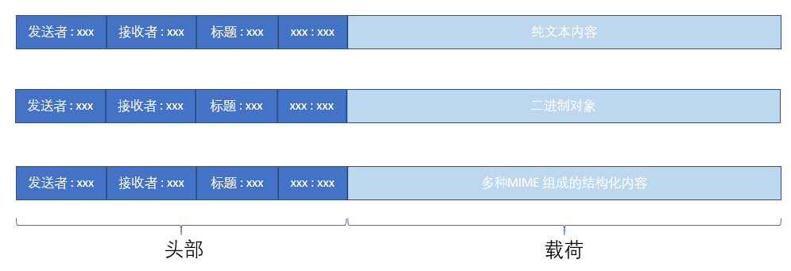

## [email](https://docs.python.org/3/library/email.html)

## [email.message](https://docs.python.org/3/library/email.message.html)

一封邮件包含头部和载荷两部分（均可能有多个），对于头部的定义，主要描述在[RFC 5322]()和[RFC 6532]()里面。对于载荷，可能是文本、二进制文件或者结构化的嵌套结构（包括多个Header和多个载荷，即multipart类型）。

- 简单消息对象：比如字符串或者二进制文件，载荷就是单个`EmailMessage`对象。
- 对于像multipart这样的包含多个载荷MIME容器，载荷就是`EmailMessage`列表。

```
email.message.EmailMessage
- add_header()
- set_content()，最简单的方式
- add_related()，内容有内嵌资源
- add_alternative()
- add_attachment()，内容有附件
```

要明白上面几种函数的不同，[用python发送邮件的基本原理](https://www.codenong.com/cs109278274/)有说明。最简单的邮件格式就是`text/plain`，如果要添加更丰富的内容就需要涉及到下面这几种类型的邮件格式：

- multipart-alternative: 邮件体内的同级内容，根据邮箱系统的环境，只显示最优效果的一个内容。
- multipart-related: 邮件体内的内容，显示一个主体内容，其他内容以相关的内联方式显示在主体内。一般主体是html内容，其他是要显示在html中的图片、音乐、视频。关联是通过Content-来实现。
- multipart-mixed: 邮件体内各种内容，包括前面两种，另外还可以处理附件。


参考：

- [MIME 类型](https://developer.mozilla.org/zh-CN/docs/Web/HTTP/Basics_of_HTTP/MIME_types)
- [email - How to Represent an Email Message in Python?](https://coderzcolumn.com/tutorials/python/email-how-to-represent-an-email-message-in-python)
- [email.contentmanager: Managing MIME Content](https://docs.python.org/3/library/email.contentmanager.html)

### 发送文本

```
msg = EmailMessage()
msg.set_content("hello world") # 此时的消息类型为text/plain
msg['Subject'] = 'say hello'
msg['From'] = me
msg['To'] = you

s = smtplib.SMTP('localhost')
s.send_message(msg)
```

调用`set_content()`传入的是字符串，所以会设定邮件的类型为`text/plain`，这也是该接口的默认值：

```
email.contentmanager.set_content(msg, <'str'>, subtype="plain", charset='utf-8', cte=None, disposition=None, filename=None, cid=None, params=None, headers=None)
email.contentmanager.set_content(msg, <'bytes'>, maintype, subtype, cte="base64", disposition=None, filename=None, cid=None, params=None, headers=None)
email.contentmanager.set_content(msg, <'EmailMessage'>, cte=None, disposition=None, filename=None, cid=None, params=None, headers=None)

   Add headers and payload to msg:
```

### 发送html

```
# Create the base text message.
msg.set_content("""\
Salut!

Cela ressemble à un excellent recipie[1] déjeuner.

[1] http://www.yummly.com/recipe/Roasted-Asparagus-Epicurious-203718

--Pepé
""")

# Add the html version.  This converts the message into a multipart/alternative
# container, with the original text message as the first part and the new html
# message as the second part.
asparagus_cid = make_msgid()
msg.add_alternative("""\
<html>
  <head></head>
  <body>
    <p>Salut!</p>
    <p>Cela ressemble à un excellent
        <a href="http://www.yummly.com/recipe/Roasted-Asparagus-Epicurious-203718">
            recipie
        </a> déjeuner.
    </p>
    
  </body>
</html>
""".format(asparagus_cid=asparagus_cid[1:-1]), subtype='html')
```

邮件格式会从`text/plain`变更为`multipart/alternative`。


### 发送图片附件

继续上面的例子，如果我们使用`add_attachment`来添加附件时，那么邮件的格式会从`text/plain`变更为`multipart/mixed`。

```
add_attachment(*args, content_manager=None, **kw)

    ... If the message is a non-multipart, multipart/related, or multipart/alternative, call make_mixed() and then proceed as above...
```

代码如下：

```
# And imghdr to find the types of our images
import imghdr

msg = EmailMessage()
msg['Subject'] = 'Our family reunion'
msg['From'] = me
msg['To'] = you

# Open the files in binary mode.  Use imghdr to figure out the
# MIME subtype for each specific image.
for file in pngfiles:
    with open(file, 'rb') as fp:
        img_data = fp.read()
    msg.add_attachment(img_data, maintype='image',
                                 subtype=imghdr.what(None, img_data))

with smtplib.SMTP('localhost') as s:
    s.send_message(msg)
```

当然，[这里](https://coderzcolumn.com/tutorials/python/email-how-to-represent-an-email-message-in-python#Example-6:-Add-Attachment-and-Get-Body-Contents-from-Multipart-Mail)也有一个添加图片作为附件的例子，使用了`mimetypes`来判断图片的类型。

转换之后的结构可以参考[Convert a Message to Multipart/Mixed](https://coderzcolumn.com/tutorials/python/email-how-to-represent-an-email-message-in-python#Example-10:-Convert-a-Message-to-Multipart/Mixed)，简单来说转换之前只有1个EmailMessage，转换之后就是一个嵌套层次：1个EmailMessage里面再包装1个EmailMessage。


### 内嵌图片附件


## Legacy API

- [email.mime](https://docs.python.org/3/library/email.mime.html?highlight=mimetext#email.mime.text.MIMEText)

[email.message: Representing an email message](https://docs.python.org/3/library/email.message.html#module-email.message)里面知道邮件内容的组成可以分为“头部”和“载荷（内容）”两部分，前者用来存储邮件相关属性，比如发送者、接收者之类，后者就是邮件的正文。邮件的正文又可以分为不同的格式，略做草图如下：



所以，从上面这个例子里面我们创建了一个`MIMEText`对象，这个对象对应的就是上图中的第一种，也就是载荷部分携带的是纯文本。但从上面的`email.mime`链接里面其实可以知道用来在邮件里面添加更加多样化的内容，包括：

- MIMEImage：创建`image`类型的对象，传送图片
- MIMEAudio：创建`audio`类型的对象，传送音频
- MIMEApplication：创建`application`类型的对象，传送应用

如果我们需要在载荷里面携带多种类型的数据，那么就必须创建`MIMEMultipart`对象，使用它的`attach()`函数将多种类型的数据组装到这个对象，再统一发出。比如@江南有大树的代码就是这么办的：

```
# 构建message
msg = MIMEMultipart()
# 添加邮件内容
content = MIMEText(html, _subtype='html', _charset='utf8')
msg.attach(content)
# 构建并添加图像对象
for id, pic in picture.items():
    img = MIMEImage(open(pic, 'rb').read(), _subtype='octet-stream')
    img.add_header('Content-ID', id)
    msg.attach(img)
```
