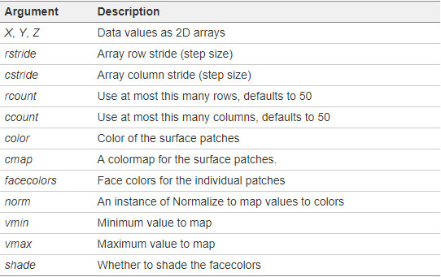

# [mplot3d](https://matplotlib.org/3.1.0/api/toolkits/mplot3d.html)

## [mpl_toolkits.mplot3d.axes3d.Axes3D](https://matplotlib.org/3.1.0/api/_as_gen/mpl_toolkits.mplot3d.axes3d.Axes3D.html)

[Axes3D.plot_surface(X, Y, Z, *args, **kwargs)](https://matplotlib.org/mpl_toolkits/mplot3d/tutorial.html)

绘制3D图形表面。kwargs提供的`rstride`(Array row stride)和`cstride`(Array column
stride)参数可以用来控制对样本数据采样的幅度，其他参数如下：

