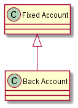
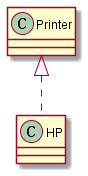
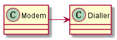
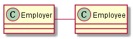
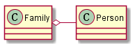
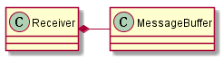
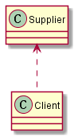

UML中建模元素之间的关系可以分为关联、依赖、泛化/实现三种。其中的关联的范围比较大，可以再次细分为组合、聚合、和弱关联三种：

1. 组合：一种通过将一个/多个简单对象组合为单个复杂对象的模型关系。
2. 聚合：聚合不同于组合在于聚合不负责维护成员的生存期，且成员可共享于多个类。
3. 弱关联：两个不直接相关对象之间的弱联系，对象之间没有整体和部分关系。

## [泛化](https://www.ibm.com/docs/en/SS8PJ7_9.7.0/com.ibm.xtools.modeler.doc/topics/cgeneral.html)/[实现](https://www.ibm.com/docs/en/rational-soft-arch/9.7.0?topic=diagrams-realization-relationships)

继承是对泛化的一种实现，表示如下：

而实现这里指的通常是针对抽象类/接口的实现，表示如下：

## 关联

关联代表了两个类之间的连接关系，这种关系常见的方式为：一个类中的实例变量指向或者引用到另外一个类，或者两个类之间可以互相发送消息。关联的表示方式通常是用带有箭头的直线来表示如下图：

所有的关联都具有名字，名字都是动词或者动词短语。关联的两段可以使用用`0..*`表示多重性。关联默认被认为是双向的，如果带有箭头，就表明将限制应用在箭头所指的方向，关联就只能够朝着箭头的方向前进，这意味着箭头指向的类不知道它的关联者。双向关联允许两个实体互相知晓。

“聚合”和“组合”是比较特别的两种关联。

**1）聚合**

聚合是一种特殊形式的关联，意味着“整体/部分”关系。它被表示为聚集类上一个白色菱形，和白色菱形相邻的类是整体，另外一个类是部分。聚合的时候，“部分”可以独立于“整体”存在，体现了“has a”松耦合的关系,平常设计里面一些类的引用成员应是聚合关系。

**2）组合**

组合是一种特殊形式的聚合，意味着“整体”负责它的“部分”的生存期，体现了“part of”紧耦合的关系。它被表示为一个黑色菱形。

将它们之间的区别绘制成表格对应下面这样的内容：

|属性|组合|聚合|弱关联|
|-|-|-|-|
|关系类型|整体/部分|整体/部分|其他|
|成员可以属于多个类|否|是|是|
|成员生存期与所在类相同|是|否|否|
|方向性|单向|单向|单向或双向|
|关系动词|part-of|has-a|uses-a|

*注1）单向=unidirectional, 双向=bidirectional。2）依赖是相较于关联更弱的一种联系，不同于关联需要在不同类之间的设计关系，依赖通常是直接从临时实例化或者函数参数传递来体现：1）实例化：比如打开文件并写入数据；2）参数传递：比如传入std::ostream完成输出操作。*

## [依赖](https://www.ibm.com/docs/en/rational-soft-arch/9.7.0?topic=diagrams-dependency-relationships)

依赖表示一个建模元素的修改会影响其他元素的变动。在UML里面用“虚线+箭头”的方式来表达：

参考：

- [UML Association vs Aggregation vs Composition](https://www.visual-paradigm.com/guide/uml-unified-modeling-language/uml-aggregation-vs-composition/)
- [Relationships in class diagrams](https://www.ibm.com/docs/en/rational-soft-arch/9.7.0?topic=diagrams-relationships-in-class)
- [10.4 — Association](https://www.learncpp.com/cpp-tutorial/10-4-association/)
- [《敏捷软件开发：原则、模式与实践》附录A：UML表示法I]()
