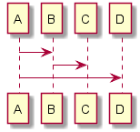
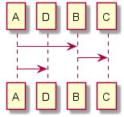

# 序列图

## 调整序列实体显示顺序

正常情况下，plantuml会按照解析脚本的顺序生成对应的 participant，比如如下脚本的解析结果
里 A, B, C和D等按照出现的顺序排列：

```
@startuml

A -> B
B -> C
A -> D

@enduml
```



如果我们想要事先固定显示顺序，比如让D 显示在 A后面，那么我们可以在脚本开始的时候定义participant，这样就可以固定它的显示顺序了。

```
@startuml

participant A
participant D
participant B
participant C

A -> B
B -> C
A -> D

@enduml
```



参考：

- [](http://plantuml.com/sequence-diagram)
