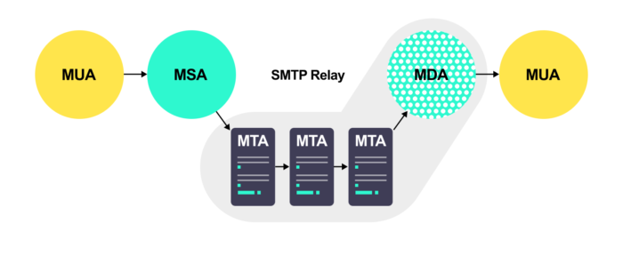

## MTA (Message transfer agent)

要理解邮件在互联网上的传输，需要先弄清楚几个基本概念：

- MUA（Mail User Agent，邮件用户代理），终端用户用来查看、编写邮件的软件。
- MSA（Mail Submission Agent，邮件提交代理），邮件提交给MTA之前所作的一些检测工作。
- MTA（Mail Transfer Agent，邮件传输代理），负责邮件的存储和转发。这实际上就是通常所说的邮件服务器，它会基于SMTP进行邮件的传输。
- MDA（Mail Delivery Agent，邮件投递代理），从MTA接收邮件并投递。
- MAA（Mail Access Agent，邮件访问代理），将用户连接到系统邮件库，使用POP或IMAP协议收取邮件。

邮件在用户与用户之间传输会涉及到下面的过程：

首先，用户使用客户端（MUA）编写邮件，然后发送邮件，比如outlook, foxmail。之后MSA对邮件进行检查，再交给MTA进行邮件的转发（基于SMTP协议）。当邮件到达接收地址最后的MTA时，MDA来完成将邮件投递给接收人的工作（基于POP或IMAP协议）。

参考：

- [Message transfer agent](https://en.wikipedia.org/wiki/Message_transfer_agent)
- [What is an MTA?](https://mailtrap.io/blog/mail-transfer-agent/)

## Content-Type

常见的`Content-Type`如下：

- .csv -> text/csv
- .doc -> application/msword
- .docx -> application/vnd.openxmlformats-officedocument.wordprocessingml.document
- .gz -> application/gzip
- .htm/.html -> text/html
- .jpeg/.jpg -> image/jpeg
- .json -> application/json
- .mp4 -> video/mp4
- .png -> image/png
- .pdf -> application/pdf
- .ppt -> application/vnd.ms-powerpoint
- .pptx -> application/vnd.openxmlformats-officedocument.presentationml.presentation
- .tar -> application/x-tar
- .txt -> text/plain
- .xls -> application/vnd.ms-excel
- .xlsx	-> application/vnd.openxmlformats-officedocument.spreadsheetml.sheet
- .zip -> application/zip
- .7z -> application/x-7z-compressed

参考：

- [Common MIME types](https://developer.mozilla.org/en-US/docs/Web/HTTP/Basics_of_HTTP/MIME_types/Common_types)