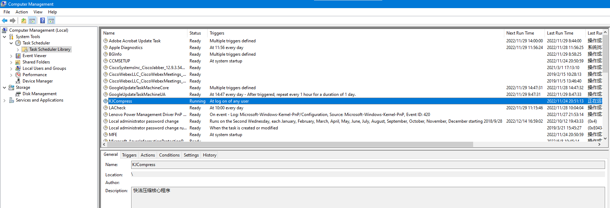

## 广告弹窗

之前安装一个什么小工具软件，结果被安装了一些快捷解压、百图这些广告插件，除了驻留在后台的进程是不是搞点小动作之外，偶尔还搞几个弹窗，比如下面这个从昨天一直停留到今天，我尝试寻找关闭它的按钮，但始终没有找到。

于是，不得不将其作为一个问题来研究研究。

## 从应用进程入手

我的第一个尝试自然是从网络中去查找类似问题，首先找到的是[电脑弹窗广告太烦人，教你如何彻底解决](https://www.51cto.com/article/679668.html)，里面提到第一种情况是弹窗广告作为一种应用程序通常在右下角会显示这个应用程序的图标，然后到任务管理器找到对应的进程，进一步找到对应位置，执行删除操作。

然而，我这个抖音广告却没有显示图标，也找不到相关进程。

## 任务管理

幸运的是，在看了[烦人的广告太多？彻底关闭各种弹窗广告，让你的电脑干干净净](https://www.youtube.com/watch?v=qTbeQ-s8MmM)这个视频之后却意外地解决了右侧的弹窗。这里面的大致过程如下：

1）首先，打开任务管理器，浏览其中自动执行的任务，发现了快洁解压。尽管不确定右侧弹窗和这个解压软件有关，但决定还是先删除它。

2）查看该任务的属性，其中可以看到它的安装位置：

3）进入安装目录，点击卸载程序Uninst.exe进行卸载，没想到的是右侧弹窗立即消失了。

## 总结

没想到这个问题看了一篇文章、一个视频就搞定了，总结一下主要方法有：

- 尝试在右下角找到对应的进程，然后根据进程顺藤摸瓜找到安装位置，执行Uninst.exe进行卸载
- 找到对应位置如果没有自带卸载程序，那么可以替换可执行文件（重命名原始的，新建空白的可执行文件并设置只读属性）
- 查看任务管理器中找到对应自动执行的任务，可以禁止，甚至可以删除。