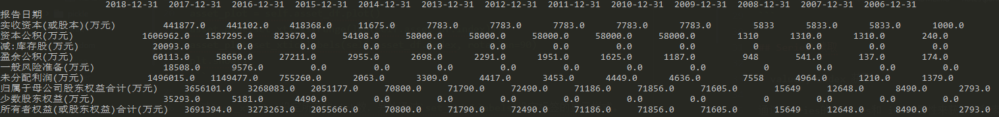

# Series

## 创建

1. 由一组数据产生简单的Series，未指定索引时默认创建一个0~N-1（N为数据的长度）的整数型索引。
2. 指定对各个数据点标记的索引。
3. 通过字典创建


*注：创建时可以指定name属性，这个属性在将Series对象与DataFrame对象进行连接操作时会用到。*


## 读取

通过 Series的`values`和`index`属性来获取值和索引，注意在返回类型上值是以数组类型（ndarry）返回，而索引则由特定的索引对象（Index）。

1. 使用`[]`

用方括号就课可以按照“标签”对Series对象进行引用。放开括号支持切片引用，不过这个时候切片索引的重点是包含在引用范围内的，这与列表中进行切片索引是不同的。

```
obj['a']
obj[['a', 'd']]
```

2. 使用`loc`

使用loc来访问元素那么也是通过索引标签来访问，同样可以支持切片访问，类似`[]`此时切片终点是包含在引用范围内的。

3. 使用`iloc`

如果想以“位置索引”来进行值的引用那么就需要使用iloc属性。进行切片引用时是不包含终点的。


比如下面是某个series，如果我们仅仅对它的值感兴趣，那么可以用`series.values[a:b]`来进行切片选取，也可以通过`series.values[[a,b]]`来选择指定的两个值。

```
2020-01-15    5530.03
2020-01-16    5527.67
2020-01-17    5510.05
2020-01-20    5587.54
2020-01-21    5523.94
2020-01-22    5575.51
2020-01-23    5377.74
2020-02-03    4910.90
```


## 最大值

如果我想查找某个Series里面最大的元素对应的索引，那么使用`idxmax()`即可。

参考：

- [max](https://pandas.pydata.org/docs/reference/api/pandas.Series.max.html)
- [idxmax](https://pandas.pydata.org/docs/reference/api/pandas.Series.idxmax.html)


## Series 转换为 list

从DataFrame中获取的Series，如何能够转换为list进行处理？

```
# converting to list
salary_list = data["Salary"].tolist()
```

参考：

- [Python | Pandas Series.tolist()](https://www.geeksforgeeks.org/python-pandas-series-tolist/)


# DataFrame

## 创建DataFrame

最简单的，就是从一个空的DataFrame开始，可以指定列标签，也可以不指定。其他创建方法，包括以下几种方法：

- 序列，包括元组、列表。一维的数据作为列，二维的数据行列和DataFrame对应。
- 字典。默认以key作为列标签

*注：在聚宽上测试发现字典的值可以是Series，这样创建出来的DataFrame会自动以Series里面所携带的index做为该DataFrame的index。*

在使用字典来创建dataframe的时候有一个隐藏条件，也既是它默认字典的key-value为dataframe的列，也即是key为dataframe的column名，这个时候字典的value需要是“非标量值”。否则会出现"ValueError: If using all scalar values, you must pass an index"这样的错误。

这个问题在[Constructing pandas DataFrame from values in variables gives “ValueError: If using all scalar values, you must pass an index”](https://stackoverflow.com/questions/17839973/constructing-pandas-dataframe-from-values-in-variables-gives-valueerror-if-usi)里面有讨论，而解决方法是可以先创建Series，再转换为dataframe。


## 创建时指定类型

```
df = pd.DataFrame(data, dtype='float')
```

## 增加行列

在某个DataFrame里面添加一列必须使用`[]`操作符，`此时应保证Series和DataFrame具有相同的index`

```
df['numbers'] = series
```


## 取消科学计数法的格式

比如下面的time，其实暗含了日期和时间，但是由于是float格式默认按照科学计数法显示了，如何将其全部显示出来？

```
           time  current   high    low       volume         money
0  2.020021e+13    1.987  2.022  1.965  338313044.0  6.753016e+08
0  2.020022e+13    2.071  2.071  2.004  689679516.0  1.411302e+09
0  2.020022e+13    2.090  2.090  2.050  704272926.0  1.461049e+09
0  2.020022e+13    2.054  2.087  2.052  572403776.0  1.184645e+09
```

可以通过如下设置来将DataFrame的展示方式替换为浮点数且保留两位小数，也就取消了默认的科学计数法展示格式。

```
pd.set_option('display.float_format', lambda x: '%.2f' % x)
pd.set_option('display.float_format', "{:.2f}".format)
pd.set_option('precision', 2)
```

参考：

- [How do I expand the output display to see more columns of a pandas DataFrame?](https://stackoverflow.com/questions/11707586/how-do-i-expand-the-output-display-to-see-more-columns-of-a-pandas-dataframe)


## 输出排版

打印DataFrame输出的格式有些时候并不友好，比如：




## `rank()`

参考：

- [关于pandas的rank()函数的一点认识](https://zhuanlan.zhihu.com/p/87593543)


## 拷贝一个DataFrame

```
df_sub_copy = df[0:1].copy()
```

- [](https://stackoverflow.com/questions/27673231/why-should-i-make-a-copy-of-a-data-frame-in-pandas)


## ValueError: could not convert string to float

`ValueError: could not convert string to float`错误可能因为获取到的dataframe里面有些是空的，所以无法将对应值转换为float。


- [Decimal place issues with floats and decimal.Decimal](https://stackoverflow.com/questions/286061/decimal-place-issues-with-floats-and-decimal-decimal)
- [How to do Decimal to float conversion in Python?](https://stackoverflow.com/questions/32285927/how-to-do-decimal-to-float-conversion-in-python)

## 变更某一列内容的展现形式

比如现在有一列"日期"是按照“年-月-日”的形式展示的，现在需要让其展现为“年-月”的形式展示，该如何操作？

```
df['month_year'] = df['date_column'].dt.to_period('M')
```

参考：

- [Extracting just Month and Year from Pandas Datetime column](https://stackoverflow.com/questions/25146121/extracting-just-month-and-year-from-pandas-datetime-column)
- [Series.dt ](http://pandas.pydata.org/pandas-docs/stable/reference/series.html#api-series-dt)


## 转换为`dict`

使用`df.to_dict()`可以将一个DataFrame转换为字典的类型，假设之前为15行3列的DataFrame：

- 默认参数`orient='dict'`，转换为以列为单位的字典：包含3个字典的字典，每个字典包含有15个key-pair键值对。
- 指定`orient="records"`，转换为以行为单位的字典列表：包含15个字典的列表，每个字典有3个key-pair键值对。

参考：

- [pandas.DataFrame.to_dict](https://pandas.pydata.org/docs/reference/api/pandas.DataFrame.to_dict.html)


