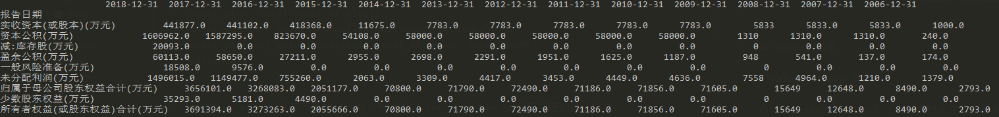

2.输出排版

打印DataFrame输出的格式有些时候并不友好，比如：




3.DataFrame.plot 时中文显示乱码


解决方法为通过`plt.rcParams['font.sans-serif'] = ['SimHei'] `将字体设置为黑体。

参考：

- [python3用matplotlib绘图出现中文乱码的问题](https://www.cnblogs.com/Icarus-suixin/p/10641085.html)

4.print的时候如何显示更多列或者行？

```
import pandas as pd
pd.set_option('display.max_rows', 500)
pd.set_option('display.max_columns', 500)
pd.set_option('display.width', 1000)
```

5.print的时候数值太大无法全部展示？

比如下面的time，其实暗含了日期和时间，但是由于是float格式默认按照科学计数法显示了，如何将其全部显示出来？

```
           time  current   high    low       volume         money
0  2.020021e+13    1.987  2.022  1.965  338313044.0  6.753016e+08
0  2.020022e+13    2.071  2.071  2.004  689679516.0  1.411302e+09
0  2.020022e+13    2.090  2.090  2.050  704272926.0  1.461049e+09
0  2.020022e+13    2.054  2.087  2.052  572403776.0  1.184645e+09
```

可以通过`pd.set_option('display.float_format', lambda x: '%.2f' % x)`取消默认的科学计数法，另外可以通过`pd.set_option(‘precision’, n)`显示小数点。

参考：

- [How do I expand the output display to see more columns of a pandas DataFrame?](https://stackoverflow.com/questions/11707586/how-do-i-expand-the-output-display-to-see-more-columns-of-a-pandas-dataframe)


## DataFrame 类型转换

想将整个 DataFrame的值转换为float类型进行计算，尝试`pd.to_numeric(m)`发现只能够转换单维的数据。如果要转换所有列，那么需要使用循环，然而这种方式会返回新的对象，不是在原对象基础上进行转换，使用起来不方便。

*注：调用`to_numeric()`时根据原有数据决定转换为`int64`还是`float64`。*

```
for col in float_df:    
    print(pd.to_numeric(float_df[col]))
```

通过`print(df.dtypes)`打印DataFrame各列的类型。

2.pandas.io.data 不可用

从0.19.0开始，pandas不再支持pandas.io.data or pandas.io.wb, 替代品为pandas_datareader。

参考：

- [Importing pandas.io.data(https://stackoverflow.com/questions/47972667/importing-pandas-io-data)
- [pandas-datareader](https://pandas-datareader.readthedocs.io/en/latest/#)

3.将index转换为list

```
list(obj.index.values)
```

参考：

- [Get row-index values of Pandas DataFrame as list?](https://stackoverflow.com/questions/18358938/get-row-index-values-of-pandas-dataframe-as-list)
