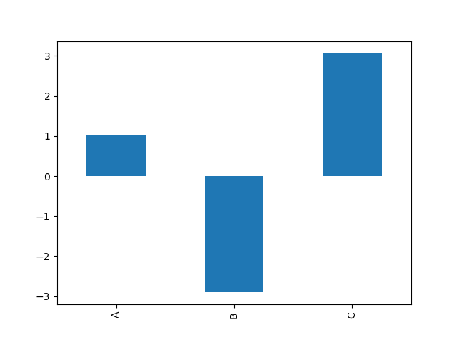

# [可视化/Visualization](https://pandas.pydata.org/pandas-docs/stable/user_guide/visualization.html)

在可视化功能上，Pandas的Series和DataFrame均支持绘图功能，另外还有专门的绘图函数库matplotlib
以及以下几种更加强大的专用模块：

- [Altair](https://altair-viz.github.io/)：基于Vega, Vega-Lite的统计可视化Python库。
- [Bokeh](https://docs.bokeh.org/en/latest/)：为现代浏览器而设的交互式可视化Python库。
- [seaborn](https://seaborn.pydata.org/)：基于matplotlib的数据可视化Python库。

## 基本绘图

```
import matplotlib.pyplot as plt
```

Series和DataFrame提供的`plot()`函数是基于`plt.plot()`封装而成。对于Series而言会以Series
的index为x轴，值为y轴，对DataFrame而言会对它的所有列进行绘图，同样以index做为x轴。

DataFrame可以指定某列做为x轴，比如：

```
td2 = pd.DataFrame(np.random.randn(1000,3),
                  index=pd.date_range('2000-01-01', periods=1000),
                  columns=list('ABC')).cumsum()
td2['D'] = pd.Series(list(range(len(td))), index=td2.index) # 赋值新列的时候，务必保持index相同
td2.plot(x='D', y='C')

plt.show()
```

## 绘制其他类型的图形

`plot()`函数默认为折线图形，可以通过传递的函数`kind`来指定绘制图形的类型，也可以通过` DataFrame.plot.<kind>`直接指定要绘制的图形。

### 条形图

条形图适用于那些标签类型/非时间序列的数据。

比如：

```
td = pd.DataFrame(np.random.randn(1000,3),
                  index=pd.date_range('2000-01-01', periods=1000),
                  columns=list('ABC')).cumsum()

td.iloc[2].plot(kind='bar')
td.iloc[2].plot.bar() # 等效
td.plot.bar()         # 多列绘制

plt.show()
```

效果为：



还有其他不同的效果：

```
td.plot.bar(stacked=True)  # 堆叠形式的条形图
td.plot.barh(stacked=True)  # 堆叠形式的条形图，水平形式
```

### 直方图
