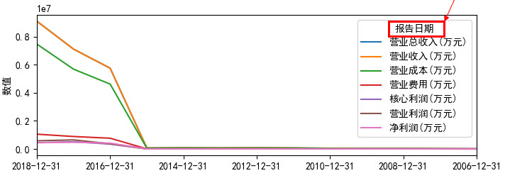
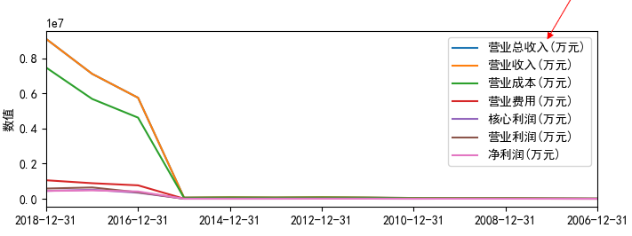

### 去掉legend中显示的index名称

如果dataframe里面的index名称不为空，这在我们选取dataframe中某列做为index的时候是很常见的，但在画图时该index的名称也会展示出来。



一种方法是在画图的时候指定显示的legend来提代默认的展示规则（展示dataframe中所有列名）

```
value_plot.legend(value_items.columns)
```



参考：

- [Modify the legend of pandas bar plot](https://stackoverflow.com/questions/33149428/modify-the-legend-of-pandas-bar-plot)

## 不显示legend