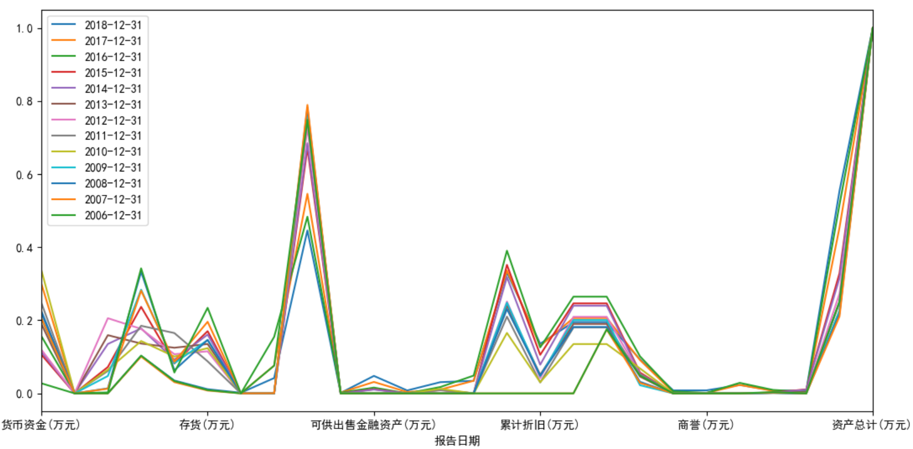
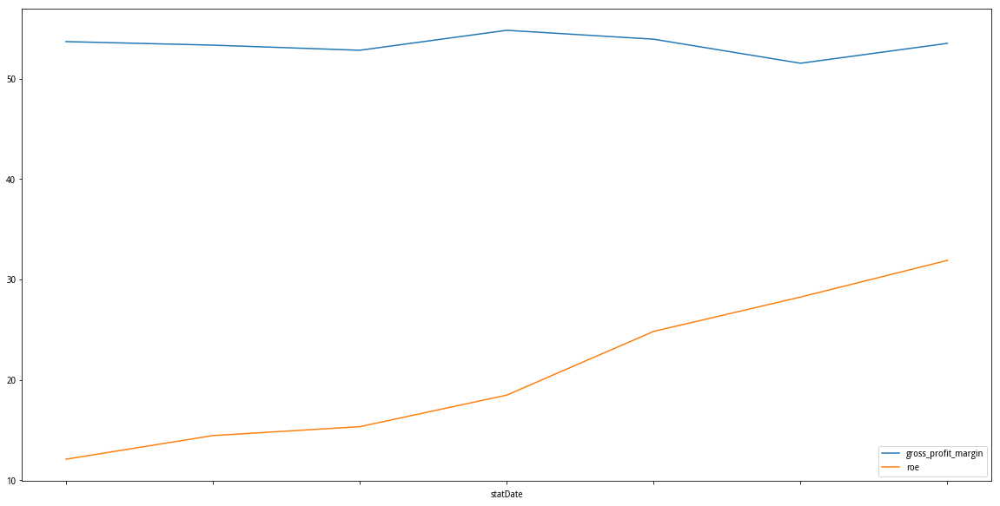
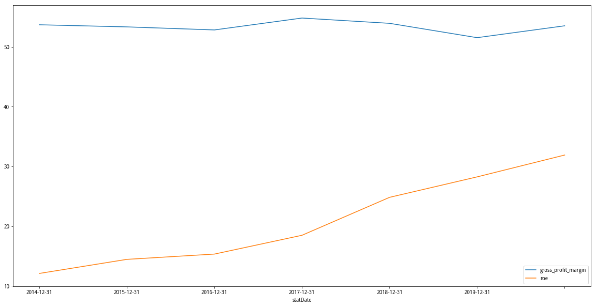
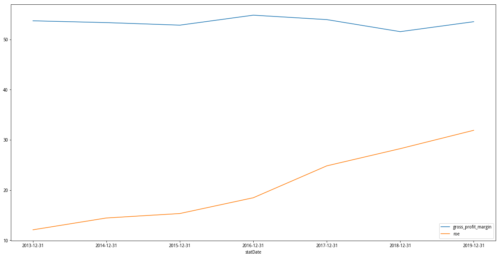
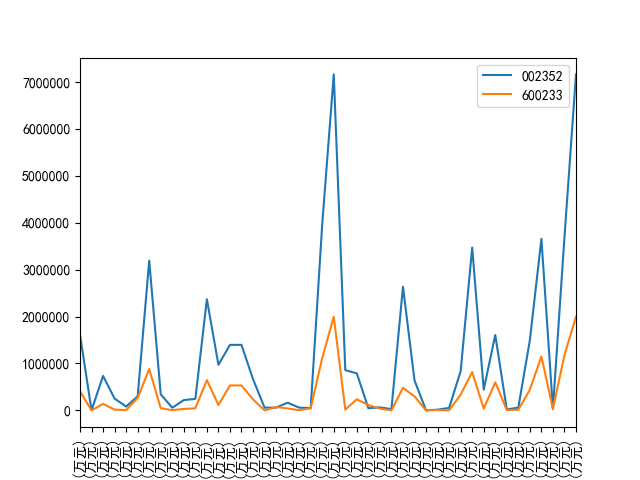
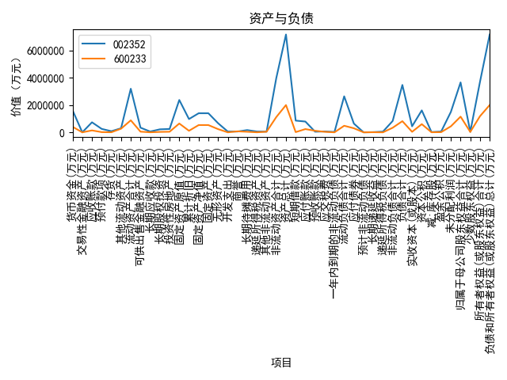

## 如何调整横坐标样式以显示更多项目

如下图，怎么调整横坐标标签显示样式，支持更多的显示。



```
asset_plot = self.asset_df.plot()
asset_plot.set_xticks(range(len(self.asset_df.index)))
asset_plot.set_xticklabels(self.asset_df.index, rotation=90)
plt.show()
```

通过`set_xticks`设定所有的tick数，另外通过`set_xticklabels`设定标签的显示样式。

参考：

- [How to plot a pandas multiindex dataFrame with all xticks](https://stackoverflow.com/questions/21281322/how-to-plot-a-pandas-multiindex-dataframe-with-all-xticks)
- [Matplotlib:: Not Showing all x-axis data frame variable](https://stackoverflow.com/questions/32572419/matplotlib-not-showing-all-x-axis-data-frame-variable?rq=1)


## 使用df.plot函数只显示x lable但是不显示ticks

*注：这个例子是在聚宽上进行的，我在本地测试没有这个问题。*

获取到了如下数据集：

```
code    statDate  gross_profit_margin      roe
0  002677.XSHE  2013-12-31              53.6989  12.0815
1  002677.XSHE  2014-12-31              53.3448  14.4380
2  002677.XSHE  2015-12-31              52.8356  15.3243
3  002677.XSHE  2016-12-31              54.8248  18.4692
4  002677.XSHE  2017-12-31              53.9400  24.8178
5  002677.XSHE  2018-12-31              51.5414  28.2421
6  002677.XSHE  2019-12-31              53.5253  31.8974
```

然后调用`df.plot(figsize=(20, 10), x='statDate', kind='line')`画图，结果只是显示了坐标轴名称但是没有刻度。



之后在[Xticks by pandas plot, rename with the string](https://stackoverflow.com/questions/26358200/xticks-by-pandas-plot-rename-with-the-string)找到了一种方法。使用了如下代码将刻度展示了出来：

```
ax = df.plot(figsize=(20, 10), x='statDate', kind='line')
ax.set_xticklabels(df['statDate'])
```



但实际上上面的图还有瑕疵，因为坐标轴上的tick label仅仅显示了`2014-12-31`到`2019-12-31`，漏掉了`2013-12-31`，并且位置偏移得也不对。

尝试添加了`ax.set_xticks(xticks)`才纠正过来，不知道什么原因。

```
ax = df.plot(figsize=(20, 10), x='statDate', kind='line')
xticks = range(0, len(df.index), 1)
ax.set_xticks(xticks)
ax.set_xticklabels(df['statDate'])
```



### X轴标签部分隐藏的问题

使用默认的显示方式有些时候无法显示出xlabel的所有内容，比如：



之前尝试解决过一次但是没有成功，这次经过多次搜索在StackOverflow上找到答案，即在`show()`
之前调用`plt.tight_layout()`，但这样整幅图的效果可能会比较怪异，比如被挤压：




可以通过以下方法调整：

- 调整 xlabel，避免使用太长、太多的展示。
- 通过`figsize`调整整幅图的大小。
- 通过`plt.subplots_adjust`来调整图形显示的边缘设置。

画出图形时如果觉得周围留空过大的问题，也可以通过`subplots_adjust`来调整显示，之前一直在
针对dataframe的plot接口里面查找，没有找到调整方案。

```
plt.subplots_adjust(wspace=0.6, hspace=0.6, left=0.1, bottom=0.22, right=0.96, top=0.96)
```

参考：

- [xlabel and ylabel out of plot region, cannot show completely in the figure
](https://stackoverflow.com/questions/29767386/xlabel-and-ylabel-out-of-plot-region-cannot-show-completely-in-the-figure)
- [How do you change the size of figures drawn with matplotlib?](https://stackoverflow.com/questions/332289/how-do-you-change-the-size-of-figures-drawn-with-matplotlib)

