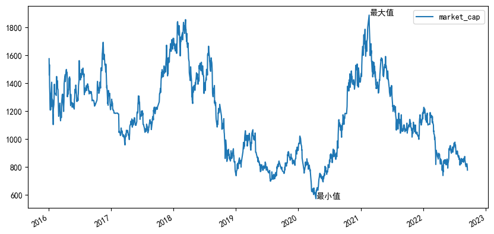
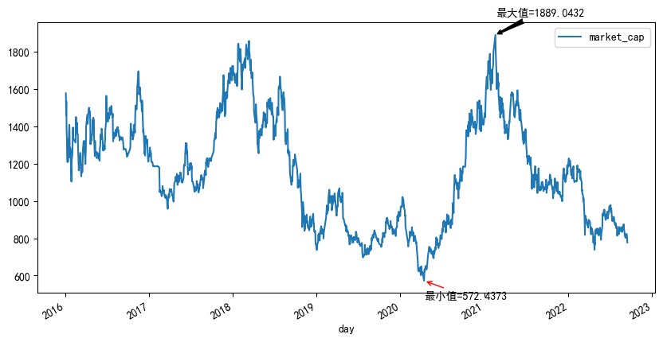

## 如何在plot上进行标记？

在PPT里面我们可以很方便的画图，也可以对已有的图形进行标注以更好的体现想要表达的意图。比如，下图是之前分众传媒在某段时间的市值变化，我想去标注出该时间区间内市值的最低值和最高值：


于是我不得不完成以下两个步骤的操作：

- 步骤一：先从原始数据里面去找到哪一天市值是最高的，最高值是多少，哪一天市值是最低的，最低值是多少。
- 步骤二：用肉眼去图上寻找最高市值、最低市值对应的时间点，然后在位置上画上箭头，并进行标注。

是不是有点儿麻烦？当然，慢工出细活，多花点时间就搞出来了。

其实，这里的“慢工”可以再优化，因为pandas本身已经提供了上面描述的“标注”功能，也就是`annotate()`函数。

今天我们来试试看它的功能。


## 准备工作

首先，我从一个量化平台上下载了002027（分众传媒）这家公司从2016年至今1600多个交易日的市盈率、市净率和市值数据，保存至002027.csv这个文件里面。

打开002027.csv这个文本文件，长这样：


然后使用pandas读取002027.csv，并把它打印出来：

```
df = pd.read_csv("002027.csv")
print(df)
```


对比打印出的DataFrame和我们打开002027.csv文件看到的数据，发现有点不一样。这是因为pandas在读取csv的时候默认“以第一行作为列标签”，但但并没有“以第一列作为行标签”，而是自动生成了`0, 1, 2... 1632`的递增数字序列来作为行标签（index）。

如果我们想在读取002027.csv的时候也以“第1列作为行标签”那该怎么做呢？很简单，使用`index_col`参数来显式指定就行了：

```
df = pd.read_csv("002027.csv", index_col=0)
print(df)
```


好了，现在数据准备好了。下一步，使用`plot()`函数画图。


## 画图

基于已有的DataFrame数据画图很简单，我们直接使用`df.plot()`就可以画出一个图形：

```
df.plot()
```


因为没有给`plot()`函数任何参数，所以这幅图使用了一些默认的设置：

1. 它默认将原有数据集的3列数据（pe_ratio, pb_ratio, market_cap）都画在一幅图上，由于这三种数据的量级不一样，所以基本效果就是上面这样。

2. 图形的大小是默认的`6.4英寸 x 4.8英寸`。

我们这里只是为了演示标记，所以仅选择`market_cap`这一项数据，并且把默认的图形设置大一些，比如长10英寸宽5英寸。

```
df.plot(y='market_cap', figsize=(10,5))
```


有点像样了，对伐？


## 标注

我们在上面已经画出了图形，那么接下来就可以使用[matplotlib.pyplot.annotate](https://matplotlib.org/stable/api/_as_gen/matplotlib.pyplot.annotate.html)，它的完整定义如下：

```
matplotlib.pyplot.annotate(text, xy, xytext=None, xycoords='data', textcoords=None, arrowprops=None, annotation_clip=None, **kwargs)
```

几个主要参数如下：

- `text`：想要标注的文本
- `xy`：标注点的坐标，坐标系统通过后面的`xycoords`参数来指定，默认为'data'
- `xytext`：标注文本的坐标

这几个参数因为没有默认值，所以是必须要指定的，所以开头就先以这三个参数试试效果。

既然我现在想要做的是标注市值的最大值和最小值，那么必须先要把最大值、最小值的位置（坐标）找到。还记得在《pandas的妙用：快速定位最大值最小值》已经介绍过的方法吗？我们可以用已有的函数来快速找到对应的位置（坐标）。

```
import matplotlib.pyplot as plt
plt.rcParams['font.sans-serif'] = ['SimHei']

axesSubplot = df.plot(y='market_cap', figsize=(10,5))
df.index = pd.to_datetime(df.index, format = '%Y-%m-%d')

y_mc_max = df['market_cap'].max()    # 最大值的y坐标
x_mc_max = df['market_cap'].idxmax() # 最大值的x坐标

y_mc_min = df['market_cap'].min()    # 最小值的y坐标
x_mc_min = df['market_cap'].idxmin() # 最小值的x坐标

axesSubplot.annotate(text="最大值", 
                     xy=(x_mc_max, y_mc_max),
                     xytext=(x_mc_max, y_mc_max))
axesSubplot.annotate(text="最小值", 
                     xy=(x_mc_min, y_mc_min),
                     xytext=(x_mc_min, y_mc_min))
```

于是，我们得到了这样一幅图：



有两点需要注意的地方：

1. 中文乱码。标注文本默认不支持中文，会有乱码。可以通过设置`plt.rcParams['font.sans-serif'] = ['SimHei']`（将默认字体设置为黑体）来解决。
2. x轴坐标，也就是DataFrame的index值不能为字符串类型，否则会提示“Failed to convert value(s) to axis units”的错误，这也是上面代码里面有一行`df.index = pd.to_datetime(df.index, format = '%Y-%m-%d')`的原因：将原来的字符串转换成Timestamp类型。

上面的代码里面我们将要“标注的点的位置”，和“注释文本的位置”都设置为一样的，也就是我们最终看到的效果。


## 箭头

我还不知足，因为我觉得上面的标注不够专业，于是想添加一个箭头。这个时候就需要把`annotate()`函数中的`arrowprops`参数用起来，这个参数是一个字典类型，可以同时设置多种不同的属性，我们这里设定“arrowstyle”这一种，更多的设置可以去参考连接里面的接口文档。

我们重新设定下标注文本的坐标`xytext`，箭头样式`arrowprops`，以及标注的文本`text`：

```
axesSubplot.annotate(text="最大值="+str(y_mc_max), 
                     xy=(x_mc_max, y_mc_max),
                     xytext=(x_mc_max, y_mc_max+100),
                     arrowprops=dict(arrowstyle="fancy", color='black')
                     )
axesSubplot.annotate(text="最小值="+str(y_mc_min), 
                     xy=(x_mc_min, y_mc_min),
                     xytext=(x_mc_min, y_mc_min-100),
                     arrowprops=dict(arrowstyle="->", color='red')
                     )
```

就可以看到：



这样的图形，就和开头的地方用PPT添加注释的差不多了。


好了，这就是我们在使用pandas画图时所需的标注功能。核心在于认识到`annotate()`函数的作用以及基本用法，主要工作估计就是在前期的数据搜集和整理，作图和标注相对来说还是简单的。当然，刚开始学习的时候需要熟悉，但是一旦熟悉了，就能够为图形增添一些色彩。


##　参考

- [matplotlib.axes.Axes.annotate](https://matplotlib.org/stable/api/_as_gen/matplotlib.axes.Axes.annotate.html#matplotlib.axes.Axes.annotate)
- [Annotations](https://matplotlib.org/stable/tutorials/text/annotations.html#)。