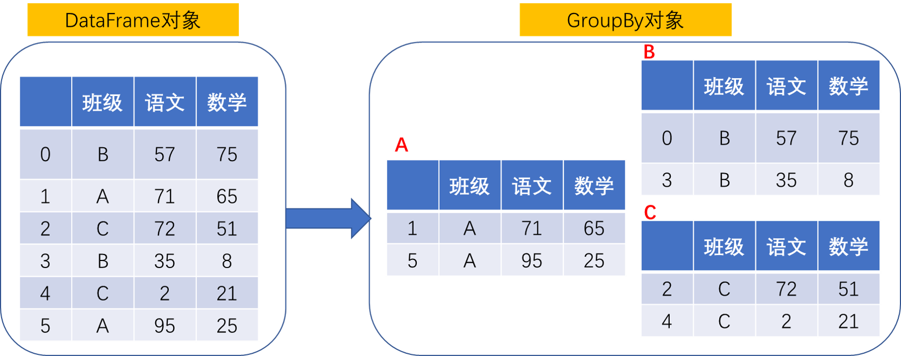
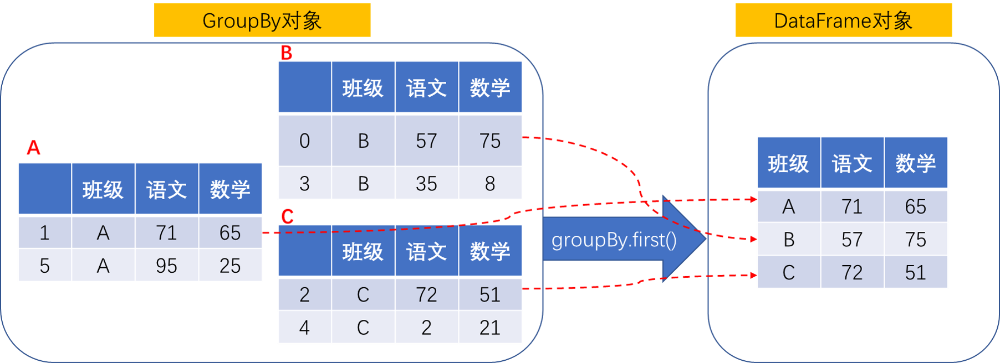

## 使用`groupby`进行自定义分组统计

`groupby`仅从英文的字面意思上理解，就是“分组”。但使用这个函数的场合不仅仅是“分组”，还包括“分组”之后要做的操作。

我们一点点看。首先，我们创建一组示例数据，假设这是2022年9月份6位同学的语文和数学期末考试成绩：

```python
import pandas as pd
import numpy as np

classes = ["A", "B", "C"]
score = pd.DataFrame({
    "班级":[classes[x] for x in np.random.randint(0, len(classes), 6)],
    "语文":np.random.randint(0, 100, 6),
    "数学":np.random.randint(0, 100, 6)
})
```

上面创建了一个DataFrame对象`score`，里面包括了以下的考试数据：

```
  班级  语文  数学
0    B    57    75
1    A    71    65
2    C    72    51
3    B    35     8
4    C     2    21
5    A    95    25
```

## 分组统计

1. 分组

我们想看看A、B、C三个班级的整体情况，这个时候就要进行分组，也就是将上面的数据集按照班级分成三个数据集。分组的操作很简单，直接在保存原有数据集的DataFrame对象上调用`groupby`函数，函数参数指定分组的标准，设定为“班级”。然后，再尝试分组结果打印出来：

```
# print(champion.groupby('班级'))

<pandas.core.groupby.generic.DataFrameGroupBy object at 0x0000020A34ACE3D0>
```

奇怪的是，通过`print()`函数打印出来的结果只是一个地址，并不是分组之后的结果。这是因为`groupby()`返回的是一个`DataFrameGroupBy`对象，这个对象不能像`DataFrame`对象那样可以直接打印出来。

但是没关系，我们课可以将该对象转换成`list`对象再打印出来一探究竟。于是可以看到：

```
# res = champion.groupby('班级')
# print(list(res))

[('A',   班级  语文  数学
1    A    71    65
5    A    95    25), ('B',   班级  语文  数学
0    B    57    75
3    B    35     8), ('C',   班级  语文  数学
2    C    72    51
4    C     2    21)]
```

可以看到原有数据集调用`groupby`之后已经是一个按照“班级”分组过后的结果，但这个结构的组成方式是一个嵌套的结构：

1. 第一层，是三个元组，包括了“班级 + 班级成绩”
2. 第二层，是“班级成绩”，它也是DataFrame对象


所以，`groupby`完成的操作实际上是将一个`DataFrame`按照一定条件分成了多个`DataFrame`。并将多个`DataFrame`保存在新的`DataFrameGroupBy`对象里面。它们之间的关系就类似于：



之后，针对`DataFrameGroupBy`对象的操作实际上就是同时针对多个组进行操作，比如我打印出`score.groupby('班级').first()`实际上就是把班级A、班级B和班级C第一位同学的成绩打印出来：

```
# print(score.groupby('班级').first())

       语文  数学
班级            
A       71    65
B       57    75
C       72    51
```

示意图如下：




2. 统计


当然，将一个`DataFrame`按照一定条件分成了多个`DataFrame`很多时候都是为了获得每个分组的各种统计信息。这些统计信息的种类就是分组之后的`DataFrameGroupBy`对象提供的那些统计函数：

- count()：每个分组包含的条目数量
- max()：每个分组各列的最大值
- min()：每个分组各列的最大值
- mean()：每个分组各列的平均值

比如我们使用`score.groupby('班级').mean()`就可以得到A、B、C三个班级在语文和数学科目上的平均分：

```
# print(score.groupby('班级').mean())

      语文  数学
班级            
A     83.0  45.0
B     46.0  41.5
C     37.0  36.0
```


更全的函数可以看[这里](https://pandas.pydata.org/pandas-docs/stable/reference/groupby.html#)。


## 自定义分组

上面介绍的是对DataFrame进行分组的基本概念。上面应用的分组条件也很简单，就是按照“班级”进行分组。那我现在有个比较特别点的需求，也就是我想对所有学生的“语文”成绩进行分段统计。比如，我想看看语文成绩不及格的有多少人？处于60分到90分的有多少人？考了90分以上的有多少人？或许，再顺便求以下它们的均值。

从数据分析的角度，也就是我们需要基于原始的数据集按照语文成绩进行分组：

- 成绩在60分以下的作为一组
- 成绩在60分~90分的作为一组
- 成绩在大于90分的作为一组

怎么搞？

很显然，我们不能像上面例子中那样，直接以“语文”成绩作为groupby的条件使用。如果那样我们会得到如下结果：

```
# print(score.groupby('语文').size())

语文
2     1
35    1
57    1
71    1
72    1
95    1
```

很显然，它确实已经按照“语文成绩”进行分组了，但是并没有按照我们需要的“成绩的范围”进行分组。

就是将一个`DataFrame`按照一定条件分成了多个`DataFrame`。这里的“条件”最简单的就是按照某列的每个不同的值进行分组，但实际上这个“条件”可以更复杂点，也就是它完全可以按照某列值的范围进行分组。这也是我这里提到的“自定义分组”。

我们看下`groupby()`第一个参数的定义：

```
DataFrame.groupby(by=None, axis=0, level=None, as_index=True, sort=True, group_keys=True, squeeze=NoDefault.no_default, observed=False, dropna=True)[source]

Parameters by mapping, function, label, or list of labels

    Used to determine the groups for the groupby. If by is a function, it’s called on each value of the object’s index. If a dict or Series is passed, the Series or dict VALUES will be used to determine the groups (the Series’ values are first aligned; see .align() method). If a list or ndarray of length equal to the selected axis is passed (see the groupby user guide), the values are used as-is to determine the groups. A label or list of labels may be passed to group by the columns in self. Notice that a tuple is interpreted as a (single) key.
```

可以看到它有多种形式，不仅仅支持比如“语文”这样的DataFrame上的列标签，还可以支持“标签列表”，但这种“标签列表”需要以字典或者Series方式来传递。

我们这里需要按照自定义的范围来统计，那么我们就基于“语文”成绩这一列进行范围的划分，这个时候会使用到`pandas.cut()`函数，这个函数里面会将给定的数据按照指定的范围进行分类，比如`[0, 60, 90, 100]`就对应了0~60， 60~90， 90~100三个范围。

```
# print(pd.cut(score['语文'], [0, 60, 90, 100]))

0      (0, 60]
1     (60, 90]
2     (60, 90]
3      (0, 60]
4      (0, 60]
5    (90, 100]
```

最后

```
# print(score.groupby(pd.cut(score['语文'], [0, 60, 90, 100])).size())

语文
(0, 60]      3
(60, 90]     2
(90, 100]    1

# print(score.groupby(pd.cut(score['语文'], [0, 60, 90, 100])).mean())
                语文       数学
语文                           
(0, 60]    31.333333  34.666667
(60, 90]   71.500000  58.000000
(90, 100]  95.000000  25.000000
```

参考：

- [Pandas Groupby Range of Values](https://stackoverflow.com/questions/21441259/pandas-groupby-range-of-values)
- [Pandas GroupBy](https://www.geeksforgeeks.org/pandas-groupby/?ref=gcse)
- [Pandas教程 | 超好用的Groupby用法详解](https://zhuanlan.zhihu.com/p/101284491)
- [GroupBy](https://pandas.pydata.org/pandas-docs/stable/reference/groupby.html#)
- [pandas.cut](https://pandas.pydata.org/pandas-docs/stable/reference/api/pandas.cut.html)
- [pandas groupby range of values]()