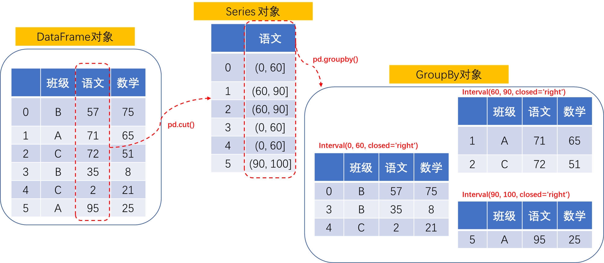

## 使用`groupby`进行自定义分组统计

Pandas中的groupby仅从字面意思上理解，就是“分组”的意思。但往往在使用这个函数的时候并不简单是为了将一堆数据进行“分组”，更重要的是包括“分组”之后要做的操作。当然，首先必须要将这个分组的动作搞定，尤其很多时候分组的标准可能多样化。我们一步步看。

## 一、创建测试数据

首先，我们用以下代码创建一组示例数据：

```python
import pandas as pd
import numpy as np

classes = ["A", "B", "C"]
score = pd.DataFrame({
    "班级":[classes[x] for x in np.random.randint(0, len(classes), 6)],
    "语文":np.random.randint(0, 100, 6),
    "数学":np.random.randint(0, 100, 6)
})
```

假设创建的这个DataFrame对象score保存了2022年9月份来自于A、B、C三个班级的6位同学的语文和数学考试成绩：

```
  班级  语文  数学
0    B    57    75
1    A    71    65
2    C    72    51
3    B    35     8
4    C     2    21
5    A    95    25
```

## 二、简单的分组统计

1. 分组

我们想看看A、B、C三个班级各自的整体情况，这个时候就需要将上面的数据集按照班级分成三个数据集。分组的操作很简单，直接在保存原有数据集的DataFrame对象上调用groupby函数，函数参数里面需要指定分组的标准，我们要按照班级进行分组，自然传入班级。然后，再尝试分组结果打印出来：

```
# print(champion.groupby('班级'))

<pandas.core.groupby.generic.DataFrameGroupBy object at 0x0000020A34ACE3D0>
```

奇怪的是，通过print()函数打印出来的结果只是一个地址，并不是分组之后的结果。这是因为groupby()返回的是一个DataFrameGroupBy对象，这个对象不能像DataFrame对象那样可以直接打印出来。好在我们可以将该对象转换成list对象再打印出来一探究竟。于是可以看到：

```
# res = champion.groupby('班级')
# print(list(res))

[('A',   班级  语文  数学
1    A    71    65
5    A    95    25), ('B',   班级  语文  数学
0    B    57    75
3    B    35     8), ('C',   班级  语文  数学
2    C    72    51
4    C     2    21)]
```

可以看到原有数据集调用groupby之后已经是一个按照“班级”分组过后的结果，但这个结构的组成方式是一个稍微复杂点的嵌套结构：

- 第一层，是三个元组，包括了“班级 + 班级成绩”
- 第二层，是“班级成绩”，是DataFrame对象


也就是说，这个将原始“DataFrame对象”分组之后变成的是一个“包含了多个DataFrame对象的元组序列”，这个“包含了多个DataFrame对象的元组序列”是一个新的GroupBy对象。它们之间的关系就类似于：


之后，针对DataFrameGroupBy对象的操作实际上就是同时针对多个组进行操作，比如我打印出score.groupby('班级').first()实际上就是把班级A、班级B和班级C的第一位同学的成绩打印出来：

```
# print(score.groupby('班级').first())

       语文  数学
班级            
A       71    65
B       57    75
C       72    51
```

示意图如下：


2. 统计


将一个DataFrame按照一定条件分成了多个DataFrame很多时候都是为了获得每个分组的各种统计信息。这些统计信息的获取就是通过DataFrameGroupBy对象提供的那些统计函数来完成的，比如：

- size()：每个分组包含的条目数量
- max()：每个分组各列的最大值
- min()：每个分组各列的最大值
- mean()：每个分组各列的平均值

比如我们使用`score.groupby('班级').mean()`就可以得到A、B、C三个班级在语文和数学科目上的平均分：

```
# print(score.groupby('班级').mean())

      语文  数学
班级            
A     83.0  45.0
B     46.0  41.5
C     37.0  36.0
```


更全的函数可以看[这里](https://pandas.pydata.org/pandas-docs/stable/reference/groupby.html#)。


## 三、进行自定义分组

上面介绍的是对DataFrame进行分组的基本概念，其中应用的分组条件也很简单，就是按照“班级”进行分组。现在有个新需求，我想对所有学生的“语文”成绩进行分段统计。比如，我想看看语文成绩不及格的有多少人？处于60分到90分的有多少人？考了90分以上的有多少人？再顺便求以下它们的均值。

从数据分析的角度，也就是我们需要基于原始的数据集按照语文成绩进行分组：

- 成绩在60分以下的作为一组
- 成绩在60分~90分的作为一组
- 成绩在大于90分的作为一组

怎么搞？

很显然，我们不能像前面例子中那样，直接以“语文”成绩作为groupby的条件使用。如果那样我们会得到如下结果：

```
# print(score.groupby('语文').size())

语文
2     1
35    1
57    1
71    1
72    1
95    1
```

这个结果确实已经按照“语文成绩”进行分组了，但是并没有按照我们需要的“成绩的范围”进行分组。我们这个时候需要更复杂一点的条件，这个条件不是按照某列的不同值进行分组，而需要一个自定义的范围。

我们先看下`groupby()`第一个参数的定义：

```
DataFrame.groupby(by=None, axis=0, level=None, as_index=True, sort=True, group_keys=True, squeeze=NoDefault.no_default, observed=False, dropna=True)[source]

Parameters by mapping, function, label, or list of labels

    Used to determine the groups for the groupby. If by is a function, it’s called on each value of the object’s index. If a dict or Series is passed, the Series or dict VALUES will be used to determine the groups (the Series’ values are first aligned; see .align() method). If a list or ndarray of length equal to the selected axis is passed (see the groupby user guide), the values are used as-is to determine the groups. A label or list of labels may be passed to group by the columns in self. Notice that a tuple is interpreted as a (single) key.
```

可以看到groupby的分组标准有多种形式，不仅仅支持比如“语文”这样的列标签，还支持“标签列表”，这种“标签列表”需要以字典或者Series方式来传递。


我们这里需要基于“语文”成绩按照自定义的范围来进行分组，这个时候就会使用到`[pandas.cut()](https://pandas.pydata.org/pandas-docs/stable/reference/api/pandas.cut.html)`函数来创建一个自定义的分组标准。

使用pandas.cut(data, bins)函数就能利用给定的数值区间bins来对数据集data做离散化操作。如果设定bins = [0, 60, 90, 100]就是相当于设定了0~60， 60~90， 90~100三个数值区间。当我们对“语文”成绩这一列进行cut之后就有下面的结果：

```
# print(pd.cut(score['语文'], [0, 60, 90, 100]))

0      (0, 60]
1     (60, 90]
2     (60, 90]
3      (0, 60]
4      (0, 60]
5    (90, 100]
Name: 语文, dtype: category
Categories (3, interval[int64, right]): [(0, 60] < (60, 90] < (90, 100]]
```

也就是，我们得到了一个新的Series，然后我们用这个新的Series去进行分组，便得到：

```
# criteria = pd.cut(score['语文'], [0, 60, 90, 100])
# print(list(score.groupby(criteria)))

[(Interval(0, 60, closed='right'),   班级  语文  数学
0    B    57    75
3    B    35     8
4    C     2    21), (Interval(60, 90, closed='right'),   班级  语文  数学
1    A    71    65
2    C    72    51), (Interval(90, 100, closed='right'),   班级  语文  数学
5    A    95    25)]
```

用示意图表达如下：



上面就是按照自定义的分组的具体实现，其实就是使用pd.cut()多了一次创建自定义分组的过程。然后就可以像前面那样对这些新的分组进行数据统计了，比如对这些自定义的分组出来的学生进行均值统计：

```
# print(score.groupby(pd.cut(score['语文'], [0, 60, 90, 100])).mean())
                语文       数学
语文                           
(0, 60]    31.333333  34.666667
(60, 90]   71.500000  58.000000
(90, 100]  95.000000  25.000000
```


参考：

- [Pandas Groupby Range of Values](https://stackoverflow.com/questions/21441259/pandas-groupby-range-of-values)
- [Pandas GroupBy](https://www.geeksforgeeks.org/pandas-groupby/?ref=gcse)
- [Pandas教程 | 超好用的Groupby用法详解](https://zhuanlan.zhihu.com/p/101284491)
- [GroupBy](https://pandas.pydata.org/pandas-docs/stable/reference/groupby.html#)
- [pandas.cut](https://pandas.pydata.org/pandas-docs/stable/reference/api/pandas.cut.html)
- [pandas groupby range of values](https://stackoverflow.com/questions/21441259/pandas-groupby-range-of-values)