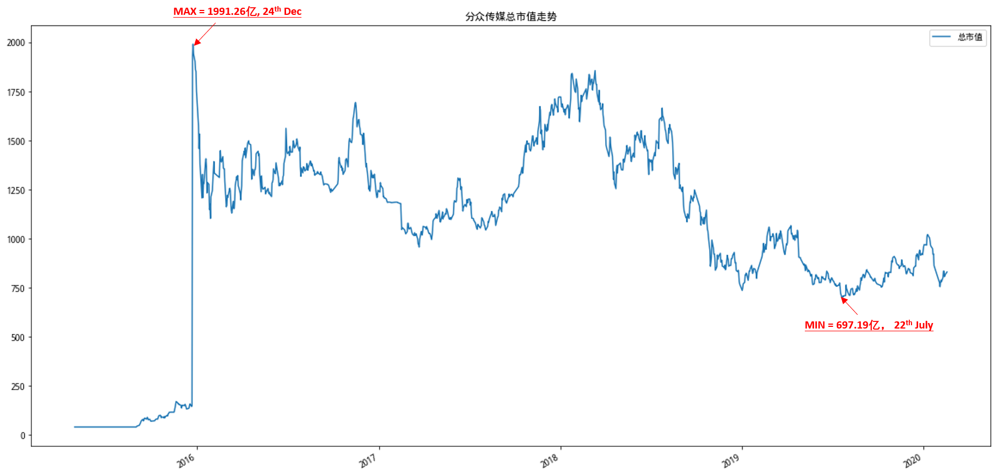

## 如何在plot上进行标记？

在PPT里面我们可以很方便的画图，也可以对已有的图形进行标注以更好的体现想要表达的意图。比如，下图是之前分众传媒在某段时间的市值变化，我需要在该时间区间去标注市值的最低和最高值：



于是我需要做以下两个步骤的操作：

- 步骤一：先从原始数据里面去找到哪一天市值是最高的，最高值是多少，哪一天市值是最低的，最低值是多少。
- 步骤二：用肉眼去图上寻找最高市值、最低市值对应的时间点，然后在位置上画上箭头，并进行标注。

是不是有点儿麻烦？当然，慢工出细活，多花点时间就搞出来了。

只不过，这里的“慢工”可以再优化，因为pandas本身已经提供了上面描述的“标注”功能，也就是`annotate()`函数。

今天我们来试试看它的功能。


## 准备工作

首先，我从一个量化平台上下载了002027（分众传媒）这家公司从2016年至今1600多个交易日的市盈率、市净率和市值数据，保存至002027.csv这个文件里面。

打开002027.csv这个文本文件，长这样：


然后使用pandas读取002027.csv，并把它打印出来：

```
df = pd.read_csv("002027.csv")
print(df)
```


对比打印出的DataFrame和我们打开002027.csv文件看到的数据，发现有点不一样。这是因为pandas在读取csv的时候默认“以第一行作为列标签”，但对“并没有以第一列作为行标签”，而是自动生成了`0, 1, 2... 1632`的递增数字序列来作为行标签。

如果我们想在读取002027.csv的时候也以“第1列作为行标签”那该怎么做呢？很简单，使用`index_col`参数来显式指定就行了：

```
df = pd.read_csv("002027.csv", index_col=0)
print(df)
```


好了，现在数据准备好了。下一步，使用`plot()`函数画图。


## 画图

基于已有的DataFrame数据画图很简单，我们直接使用`df.plot()`就可以画出一个图形：

```
df.plot()
```


因为没有给`plot()`函数任何参数，所以这幅图至少有两个默认的设置：

1. 它默认将原有数据集的3列数据（pe_ratio, pb_ratio, market_cap）都画在一幅图上，由于这三种数据的量级不一样，所以基本效果就是上面这样。

2. 图形的大小是默认的`6.4英寸 x 4.8英寸`。

我们这里只是为了演示标记，所以仅选择`market_cap`这一项数据，并且把默认的图形设置大一些，比如长10英寸宽5英寸。

```
df.plot(y='market_cap', figsize=(10,5))
```


