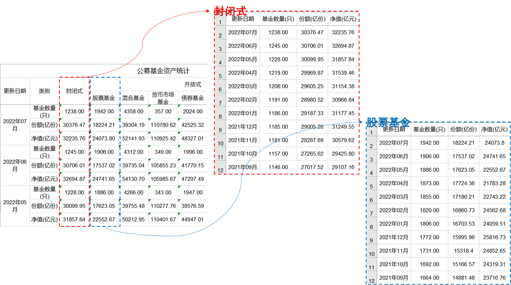
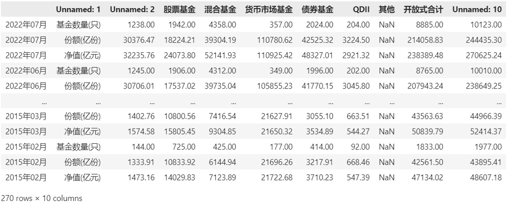
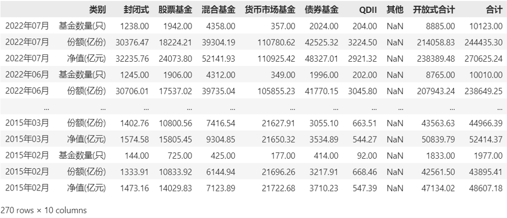
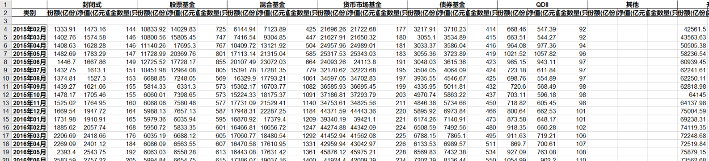

## 手动操作的困境

我前几天从中国证券投资基金业协会下载了公募基金行业数据，数据以`.xls`的格式保存，大小76KB，里面保存了从2015年02月到2022年07月总共90个月的公募基金行业的统计数据。

用excel打开，长这样：


我现在想要做的工作是针对每种类型的基金，将“基金数量（只）”、“份额（亿份）”和“净值（亿元）”按照时间单独列示出来，这样就好去对比。也就是，我想要的效果是下面这样的：



我手动操作了一次，完成一种类型的基金数据的整理要花10分钟左右的时间，表格里总共有6种基金的数据要整理，算下来差不多需要一个小时。

工作原因我经常敲电脑，手速不是特别快，但也不算慢。如果有人练的是“一指禅”的功夫，咳，那估计时间double一下还不止...

其实，有更快速的方法，那就是使用pandas来完成我的小目标。


## 第一步：整理数据

首先，尝试使用`pandas`读取这个`.xls`文件，打印出来可以看到下面的结果。从中可以看到，我们使用office excel打开的时候有些列名称是合并的，但是在使用pandas读取之后它会默认将它们展开为单独的列：

```
# 读取excel
pd.read_excel("fund_data.xls")
```


从excel里面读取的数据会保存到新的DataFrame对象里面，并且会附加新的数字序号`0, 1, 2...`作为index，且默认以第一行作为column，但因为第一行只有“公募基金资产统计”这一合并之后的列，所以我们看到的column是`公募基金资产统计，Unnamed:1, Unnamed:2...`

有没有办法在读取的时候直接以原有表格的第1列作为index，第3行作为column呢？当然有，只需要在读取的时候使用`header`和`index_col`来指定对应的行和列就行了：

```
# 读取excel的时候指定特定行来作为column，特定列作为index
pd.read_excel("fund_data.xls", header = 2, index_col = 0)
```




指定特定行和特定列来作为column和index之后，我们看到个别列因为之前是合并的列所以还有3个Unnamed的列名称。可以使用`rename`将它们进行替换：

```
# 替换特定列的名称
df = pd.read_excel("fund_data.xls", header = 2, index_col = 0)
df.rename(columns={'Unnamed: 1' : '类别', 'Unnamed: 2' : '封闭式', 'Unnamed: 10' : '合计'})
```




## 第二步：分析数据

在整理好数据之后，我们下一步就是想办法怎么样能够达到最开始的目标，也就是把原来以“行展示的统计类别，如基金数量、份额和净值”变换到“以列的形式展示出来”：


我们知道在Excel里面有透视表的功能，pandas也有，并且功能还更为强大。不过这里只需要用来最基本的功能：只需要将原来的“类别”这一行作为列来展示就行了：

```
# 使用透视表功能，按照“类别”作为行进行透视
df.pivot(columns="类别")
```


你看，上面的结果就是我们想要的结果。然后只需要调用`to_excel()`函数将这个透视表的结果保存下来就行了。

```
# 将透视表保存为xls文件
pivot_df = df.pivot(columns="类别")
pivot_df.to_excel("pivot.xls", encoding='gb2312')
```




所以，前面需要将近1个小时手动处理的事情，只需要下面4行代码就可以搞定。更别提这里只有90个月的基金数据，要是这个数据更多，手动操作所花的时间将线性增长，下面4行代码能够节省的时间也就更多了。

```
df = pd.read_excel("fund_data.xls", header = 2, index_col = 0)
df = df.rename(columns={'Unnamed: 1' : '类别', 'Unnamed: 2' : '封闭式', 'Unnamed: 10' : '合计'})
pivot_df = df.pivot(columns="类别")
pivot_df.to_excel("pivot.xls", encoding='gb2312')
```

当然，这里表述的只是我前两天碰到的一个例子，每个人碰到的问题都不尽相同。所以，如果这篇文章还有点用处的话，它的用处不在于这个具体例子，更不在于这几行代码，而在于展示了一种可能的，优化excel数据处理的方法。


## 几个需要关注的知识点

1） `.xls`格式

.xls格式是Office 2003及之前版本的Excel文件的格式，我们在使用pandas里面的`read_excel()`和`to_excel()`读取和保存。xls格式的时候需要安装对应的函数库：

- 读.xls需要安装`xlrd`函数库
- 写.xls需要安装`xlwt`函数库

Office 2007及之后版本的Excel文件是.xlsx格式，读取.xlsx格式的电子表格需要的函数库又不同了，是`openpyxl`。

所以，如果你还在操作.xls格式，那么就会收到有关`xlrd`/`xlwt`函数库过时不再维护的信息。

2）操作数据时对于DataFrame本身的概念需要先熟悉

因为excel数据相对csv数据来说略微多样化一点，有些单元格是已经合并的，那么在读取为DataFrame的时候就会出现`unnamed: 1`之类未命名的列，恰如上面操作数据的过程所看到的那样。

这个时候就会涉及到读取excel时候的index和column的选择，以及后续对于column名称的矫正，这些操作都需要建立在对于DataFrame本身的理解之上，不然可能一头雾水。

3）透视表

透视表是一种分析数据的常见方法，在excel里面我们如果要进行稍微一些复杂一些的数据分析，那么也会使用到透视表。

我们知道存储在excel里面的是静态的二维数据，而数据透视表可以简单的理解为“从不同的角度再次审视数据”，通常是去关注原有数据集的一部分，然后从相比原有数据集中不同的行或者列的维度去审视数据。

比如，这篇文章里面其实就是将“类别”这列数据从“列视角”转换为“行视角”。


## 参考：

- [pandas.read_excel](https://pandas.pydata.org/pandas-docs/stable/reference/api/pandas.read_excel.html)
- [pandas.DataFrame.rename](https://pandas.pydata.org/pandas-docs/stable/reference/api/pandas.DataFrame.rename.html)
- [Excel表格文件，.xls和.xlsx格式的区别](https://zhuanlan.zhihu.com/p/463942740)
- [解锁数据透视表，看这一篇就够了！](https://zhuanlan.zhihu.com/p/36785151)