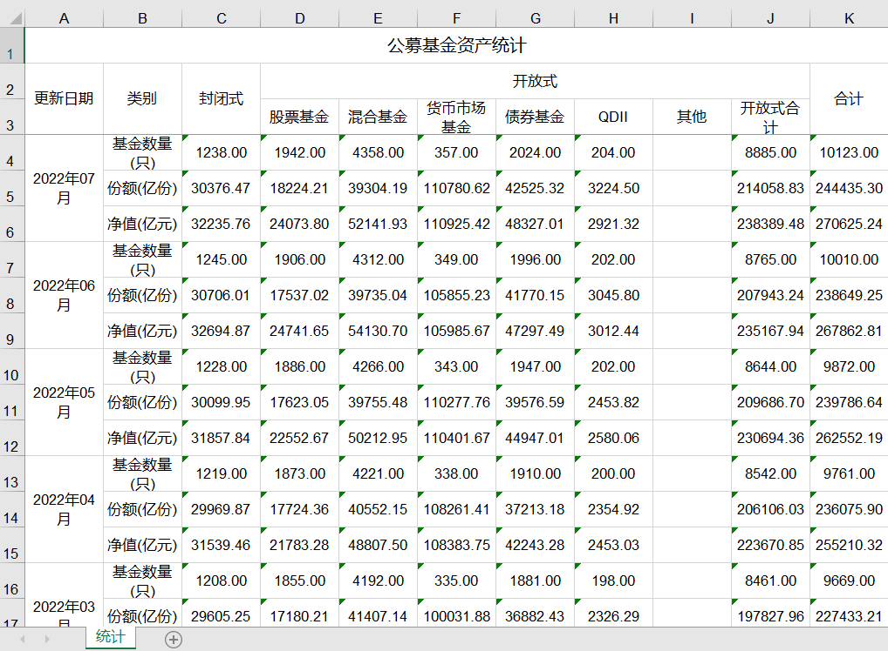

## 手动操作的困境

我从中国证券投资基金业协会下载了公募基金行业数据，数据以`.xls`的格式保存，大小76KB，里面保存了从2015年02月到2022年07月总共90个月的公募基金行业的统计数据。

用excel打开，长这样：



我现在想要做的工作是针对每种类型的基金，将“基金数量（只）”、“份额（亿份）”和“净值（亿元）”按照时间单独列示出来，这样就好去对比。也就是，我想要的效果是下面这样的：


我手动去试了一次，完成一种类型的基金数据的整理要花10分钟左右的时间，表格里总共有6种基金的数据要整理，算下来差不多需要一个小时的时间。

经常敲电脑的，我的手速不是特别快，但也不算慢。如果有人练习的是“一指禅”的键盘功夫，那时间double一下还不止。不信你试试看

其实，使用pandas能够更加快捷方便。

## 第一步

我们尝试使用`pandas`读取这个`.xls`文件，然后打印出来可以看到下面的结果。从中可以看到，我们使用office excel打开的时候有些列名称是合并的，但是在使用pandas读取之后它会默认将它们展开：

```
pd.read_excel("fund_data.xls")
```


