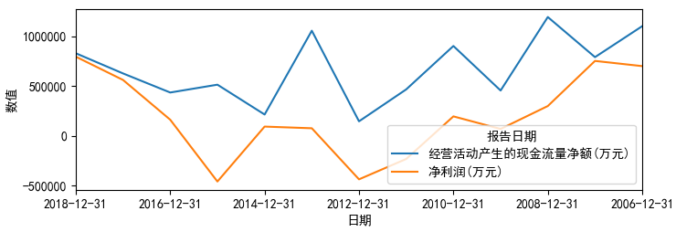

## [简介](https://matplotlib.org/)

## 安装

执行`pip install matplotlib`安装即可，但如果需要配置代理，那么使用`pip3 --proxy 127.0.0.1:6152 install matplotlib`。

## %matplotlib inline 的含义

它是IPython里面的一个魔法函数，表示内嵌绘图，并且可以省略掉plt.show()

- [Purpose of “%matplotlib inline”](https://stackoverflow.com/questions/43027980/purpose-of-matplotlib-inline)

## 图标元素

Matplotlib 中的基本图标包括以下元素：

- x轴和y轴：水平和垂直的轴线。
- x轴和y轴刻度：刻度标示坐标轴的分隔，包括最小刻度和最大刻度。
- x轴和y轴刻度标签：表示特定坐标轴的值。
- 绘图区域：实际绘图的区域。

## 图标设置

```
plt.title("$\sin$ 和 $\cos$ 函数") # 定义标题

plt.xlim(-3.0, 3.0) # 设置 x 轴的范围
plt.ylim(-1.0, 1.0) # 设置 y 轴的范围

# 在特定值处设置记号
plt.xticks([-np.pi, -np.pi/2, 0, np.pi/2, np.pi],
          [r'$-\pi$', r'$-\pi/2$', r'$0$', r'$+\pi/2$', r'$+\pi$'])
plt.yticks([-1, 0, +1],
          [r'$-1$', r'$0$', r'$+1$'])
```

这里标题中的`$..`是利用`matplotlib`对`LaTex`表达式的支持，可以在Python格式化字符中加入了数学符号。

## 坐标轴设置

调用`plt.axis(xmin, xmax, ymin, ymax)`来设置坐标轴的范围。如果不设置，matploblib会自动使用能够容纳数据集的最小值。

```
matplotlib.rcParams['axes.unicode_minus']=False

l = [-1, 1, -10, 10]
plt.axis(l)
```


##  坐标轴标签

```
plt.xlabel('radians')
plt.ylabel('amplitude', fontsize='large') # 设置字体大小
plt.title('Sin(x)')
plt.grid() # 显示网格
```


## 坐标轴标签上显示负号(minus sign)

matplotlib默认以Unicode的形式来展示“-”，但是当你将有些图示的语系变更之后可能导致无法在坐标轴上显示出“-”，比如如下为了在图形中显示中文添加了`matplotlib.rcParams['font.sans-serif'] = ['SimHei']`从而导致无法正常显示"-"，添加如下代码关闭默认的显示形式之后可以正常显示：

```
# matplotlib.rcParams['font.sans-serif'] = ['SimHei']
matplotlib.rcParams['axes.unicode_minus'] = False
```



参考：

- [Unicode minus](https://matplotlib.org/gallery/api/unicode_minus.html)

## 坐标轴显示乱码(支持中文)？

使用如下命令打印出matplotlib能够支持的系统字体：

```
fonts = sorted([f.name for f in matplotlib.font_manager.fontManager.ttflist])

for i in fonts:
    print(i)
```

再设定图形使用的字体：

```
plt.rcParams['font.family']=['STFangsong']
```

## 轴线移动到正中央

```
ax = plt.gca()

# 将右边和顶部的轴隐藏起来
ax.spines['right'].set_color('none')
ax.spines['top'].set_color('none')

# 将底部和左边的轴移动到 0 的位置
ax.spines['bottom'].set_position(('data',0))
ax.spines['left'].set_position(('data',0))

# 将刻度移动到对应的位置
ax.xaxis.set_ticks_position('bottom')
ax.yaxis.set_ticks_position('left')
```