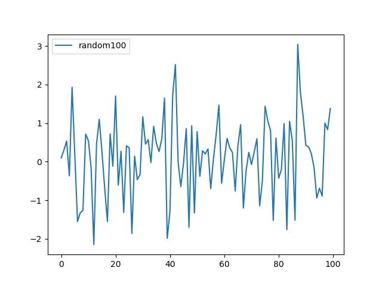

## 基本概念

`Matplotlib`包含了如下绘图元素：

- `Figure`是`matplotlib`中的一个类型，翻译为“画布”，指的是比如操作系统中弹出的窗口，Jupyter widgets，其中可以放置多个`Axes`对象
- `Axes`这种对象指的是坐标轴区域，可以在其中展示具体的图形。
- `Axis`：x轴和y轴，代表水平和垂直的轴线。
    - 刻度：刻度标示坐标轴的分隔，包括最小刻度和最大刻度。
    - 刻度标签：表示特定坐标轴的值。

在调用`Matplotlib`函数库来绘图时有两种方式：

- 显示接口，通过OO的方式一步一步创建`Figure`，`Axes`等需要的绘图元素；
- 隐式接口，通过`Matplotlib.pyplot`创建必须的绘图元素，并且自动跟踪上一次使用的`Figure`，`Axes`（解释了双坐标时候均只需要使用`plt.plot()`）。

比如，下面是一个例子展示两者的差别（注：不管是显示的方式还是隐式的方式，对于`Figure`，`Axes`等主要绘图元素都可以通过`pyplot.subplots()`来创建）：

```
import matplotlib.pyplot as plt

# 显式调用，必须分三步
fig = plt.figure()
ax = fig.subplots()
ax.plot([1, 2, 3, 4], [0, 0.5, 1, 0.2])

# 隐式调用，仅需一步
plt.plot([1, 2, 3, 4], [0, 0.5, 1, 0.2])
```

参考：

- [The explicit and the implicit interfaces](https://matplotlib.org/stable/users/explain/quick_start.html#the-explicit-and-the-implicit-interfaces)
- [Matplotlib Application Interfaces (APIs)](https://matplotlib.org/stable/users/explain/figure/api_interfaces.html#api-interfaces)


## `Figure`

这是一个`Figure`的示意图，包括了多种绘图元素：


创建如上这样带有`Axes`的`Figure`的简单的方式是使用`plt.subplots()`，也可以直接创建不带有`Axes`的`Figure`：

```
import matplotlib.pyplot as plt

fig = plt.figure()             # an empty figure with no Axes
fig, ax = plt.subplots()       # a figure with a single Axes
fig, axs = plt.subplots(2, 2)  # a figure with a 2x2 grid of Axes  
```


## `plt.Figure`和`matplotlib.Figure`的区别

这里没有`plt.Figure`这个类型，只是`plt.figure()`这个接口。

`plt.figure()`用来更快速的创建或者激活已有的`matplotlib.Figure`，如果创建了多个窗口，尽可能使用`pyplot.close()`来关闭不用的窗口。

需要注意的是在GUI中必须直接使用`Matplotlib`的API，而非使用`pylab/pyplot`相关的接口。

举个例子，如果使用`pyplot`的接口来创建`Figure`的时候退出时有资源残留，无法正常全部退出。

参考：

- [Embedding in Tk](https://matplotlib.org/stable/gallery/user_interfaces/embedding_in_tk_sgskip.html#embedding-in-tk)


## `Axes`和`Axis`

`Axes`指的是绘图窗口中的一个坐标轴区域，通常包括2个`Axis`对象。而`Axis`对象用来展示刻度、刻度标签。

- `Axes`：常见函数`set_title()`, `set_xlabel()`, `set_ylabel()`
- `Axis`：使用`Locator`和`Formatter`来控制刻度位置和标签

调用`plt.axis(xmin, xmax, ymin, ymax)`来设置坐标轴的范围。如果不设置，matploblib会自动使用能够容纳数据集的最小值。

```
matplotlib.rcParams['axes.unicode_minus']=False

l = [-1, 1, -10, 10]
plt.axis(l)
```


## `Axess`标签

```
x = np.linspace(0, 2, 100)  # Sample data.

fig, ax = plt.subplots(figsize=(5, 2.7), layout='constrained')
ax.plot(x, x, label='linear')  # Plot some data on the Axes.

ax.set_xlabel('x label')
ax.set_ylabel('y label')
ax.set_title("Simple Plot")
ax.legend()  # Add a legend.


plt.figure(figsize=(5, 2.7), layout='constrained')
plt.plot(x, x, label='linear')  # Plot some data on the (implicit) Axes.

plt.xlabel('x label') #接口差别
plt.ylabel('y label') #接口差别
plt.title("Simple Plot") #接口差别
plt.legend()
```

## 图标设置

```
plt.title("$\sin$ 和 $\cos$ 函数") # 定义标题

plt.xlim(-3.0, 3.0) # 设置 x 轴的范围
plt.ylim(-1.0, 1.0) # 设置 y 轴的范围

# 在特定值处设置记号
plt.xticks([-np.pi, -np.pi/2, 0, np.pi/2, np.pi],
          [r'$-\pi$', r'$-\pi/2$', r'$0$', r'$+\pi/2$', r'$+\pi$'])
plt.yticks([-1, 0, +1],
          [r'$-1$', r'$0$', r'$+1$'])
```

这里标题中的`$..`是利用`matplotlib`对`LaTex`表达式的支持，可以在Python格式化字符中加入了数学符号。


## 显示中文和负号(minus sign)

1）中文显示

使用如下命令打印出matplotlib能够支持的系统字体：

```
fonts = sorted([f.name for f in matplotlib.font_manager.fontManager.ttflist])

for i in fonts:
    print(i)
```

再设定图形使用的字体：

```
matplotlib.rcParams['font.sans-serif'] = ['SimHei']
matplotlib.rcParams['font.family']=['STFangsong']
```

2）显示负号

matplotlib默认以Unicode的形式来展示“-”，但是当你将有些图示的语系变更之后可能导致无法在坐标轴上显示出“-”，比如如下为了在图形中显示中文添加了`matplotlib.rcParams['font.sans-serif'] = ['SimHei']`从而导致无法正常显示"-"，添加如下代码关闭默认的显示形式之后可以正常显示：

```
matplotlib.rcParams['axes.unicode_minus'] = False
```


参考：

- [Unicode minus](https://matplotlib.org/gallery/api/unicode_minus.html)


## 轴线移动到正中央

```
ax = plt.gca()

# 将右边和顶部的轴隐藏起来
ax.spines['right'].set_color('none')
ax.spines['top'].set_color('none')

# 将底部和左边的轴移动到 0 的位置
ax.spines['bottom'].set_position(('data',0))
ax.spines['left'].set_position(('data',0))

# 将刻度移动到对应的位置
ax.xaxis.set_ticks_position('bottom')
ax.yaxis.set_ticks_position('left')
```

## 图例

图例和注解清晰连贯地解释了数据图表的内容。`plt.legend()`用来添加图例，比如默认的图例是没有说明文字的，尽管我们在绘制图形的时候设定了`label`属性。


如果要将图例说明显示出来，需要默认调用`legend()`将其展示出来。比如调用`plt.legend(loc=0)`
将说明显示在最佳的位置，loc参数为location code，0代表`best`, 1代表`upper right`...




plt.legend接收不同的位置参数，0表示最佳显示位置（尽可能不阻挡数据的显示），参数列表如下：

|Loc|Description|
|-|-|
|Empty|Automatic|
|0|Best possible|
|1|Upper right|
|2|Upper left|
|3|Lower left|
|4|Lower right|
|5|Right|
|6|Center left|
|7|Center right|
|8|Lower center|
|9|Upper center|
|10|Center|

```
plt.plot(y[:, 0], lw=1.5, label='1st') # 设置第0列数据集的标签为1st。
plt.plot(y[:, 1], lw=1.5, label='2nd') # 设置第1列数据集的标签为2nd。
plt.legend(loc=0) # 使用legend, loc设置位置
```

参考

- [matplotlib.pyplot.legend](https://matplotlib.org/3.1.0/api/_as_gen/matplotlib.pyplot.legend.html )
- [Matplotlib 系列之「Legend 图例」](https://zhuanlan.zhihu.com/p/41781440)

## 图例框

```
legend(bbox_to_anchor=(0., 1.02, 1., .102), loc=3,
       ncol=3, mode="expand", borderaxespad=0.)
```


## 刻度

刻度是图形的一部分，由刻度定位器（tick locator，指定刻度所在的位置）和刻度格式器（tick formatter，指定刻度显示的样式）组成。

刻度有主刻度（major ticks）和次刻度（minor ticks），默认不显示次刻度。主刻度和次刻度可以被独立地指定位置和格式化。

```
ax = plt.gca() # 获取当前的坐标轴
ax.locator_params(tight=True, nbins = 10) # 将视图设置为紧密，并将最大刻度间隔数设置为10
```

## 日期刻度

```
import matplotlib as mpl

ax = gca() # 获取当前得坐标轴
ax.plot_date(dates, values, linestyle='-', marker='') # 用时间数据来绘制图像

date_format = mpl.dates.DateFormatter('%Y-%m-%d') # 指定时间的格式
ax.xaxis.set_major_formatter(date_format) # 应用时间的格式

# 自动设置日期标签格式，默认情况下，将标签旋转30度，使用rotate这个参数指定不同的旋转度，使用bottom 这个参数为日期标签提供更多空间
fig.autofmt_xdate()
```


## 不显示X轴坐标

```
axs[1, 1].axis("off")
axs[0, 0].xaxis.set_visible(False)
```

参考：

- [Turn off axes in subplots](https://stackoverflow.com/questions/25862026/turn-off-axes-in-subplots)


## 参考


- [Quick start guide](https://matplotlib.org/stable/users/explain/quick_start.html)
- [Introduction to Figures](https://matplotlib.org/stable/users/explain/figure/figure_intro.html)