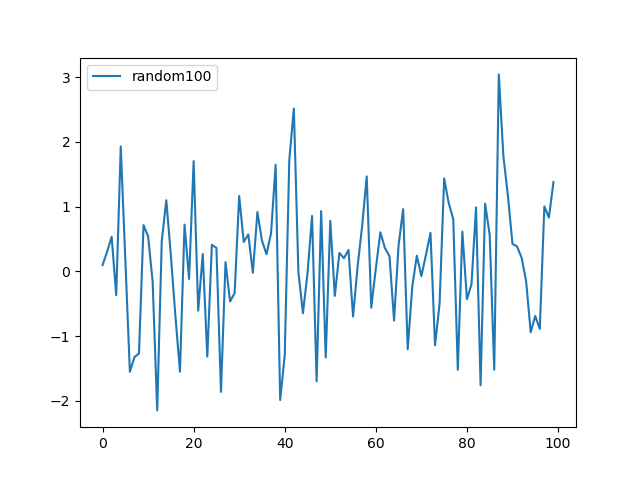

## 图例

图例和注解清晰连贯地解释了数据图表的内容。`plt.legend()`用来添加图例，比如默认的图例是没有说明文字的，尽管我们在绘制图形的时候设定了`label`属性。


如果要将图例说明显示出来，需要默认调用`legend()`将其展示出来。比如调用`plt.legend(loc=0)`
将说明显示在最佳的位置，loc参数为location code，0代表`best`, 1代表`upper right`...




plt.legend接收不同的位置参数，0表示最佳显示位置（尽可能不阻挡数据的显示），参数列表如下：

|Loc|Description|
|-|-|
|Empty|Automatic|
|0|Best possible|
|1|Upper right|
|2|Upper left|
|3|Lower left|
|4|Lower right|
|5|Right|
|6|Center left|
|7|Center right|
|8|Lower center|
|9|Upper center|
|10|Center|

```
plt.plot(y[:, 0], lw=1.5, label='1st') # 设置第0列数据集的标签为1st。
plt.plot(y[:, 1], lw=1.5, label='2nd') # 设置第1列数据集的标签为2nd。
plt.legend(loc=0) # 使用legend, loc设置位置
```

参考

- [matplotlib.pyplot.legend](https://matplotlib.org/3.1.0/api/_as_gen/matplotlib.pyplot.legend.html )
- [Matplotlib 系列之「Legend 图例」](https://zhuanlan.zhihu.com/p/41781440)

## 图例框

```
legend(bbox_to_anchor=(0., 1.02, 1., .102), loc=3,
       ncol=3, mode="expand", borderaxespad=0.)
```
