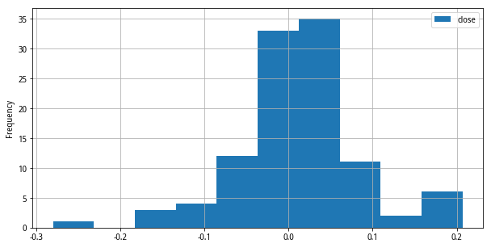
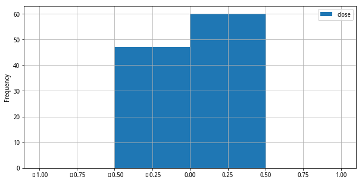
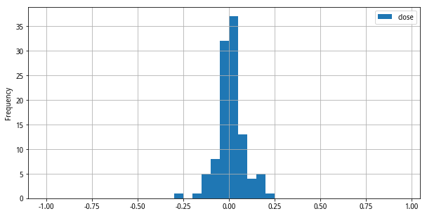

## 什么是直方图

直方图通常用来展示数据的分布情况，通过直方图能够对整个数据集合有一个感性的认识。下面是一个简单的直方图：


直方图会将要展示的数据按照数值的范围切割为多个组/间隔，这些组/间隔在英文中称作`bin`，然后会统计出处在各个数据段中的数据个数并且以不同长度的长条展示出来。所以，直方图本身也是一种条形图。

## 使用pandas的hist函数

Python强大的能力一方面来自于它具有强大的生态。我们现在使用Python来画直方图，首先需要认识两个新的Python函数库（也可以叫函数模块）：

- pandas：基于numpy之上构建，除了具有NumPy高性能的数组计算功能，还具有便捷地处理结构化数据如电子表格、关系型数据库数据的功能。
- matplotlib：专门用于绘制数据图表的Python库，支持绘制不同的图形，不管是2D、3D，所以里面还细分了一些子模块，其中的`pyplot`子模块专门用来绘制2D图形。

要画出直方图可以使用pandas里的`hist()`函数，但我们经常可以看到一些相似的接口，比如[pandas.DataFrame.hist](https://pandas.pydata.org/docs/reference/api/pandas.DataFrame.hist.html)，[pandas.DataFrame.plot.hist](https://pandas.pydata.org/pandas-docs/stable/reference/api/pandas.DataFrame.plot.hist.html)和[matplotlib.pyplot.hist()](https://matplotlib.org/3.5.1/api/_as_gen/matplotlib.pyplot.hist.html)。

它们之间的区别在于`pandas.DataFrame.plot.hist`将整个dataframe的数据展示在一幅图上，而`pandas.DataFrame.hist`会调用`pandas.DataFrame.plot.hist`将dataframe的数据按照不同的列分别展现在不同的图形上。然而，`pandas.DataFrame.plot.hist`本身调用的是`matplotlib.pyplot.hist()`。简单点说，pandas里面相关的hist函数都是基于matplotlib里面的pyplot所做的封装。

前面展示的直方图只需要通过一条语句：`df.plot.hist()`，df是一个有数据的dataframe对象。

## 自定义bin

在使用`df.plot.hist()`画直方图的时候，如果不给定参数那么它会使用默认的参数，比如默认bin个数是10个，所以在下图中我们可以看到针对10个数据期间的统计：



那如果我们想自定义bin的个数该怎么办？

在[Pandas Histogram | pd.DataFrame.hist()](https://www.youtube.com/watch?v=zNvxJNQhmRs)这个视频里面可以学习到可以创建自定义的bin，比如`df.plot.hist(bins=[-1,-0.5,0,0.5,1])`就可以基于之前的数据创建4个bin，不过我使用的数据集里面最小值为-0.280046，最大值为0.206925，所以介于[-1,0.5]和[0.5,1]区间的统计个数为0，下面的图里面没有显示出来：



```
close
count  107.000000
mean     0.010270
std      0.073476
min     -0.280046
25%     -0.021101
50%      0.012975
75%      0.038590
max      0.206925
```

我使用的这些数据是某只指数以“月”为单位的涨跌数据，我上面给定的范围实际上对于股票市场的涨跌幅来说确实过大了，一个更实际的需求是：*我想查看这只指数成立以来以5%的涨跌幅为单位的分布情况。*

那该如何做？很显然我不可能在`df.plot.hist(bins=[...])`参数列表里手写20个范围的值，对吧？

一旦明白了自身的需要，那么答案就比较容易了，因为我们看到bins参数需要的是一个列表，虽然不能直接手写20个范围，但我们可以使用Python里面的列表解析方法来便捷的创建列表，也就是我们可以写成`bins=[n/100 for n in range(-100, 100, 5)]`，这样就达到要求了。




## 添加图形注释

上面绘制的直方图都是没有注释的，那我们怎么能够把一些注释标记在图形上面呢？

可以适用专门的标记函数[matplotlib.pyplot.annotate](https://matplotlib.org/3.5.1/api/_as_gen/matplotlib.pyplot.annotate.html)，只不过使用这个函数需要一些前期的准备共作，比如：

- 需要保存调用hist()函数返回的`AxesSubplot`对象，并且需要了解这个对象，特别是里面包含了图形当中的各种元素。
- 从`AxesSubplot`对象里面遍历获取每个bar的x坐标和y坐标，以及bar的宽度，用来决定注释的位置
- 再加上一些基本的样式调整，比如注释文本距离指定坐标的偏移，是否居中显示

于是我们用下面的代码画出有注释标记的直方图：

```
ax = df.plot.hist(bins=[n/100 for n in range(-100, 100, 5)])

for bar in ax.patches:
  ax.annotate(format(bar.get_height(), '.0f'),
                   (bar.get_x() + bar.get_width() / 2,
                    bar.get_height()), ha='center', va='center',
                   size=15, xytext=(0, 8),
                   textcoords='offset points')
```


## 参考

- [pandas.DataFrame.plot.hist](https://pandas.pydata.org/pandas-docs/stable/reference/api/pandas.DataFrame.plot.hist.html)
- [Pandas Histogram | pd.DataFrame.hist()](https://www.youtube.com/watch?v=zNvxJNQhmRs)
- [Creating Histograms using Pandas](https://mode.com/example-gallery/python_histogram/)
- [What is pyplot?](https://www.educative.io/edpresso/what-is-pyplot-in-python)
- [Pandas.DataFrame.hist() function in Python](https://www.geeksforgeeks.org/pandas-dataframe-hist-function-in-python/)
- [How To Annotate Bars in Barplot with Matplotlib in Python?](https://www.geeksforgeeks.org/how-to-annotate-bars-in-barplot-with-matplotlib-in-python/)
- [Text and Annotation](https://jakevdp.github.io/PythonDataScienceHandbook/04.09-text-and-annotation.html)
- [Clearing the confusion once and for all: fig, ax = plt.subplots()](https://towardsdatascience.com/clearing-the-confusion-once-and-for-all-fig-ax-plt-subplots-b122bb7783ca)
