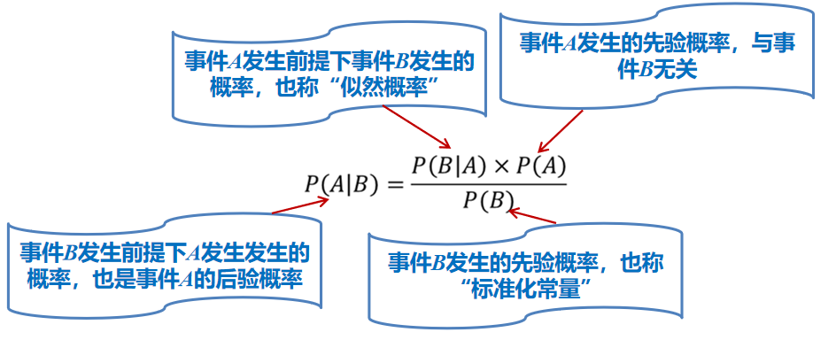

## 贝叶斯分布

贝叶斯分析是一种根据概率统计知识对数据进行分析的方法，属于统计学分类的范畴。生活中的例子：

- 一条街上哪个饭馆最好吃?
- 新开发的App应该等做得尽善尽美再发布，还是应该尽早发布，用互联网的力量帮助它完善?
- 我应该选择哪个工作offer或者还是考公务员才能使自己的收益最大化?
- 比如使用谷歌的时候，如果你拼错一个单词，它会提醒你正确的拼法。

## 频率学派

根据历史的数据来计算概率，会忽略当前正在发生的事情可能导致的概率变化因素。比如A和B两支球队比赛100场，A队胜了65场，那么就会认为下一场A队获胜的概率为65%。

但实际上，在下一场开场之前可能A队有高水平球员缺席，B队新引进了外援，但这些因素通通都被忽略掉。

这种计算概率方法称为“频率学派概率”，该方法从历史数据中计算某个事件的概率，认为只要采样足够多，事件发生的频率就可无限逼近真实概率。

## 贝叶斯方法

18世纪的英国数学家和神职人员Thomas Bayes（托马斯·贝叶斯）认为如上的通过频率来计算概率的方法不准确，必须要引入更多的信息。也就是既要考虑历史事实，又要考虑当前事实，便有如下公式：

> 后验概率 = 先验概率 X 似然概率（新增信息带来的调节程度）

基于贝叶斯概率的计算方法认为某个事件发生的概率不仅与先前这个事件发生的概率相关（先验概率），也与后期计算该事件概率时所观测到的“新近”信息有关（似然概率）。

推导过程：

- $P(A|B)$：表示事件 $B$ 发生的前提下，事件 $A$ 发生的概率：$P(A|B)=\frac{P(A ∩ B)}{P(B)}$
- $P(B|A)$：表示事件 $A$ 发生的前提下，事件 $B$ 发生的概率：$P(B|A)=\frac{P(A ∩ B)}{P(A)}$
- 那么，就有$P(A|B)\times P(B) = P(B|A) \times P(A)$,即：$P(A|B)=\frac{P(B|A) \times P(A)}{P(B)}$

为了计算 P(A|B)，可预先估计一个先验概率 P(A)，然后根据实际情况来计算 P(B|A)/P(B)，用其作为调节因子，基于观测到的新增信息，对先验概率 P(A) 不断修正，得到更为准确的后验概率 P(A|B)。

上面这个公式就是贝叶斯公式，回到上面这个例子中有（可能不对）：

- $P(A|B)$：B获胜的情况下，A队再获胜的概率
- $P(B|A)$：似然概率，A获胜的情况下，B队再获胜的概率
- $P(A)$：先验概率，A队获胜的概率，为35%。
- $P(B)$：先验概率，B队获胜的概率，为65%。

## 贝叶斯推理：广告邮件自动识别

情况一：假设采集到了 10000 个邮件样本，其中有 4000 封邮件被认定为广告邮件、6000 封被认定为正常邮件。这 4000 封广告邮件中，出现“红包”关键词的有 1000 封 ，而在 6000 封正常邮件中仅有 6 封包含“红包”这个词。请问这封包含了“红包”单词的邮件是广告邮件的概率有多大？

- $P(广告邮件) = \frac{4000}{10000} = \frac{2}{5}；P(正常邮件) = \frac{6000}{10000} = \frac{3}{5}$
- $P(出现“红包”|广告邮件) = \frac{1000}{4000} = \frac{1}{4}$
- $P(出现“红包”|正常邮件) = \frac{6}{6000} = \frac{1}{1000}$
- $P(出现“红包”) = \frac{1006}{10000}$
- $P(正常邮件|出现“红包”)=\frac{P(正常邮件)P(出现“红包”|正常邮件)}{P(出现“红包”)} = \frac{0.6\times 0.001}{1006\div 10000} ≈ 0.006 $
- $P(广告邮件|出现“红包”)=\frac{P(广告邮件)P(出现“红包”|广告邮件)}{P(出现“红包”)} = \frac{0.4\times 0.25}{1006\div 10000} ≈ 0.994 $

情况二：假设在过年期间采集到了 10000 个邮件样本，其中有 4000 封邮件被认定为广告邮件、6000 封被认定为正常邮件。这 4000 封广告邮件中，出现“红包”关键词的有 1000 封，在 6000 封正常邮件（大多以拜年为主）中有 5000 封包含了“红包”这个词。请问这封包含了“红包”单词的邮件是广告邮件的概率有多大？

- $P(广告邮件) = \frac{4000}{10000} = \frac{2}{5}；P(正常邮件) = \frac{6000}{10000} = \frac{3}{5}$
- $P(出现“红包”|广告邮件) = \frac{1000}{4000} = \frac{1}{4}$
- $P(出现“红包”|正常邮件) = \frac{5000}{6000} = \frac{5}{6}$
- $P(出现“红包”) = \frac{6000}{10000}$
- $P(正常邮件|出现“红包”)=\frac{P(正常邮件)P(出现“红包”|正常邮件)}{P(出现“红包”)} = \frac{0.6\times 0.833}{6000\div 10000} ≈ 0.833 $
- $P(广告邮件|出现“红包”)=\frac{P(广告邮件)P(出现“红包”|广告邮件)}{P(出现“红包”)} = \frac{0.4\times 0.25}{6000\div 10000} ≈ 0.166 $

在上述两种情况计算中，先验概率取值是一样的，但是由于似然概率取值发生了巨大变化，因此产生了很大的调节作用，使得计算结果大相径庭。

在上述后验概率计算过程中，某个事件发生或不发生的后验概率公式中分母均是一样的，因此很多时候在计算后验概率时，我们会省略分母，直接计算“先验概率乘以似然概率”。

在贝叶斯分类中，邮件要被先标注为“正常邮件”和“不正常邮件”，然后开始分类，这种利用了类别标签信息的分类方法，属于有监督机器学习。

## 朴素贝叶斯分类器

## 深入朴素贝叶斯

- 多项式朴素贝叶斯（ multinomial naive Bayes ），适用于服从多项式服从的数据，离散型数据。文本分类 （这个领域中数据往往以词向量表示）。
- 伯努利朴素贝叶斯（ Bernoulli naive Bayes） 适用于伯努利分布（二值分布）的特征，离散型数据。
- 高斯朴素贝叶斯（ GaussianNB ） 适用于高斯分布（正态分布）的特征，连续型数据。

## CHANGE LOG

- 20240115：公式太多，没太明白，有点泄气。