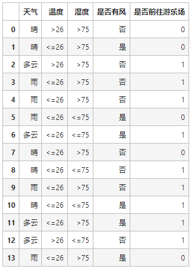

## 决策树

决策树是一种通过树形结构进行分类的方法。在决策树中，树形结构中每个节点表示对分类目标在属性上的一个判断，每个分支代表基于该属性做出的一个判断，最后树形结构中每个叶子节点代表一种分类结果。

- “根节点”只有向下分类的箭头
- 除了“根节点”和“叶子节点”的为“中间节点”，“中间节点”总是有箭头指向它们，也有箭头离开它们
- “叶子节点”只有箭头指向它们，但没有箭头离开它们

## 创建决策树

比如针对下面这张表格创建决策树，到底把“天气”、“温度”、“湿度”还是“是否有风”放在根节点上？

无论哪一种都不能够完美的把去游乐场和不去游乐场切分出来，为了决定哪一种切分方式最好，我们需要去计算切分方法的纯度。

## 信息熵

计算信息的不确定性来度量信息，信息量的大小定义为“信息熵”（entropy），这个概念是克劳德·艾尔伍德·香农（Claude Elwood Shannon）提出的。

直觉上，对一个不确定信息的了解需要更多信息，对一个确定信息的了解需要的信息更少。从信息论的角度，对信息的度量等于计算信息不确定性的多少。

假设有 $K$ 个信息，其组成了集合样本 $D$ ，记第 $k$ 个信息发生的概率为 $p_k(1≤k≤K)$。这 $K$ 个信息的信息熵：

$$E(D)=-\sum_{k=1}^{K}p_k log_{2} p_k$$

$E(D)$ 的值越小，表示$ D $ 包含的信息越确定，也称$ D $的纯度越高。**所有 $p_k$ 累加起来的和为1**。

## 信息增益

信息增益用来衡量样本集合复杂度（不确定性）所减少的程度。

$$Gain(D,A)=E(D)-\sum_{i}^{n}\frac{|D_i|}{D}E(D_i)$$

注：对应分支节点所包含子样本集记为 $D_i$ ，该子样本集包含样本数量记为 $|D_i|$

通常情况下，某个分支的信息增益越大，则该分支对样本集划分所获得的“纯度”越大，信息不确定性减少的程度越大。