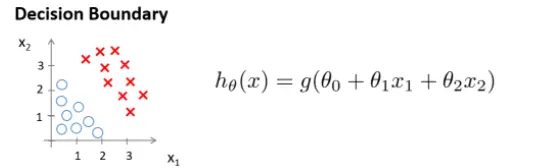
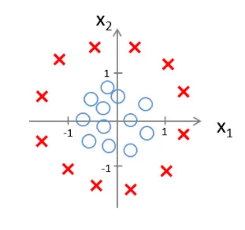

## 逻辑回归

逻辑回归在现实生活中的运用十分广泛，比如判断垃圾邮件，网购的商品是否存在欺诈，肿瘤是恶性还是良性等等。

## 逻辑回归与线性回归的区别

逻辑回归通常用来针对分类问题，从简单的二元分类到多元分类，它对应着一种分类算法，它名字里面有“回归”二字是有历史原因的。比如对于二元分类问题的输出值永远是0或者1，如果使用线性回归的算法来解决逻辑回归会有两个问题：

1. 线性回归的假设函数是连续的，应用到二元分类时必然需要通过阈值来进行辅助判断，但可能会因为偶尔的离群值将整体的判断质量变得更加糟糕。
2. 尽管二元分类的输出值只有`0`和`1`，但是线性回归假设函数的输出值可能大于`1`或者小于`0`。

## 假设陈述

在线性回归时应用的最简单的假设函数为：

$ h_{\theta}(x)=\theta^{T}x $

在二元分类中同样需要一个方程来表示假设。针对二元分类的问题，可以基于如上的假设函数进行改进：

$ h_{\theta}(x)=g\left({\theta^{T}x}\right) $

$ g(z)=\frac{1}{1 + e^{-z}} $

以上的`g(z)`就是“逻辑函数”，所以求解这个“逻辑函数”的过程被称为“逻辑回归”。合并如上两个函数可得：

$ h_{\theta}(x)=\frac{1}{1 + e^{-{\theta^{T}x}}} $

## 决策界限

什么时候判定假设函数的值为1和0呢？通常当 $ h_{\theta}(x) \geq 0.5$ 是为1，当 $ h_{\theta}(x) < 0.5$ 为0。而根据$ g(z)=\frac{1}{1 + e^{-z}} $的函数图形知道：

- 当 $ z \geq 0$ 的时候，也就是 ${\theta^{T}x \geq 0 } $ 的时候，$ h_{\theta}(x) \geq 0.5 $，取值为`1`。
- 当 $ z < 0$ 的时候，也就是 ${\theta^{T}x < 0 } $ 的时候，$ h_{\theta}(x) < 0.5 $，取值为`0`。

决策边界是假设函数的一个属性。

## 模型应用一：线性决策边界

考虑下面这个模型，如何确定一条直线将O和X分开：



这个模型的假设函数可以用 $ h_{\theta}(x) = g\left({\theta^{T}x}\right) = g\left( \theta_{0} + \theta_{1}x1 + \theta_{2}x2 \right)$ 来表示。

假设我们已经确定了各项 $\theta$ 的值，比如 $\theta_{0} = -3, \theta_{1} = 1, \theta_{2} = 2 $，那么实际上也就有：$ h_{\theta}(x) = g\left( -3 + x1 + x2 \right)$

- 当 $ -3 + x1 + x2 \geq 0$ 的时候，假设函数的值判定为 1
- 当 $ -3 + x1 + x2 < 0$ 的时候，假设函数的值判定为 0

而 $ -3 + x1 + x2 = 0$ 就是该模型对应的“决策边界”。

当然在还没有确认假设函数的时候，我们需要通过训练集来求出 $\theta_{0}, \theta_{1}, \theta_{2} $。

## 模型应用二：非线性决策边界

考虑下面这个模型，如何确定一条曲线将O和X分开，通常都是通过多项式来求得假设函数，对于曲线的求取需要更复杂的多项式。



假设我们已经确定了：

$ \theta = \begin{bmatrix}
  -1 \\
  0 \\
  0 \\
  1 \\
  1 \\
\end{bmatrix} $ 

也就是  $\theta_{0} = -1, \theta_{1} = 0, \theta_{2} = 0, \theta_{3} = 1, \theta_{4} = 1 $，那么实际上也就有：$ h_{\theta}(x) = g\left( -1 + x1^2 + x2^2 \right)$

根据上面对于 $ \theta^{T}x $ 的讨论：

- 当 $ -1 + x_1^2 + x_2^2 \geq 0$ 的时候，假设函数的值判定为 1
- 当 $ -1 + x_1^2 + x_2^2 < 0$ 的时候，假设函数的值判定为 0

而 $ -1 + x_1^2 + x_2^2 = 0 $ 就是该模型对应的“决策边界”。

## 如何确定回归参数$ \theta $：定义代价函数

按照之前的线性回归，同样地我们需要确认代价函数，用来拟合并确定 $ \theta $。在线性回归里面模型里面的代价函数是所有模型误差的平方和，但逻辑回归里面的代价函数却是一个非凸函数。

线性回归的代价函数为：

 $ \frac{1}{2 m} \sum_{i=1}^{m}\left(h_{\theta}\left(x^{(i)}\right)-y^{(i)}\right)^{2}$ 

重新定义逻辑回归的代价函数为：

$ \frac{1}{m} \sum_{i=1}^{m}Cost\left(h_{\theta}\left(x^{(i)}\right),y^{(i)}\right)$ 

其中对于 $ Cost(h_\theta(x), y) $ 来说：

- $ if y = 1, -\log(h_\theta(x))$
- $ if y = 0, -\log(1 - h_\theta(x))$

简化为：$ Cost(h_\theta(x),y) = -y\times\log(h_\theta(x)) - (1 - y)\times\log(1-h_\theta(x))  $ ，带入代价函数得到：

$$ J(\theta) = -\frac{1}{m}\sum^{m}_{i=1}[y^{(i)}\log(h_\theta(x^{(i)})) + (1-y^{(i)})\log(1-h_\theta(x^{(i)}))] $$

## 如何确定回归参数 $ \theta $：梯度下降

最小化代价函数的方法，如同线性回归一样，同样需要使用梯度下降法。

$$ \theta_j := \theta_j - \alpha \frac{1}{m}\sum^m_{i=1}(h_\theta(x^{(i)})-y^{(i)})x^{(i)}_j $$

这个更新规则是线性回归的相同，但因为假设函数已经发生变化，所以两者的梯度下降已经不同了。

## 高级优化算法

梯度下降并不是唯一用来计算代价函数的方法，还有一些更高优先级的算法。比如`BFGS` (变尺度法) ,`L-BFGS`(限制变尺度法)。

在Python里面可以直接使用`optimizer`来更新梯度，无需手动实现梯度下降算法来更新梯度：

```
import torch
import torch.nn as nn

model = nn.Sequential(nn.Linear(1,13))
# optimizer 的大致使用步骤
# 定义一个 optimizer
optimizer = torch.optim.Adam(model.parameters(), lr=0.001) # optimizer 使用 Adam

optimizer.zero_grad()  # 梯度置零
# 计算模型参数和梯度
# ...
# ...
# ...
optimizer.step()  # 利用梯度更新参数
```

## 多元分类

多元分类的问题有很多比如：

- 邮件归类：工作、朋友、家人、爱好等
- 药物诊断：感冒用、流感用
- 天气：晴天、阴天、雨天、多云

解决方案是通过训练集将一个多元分类的问题，转换为多个二元分类的问题。
