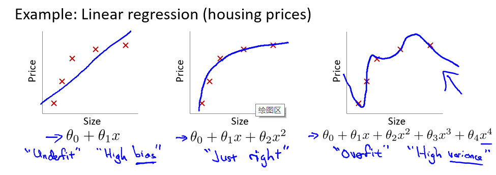

## 欠拟合（Underfit）和过拟合问题（Overfit）

- 欠拟合，另一种说法是这种算法有着“过高的偏差”，假设函数没有很好的拟合训练的数据。
- 过度拟合，另一种说法是这种算法有着“过高的方差”，能够很好的拟合历史数据，却不能够很好地预测新数据。

过度拟合的情况通常要是因为需要从一个高阶多项式去求取假设函数，但高阶多项式拥有很多的变量，训练集并不够充足。尽管训练过程中得到的假设函数能够拟合所有的训练集，但是数据不足以约束高阶多项式，以获得好的假设函数。

## 缓解过度拟合

当模型的数据维度过多，而训练集的数据量很少时，可能就会出现过拟合这个问题。当只有少数几个变量时，能够很容易通过可视化的方式来判断是否过度拟合，但变量多就很难了。

缓解过度拟合的方法通常有两种：

1. 人工检查变量清单，选取最重要的变量。或者使用模型选择算法。
2. 正则化，保留所有变量，但是减少变量的量级或者$\theta_j$ 的大小。