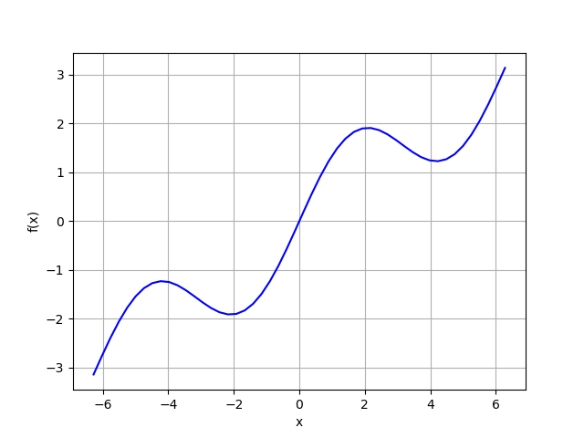
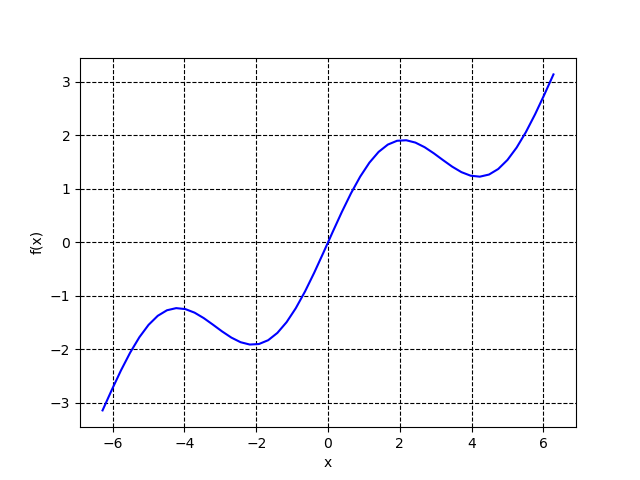

# plt.grid

在调用plt.plot()函数之后添加`plt.grid(True)`来显示网格，默认样式如下：

如果想要设定网格的样式，可以通过`plt.rc('grid', linestyle="--", color='black')`来设置，需要注意的是该语句需要放置在`plt.plot()`之前，放置在后面没有效果。

# 参考

- [How do I draw a grid onto a plot in Python?](https://stackoverflow.com/questions/8209568/how-do-i-draw-a-grid-onto-a-plot-in-python)
