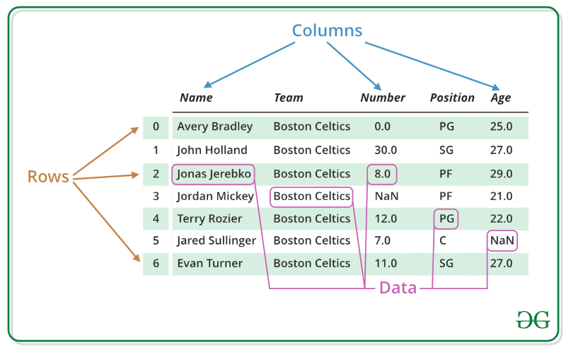

## [DataFrame](https://pandas.pydata.org/pandas-docs/stable/reference/frame.html)

DataFrame 是一个二维表式的数据结构，由data(数据)、rows(行)、columns(列)组成，数据基于行列进行存储，因此它既有行索引也有列索引，可被看做是由Series组成的字典（共用同一个索引）。

DataFrame每列的数据类型可以通过`print(df.dtypes)`显示出来。

## 属性

- DataFrame.shape ：显示行、列信息。
- DataFrame.dtypes ：显示行的类型。

*使用`len(df)`所打印出来的是df具有的行个数。*

## 方法

- DataFrame.head() ：默认显示前面5行的数据。
- DataFrame.describe() ：显示对应数据对应里面“数据列”的统计信息，包括count, min, max...
- DataFrame.describe(include=['object']) ：显示非数据列的统计信息，包括count, uniq, top, freq
