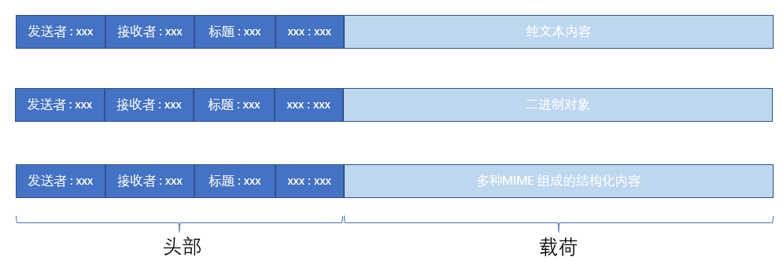

[email](https://docs.python.org/3/library/email.html)

## email.message

一封邮件包含头部和载荷两部分（均可能有多个），对于头部的定义，主要描述在[RFC 5322]()和[RFC 6532]()里面。对于载荷，可能是文本、二进制文件或者结构化的嵌套结构（包括多个Header和多个载荷，即multipart类型）。

- 简单消息对象：比如字符串或者二进制文件，载荷就是单个`EmailMessage`对象。
- 对于像multipart这样的包含多个载荷MIME容器，载荷就是`EmailMessage`列表。

```
email.message.EmailMessage
- add_header()
- set_content()，最简单的方式
- add_related()，内容有内嵌资源
- add_alternative()
- add_attachment()，内容有附件
```

要明白上面几种函数的不同，[用python发送邮件的基本原理](https://www.codenong.com/cs109278274/)有说明。最简单的邮件格式就是`text/plain`，如果要添加更丰富的内容就需要涉及到下面这几种类型的邮件格式：

- multipart-alternative: 邮件体内的同级内容，根据邮箱系统的环境，只显示最优效果的一个内容。
- multipart-related: 邮件体内的内容，显示一个主体内容，其他内容以相关的内联方式显示在主体内。一般主体是html内容，其他是要显示在html中的图片、音乐、视频。关联是通过Content-来实现。
- multipart-mixed: 邮件体内各种内容，包括前面两种，另外还可以处理附件。


参考：

- [email.message](https://docs.python.org/3/library/email.message.html)
- [MIME 类型](https://developer.mozilla.org/zh-CN/docs/Web/HTTP/Basics_of_HTTP/MIME_types)
- [email - How to Represent an Email Message in Python?](https://coderzcolumn.com/tutorials/python/email-how-to-represent-an-email-message-in-python)
- [email.contentmanager: Managing MIME Content](https://docs.python.org/3/library/email.contentmanager.html)


## 发送文本

```
from email.message import EmailMessage

msg = EmailMessage()
msg.set_content("hello world") # 此时的消息类型为text/plain
msg['Subject'] = 'say hello'
msg['From'] = me
msg['To'] = you

s = smtplib.SMTP('localhost')
s.send_message(msg)
```

调用`set_content()`传入的是字符串，所以会设定邮件的类型为`text/plain`，这也是该接口的默认值：

```
email.contentmanager.set_content(msg, <'str'>, subtype="plain", charset='utf-8', cte=None, disposition=None, filename=None, cid=None, params=None, headers=None)
email.contentmanager.set_content(msg, <'bytes'>, maintype, subtype, cte="base64", disposition=None, filename=None, cid=None, params=None, headers=None)
email.contentmanager.set_content(msg, <'EmailMessage'>, cte=None, disposition=None, filename=None, cid=None, params=None, headers=None)

   Add headers and payload to msg:
```

*注1：使用抄送的时候直接用msg['Cc'] = address list即可。*
*注2：邮箱地址需要用列表，比如['address 1', 'address 2'...]，不能用shell里的"address 1;address 2"这种形式。*


## 发送html

`email.message`这个模块里面的核心类是[EmailMessage](https://docs.python.org/3/library/email.message.html#email.message.EmailMessage)。那这个`EmailMessage`又是什么呢？其实这个对象提供了一些函数可以直接添加多种类型的内容，而不用像老的API那样组装邮件内容时需要先创建`MIMEText`, `MIMEImage`或者其他的对象。比如下面是一个发送邮件正文为纯文本的例子：

```
import smtplib
from email.message import EmailMessage

msg = EmailMessage()
msg['From'] = '你的163邮箱地址'
msg['To'] = '接收者邮箱地址'
msg['Subject'] = 'Hello world'
msg.set_content("There you are!")

mail_server = smtplib.SMTP_SSL('smtp.163.com',port=465)
mail_server.login('你的163邮箱账号', '你的SMTP授权码')
mail_server.send_message(msg)
```

测试成功之后我决定尝试着发送html网页，于是我先创建了一个最简单的html网页，名称为`display.html`，然后尝试将它的内容读出来再调用`set_content`填充到msg里面，最后发送出去。

```
import smtplib
from email.message import EmailMessage

msg = EmailMessage()
msg['From'] = '你的163邮箱地址'
msg['To'] = '接收者邮箱地址'
msg['Subject'] = 'Hello world'
msg.set_content("There you are!")

mail_server = smtplib.SMTP_SSL('smtp.163.com',port=465)
mail_server.login('你的163邮箱账号', '你的SMTP授权码')
with open("display.html") as f:
    msg.set_content(f.read())
mail_server.send_message(msg)
```

我看到的内容并不是展示出来的html内容，而全是代码。问题出在哪里？在网络上进行查找对比之后是因为在`set_context()`的时候没有设置内容格式因此默认当作纯文本格式了，只需要设置`msg.set_content(f.read(), 'html')`就可以。在官方文档[email: Examples](https://docs.python.org/3/library/email.examples.html)的一个例子里面，使用`msg.add_attachment(f.read(), subtype='html')`也是可以成功的。

邮件格式会从`text/plain`变更为`multipart/alternative`。

## 将多个html写入邮件

如果想将多个html文件写入邮件正文，调用`msg.set_content(f.read(), 'html')`仅仅会写入最后一个，也就是之前的被后面的覆盖。

解决方案就是提前将多个html文件的代码合并到同一个html文件。

## 发送图片

我们提到新版本的Python（3.6）引入了[EmailMessage](https://docs.python.org/3/library/email.message.html#email.message.EmailMessage)，以便通过统一接口来操作各种MIME type类似，前面我们仅仅提到了发送文本的做法，那么发送图片如何处理呢？

在之前的版本，比如大树兄的版本里面发送图片需要手动创建`MIMEMultipart`做为邮件的主体对象，然后分别创建`MIMEText`和`MIMEImage`分别将文本对象和图片对象组合到主体对象中。如果直接使用`EmailMessage`就不需要这么麻烦了，直接调用`add_attachment()`进行添加即可。

```
msg = MIMEMultipart()
content = MIMEText(html, _subtype='html', _charset='utf8')
msg.attach(content)
for id, pic in picture.items():
    img = MIMEImage(open(pic, 'rb').read(), _subtype='octet-stream')
    img.add_header('Content-ID', id)
    msg.attach(img)

msg = EmailMessage()
msg.add_attachment(html, subtype='html')
for id, pic in picture.items():
    msg.add_attachment(open(pic, 'rb').read(), maintype='image', subtype='png',cid=id)
```

另外一个知识点，从廖雪峰的[SMTP发送邮件](https://www.liaoxuefeng.com/wiki/1016959663602400/1017790702398272#0)才搞明白`add_alternative()`实际上添加的是一个备选项，比如下面这段代码的意思是先用`set_content()`将邮件正文设置为“text里面的内容”，这种是纯文本；同时也用`add_alternative()`添加一种备选的html格式的正文，如果接收者的邮箱支持html那么默认按照html格式展示html_content，如果不支持那么以纯文本展示text包含的纯文本内容。也就是这添加的两种内容仅仅只会展示一种。

```
msg = EmailMessage()
msg.set_content(text)
msg.add_alternative(html_content, subtype='html')
```

参考：

- [Python SMTP发送邮件](https://www.runoob.com/python/python-email.html)
- [email — An email and MIME handling package](https://docs.python.org/3/library/email.html)
- [email: Examples](https://docs.python.org/3/library/email.examples.html)
- [Python smtplib模块详解：发送邮件](https://naoketang.com/p/dlr7326xqpog)
- [SMTP发送邮件](https://www.liaoxuefeng.com/wiki/1016959663602400/1017790702398272#0)
- [Multipurpose Internet Mail Extensions (MIME) Part One: Format of Internet Message Bodies](https://tools.ietf.org/html/rfc2045.html#page-10)
- [Multipurpose Internet Mail Extensions (MIME) Part Two: Media Types](https://tools.ietf.org/html/rfc2046#page-17)

## 发送压缩包附件

使用[email: Examples](https://docs.python.org/3.9/library/email.examples.html#id2)中的一个例子：

```
import mimetypes
from email.message import EmailMessage

for filename in os.listdir(directory):
        path = os.path.join(directory, filename)
        if not os.path.isfile(path):
            continue        
        ctype, encoding = mimetypes.guess_type(path)
        if ctype is None or encoding is not None:            
            ctype = 'application/octet-stream'
        maintype, subtype = ctype.split('/', 1)
        with open(path, 'rb') as fp:
            msg.add_attachment(fp.read(),
                               maintype=maintype,
                               subtype=subtype,
                               filename=filename)
```

## 发送图片附件

继续上面的例子，如果我们使用`add_attachment`来添加附件时，那么邮件的格式会从`text/plain`变更为`multipart/mixed`。

```
add_attachment(*args, content_manager=None, **kw)

    ... If the message is a non-multipart, multipart/related, or multipart/alternative, call make_mixed() and then proceed as above...
```

代码如下：

```
# And imghdr to find the types of our images
import imghdr

msg = EmailMessage()
msg['Subject'] = 'Our family reunion'
msg['From'] = me
msg['To'] = you

# Open the files in binary mode.  Use imghdr to figure out the
# MIME subtype for each specific image.
for file in pngfiles:
    with open(file, 'rb') as fp:
        img_data = fp.read()
    msg.add_attachment(img_data, maintype='image',
                                 subtype=imghdr.what(None, img_data))

with smtplib.SMTP('localhost') as s:
    s.send_message(msg)
```

当然，[这里](https://coderzcolumn.com/tutorials/python/email-how-to-represent-an-email-message-in-python#Example-6:-Add-Attachment-and-Get-Body-Contents-from-Multipart-Mail)也有一个添加图片作为附件的例子，使用了`mimetypes`来判断图片的类型。

转换之后的结构可以参考[Convert a Message to Multipart/Mixed](https://coderzcolumn.com/tutorials/python/email-how-to-represent-an-email-message-in-python#Example-10:-Convert-a-Message-to-Multipart/Mixed)，简单来说转换之前只有1个EmailMessage，转换之后就是一个嵌套层次：1个EmailMessage里面再包装1个EmailMessage。


## Legacy API

- [email.mime](https://docs.python.org/3/library/email.mime.html?highlight=mimetext#email.mime.text.MIMEText)

[email.message: Representing an email message](https://docs.python.org/3/library/email.message.html#module-email.message)里面知道邮件内容的组成可以分为“头部”和“载荷（内容）”两部分，前者用来存储邮件相关属性，比如发送者、接收者之类，后者就是邮件的正文。邮件的正文又可以分为不同的格式，略做草图如下：



所以，从上面这个例子里面我们创建了一个`MIMEText`对象，这个对象对应的就是上图中的第一种，也就是载荷部分携带的是纯文本。但从上面的`email.mime`链接里面其实可以知道用来在邮件里面添加更加多样化的内容，包括：

- MIMEImage：创建`image`类型的对象，传送图片
- MIMEAudio：创建`audio`类型的对象，传送音频
- MIMEApplication：创建`application`类型的对象，传送应用

如果我们需要在载荷里面携带多种类型的数据，那么就必须创建`MIMEMultipart`对象，使用它的`attach()`函数将多种类型的数据组装到这个对象，再统一发出。比如@江南有大树的代码就是这么办的：

```
# 构建message
msg = MIMEMultipart()
# 添加邮件内容
content = MIMEText(html, _subtype='html', _charset='utf8')
msg.attach(content)
# 构建并添加图像对象
for id, pic in picture.items():
    img = MIMEImage(open(pic, 'rb').read(), _subtype='octet-stream')
    img.add_header('Content-ID', id)
    msg.attach(img)
```
