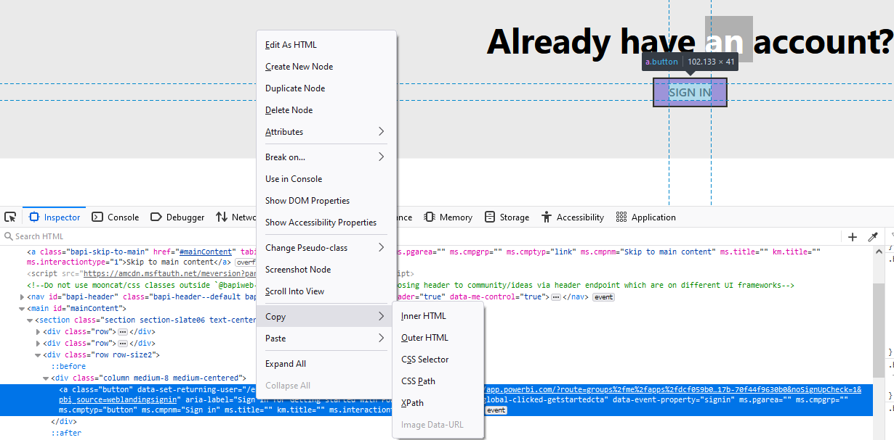

## [Selenium](https://selenium-python.readthedocs.io/)

Selenium使用对应浏览器的驱动来和浏览器进行交互，比如Firefox使用geckodriver, Chrome使用chromedriver，其他浏览器都可以在Selenium说明文档[1.5. Drivers](https://selenium-python.readthedocs.io/installation.html#drivers)找到。

使用浏览器主要涉及打开并和页面进行交互的过程，这里面的步骤大致包括下面几步：

- step 1：打开页面
- step 2：定位到页面的某个/某些元素
- step 3：操作元素
- step 4：关闭页面


### [打开浏览器]()

最简单的方式就是通过get()函数来打开页面：

```
from selenium import webdriver
driver = webdriver.Firefox()
driver.get("http://www.google.com")
```

在API文档[7.20. Remote WebDriver](https://selenium-python.readthedocs.io/api.html?highlight=maximize_window#module-selenium.webdriver.remote.webdriver)可以找到driver可以使用的很多功能。比如：

```
close() #关闭当前窗口
find_element_by_xpath() #查找元素
fullscreen_window() #全屏
get(url) #在当前窗口里面加载某个页面
get_screenshot_as_file(filename) #截图
get_window_position(windowHandle='current') #获取当前窗口坐标
get_window_size(windowHandle='current') #获取当前窗口尺寸
maximize_window() #最大化窗口
set_page_load_timeout(time_to_wait) #设置页面最大的加载时间
switch_to_active_element()
switch_to_alert()
```

使用driver.get()加载某个页面时，该函数尽管返回了（"onload"事件已处理）但是内容可能还没有加载完全（使用了很多AJAX就无法准确得知状态）。这个时候需要等待的话一种方式是使用python的时间模块提供的sleep功能，其实在[7.35. Wait Support](https://selenium-python.readthedocs.io/api.html?highlight=maximize_window#module-selenium.webdriver.support.wait)里面找到了对应的等待功能，亲测可用：

```
#将等待时间设定为10秒，10秒没有找到那么超时。
element = WebDriverWait(driver, 10).until(lambda x: x.find_element_by_id(“someId”))
```


### [定位页面元素](https://selenium-python.readthedocs.io/locating-elements.html#locating-elements)

定位到页面元素的手段比较多，常见是就是下面这些方法：

```
find_element_by_id
find_element_by_name
find_element_by_xpath
find_element_by_link_text
find_element_by_partial_link_text
find_element_by_tag_name
find_element_by_class_name
find_element_by_css_selector
```

举个例子，对于下面的输入框元素我们可以通过多种方法来找到它。

```
<input type="text" name="passwd" id="passwd-id" />

element = driver.find_element_by_id("passwd-id")
element = driver.find_element_by_name("passwd")
element = driver.find_element_by_xpath("//input[@id='passwd-id']")
element = driver.find_element_by_css_selector("input#passwd-id")
```

XPath是专门应用在XML文档里面搜索节点的语言，XPath支持根据id, name来定位元素，即便某个元素没有id/name，也可以通过XPath进行绝对定位（通过绝对路径？）和相对定位（根据具有id/name的元素进行相对位置的定位），并且还可以支持根据attributes来定位元素。

可以通过F12打开浏览器的开发人员工具很快的定位到具体元素，比如在下图里面可以很快的拷贝到特定元素的XPth，比如我拷贝出“SING IN”按钮的XPath为`/html/body/main/section[1]/div[3]/div/a`。




### [操作页面元素](https://selenium-python.readthedocs.io/navigating.html)

操作定位到的元素主要包括输入、点击等。

1）对于文本框的操作

```
# 输入内容
element.clear()
element.send_keys("some text")
```

2）对于可选元素的操作

```
from selenium.webdriver.support.ui import Select
select = Select(driver.find_element_by_name('name'))
select.select_by_index(index)
select.select_by_visible_text("text")
select.select_by_value(value)

# 取消选择
select = Select(driver.find_element_by_id('id'))
select.deselect_all()

# 获取选择项
select = Select(driver.find_element_by_xpath("//select[@name='name']"))
all_selected_options = select.all_selected_options
```

3）对于点击类型的按钮

```
# Assume the button has the ID "submit" :)
driver.find_element_by_id("submit").click()

# WebDriver 为每个element都提供了简便的submit函数来实现点击
element.submit()

# 点击
element.send_keys(" and some", Keys.ARROW_DOWN)
```

4）在Window和Frame之间移动

```
# 切换到某个window
driver.switch_to_window("windowName")

# 遍历每个打开的window
for handle in driver.window_handles:
    driver.switch_to_window(handle)

# 切换到某个frame
driver.switch_to_frame("frameName")

# 访问某个sub-frame
driver.switch_to_frame("frameName.0.child")
```

5）弹出的对话框

通过`alert = driver.switch_to.alert`可以访问弹出的alert对象，该接口也能够很好的访问confirm, prompt对象。


### [关闭页面]()


## Q&A

1）如何开始使用selenium ？

首先需要安装`selenium`，然后需要安装对应浏览器的驱动，比如Firefox的`geckodriver`，这个驱动的安装只需要把对应的exe（Windows系统下）下载下来并将其目录添加到系统PATH中即可。之后便是熟悉库里面各种变量和函数的使用。
