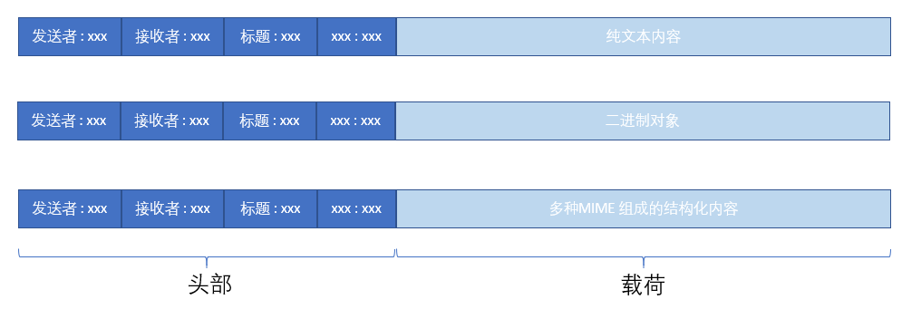

# 邮件服务端设置SMTP服务

Python函数库`smtplib`专门用来支持邮件的发送，这个库是基于SMTP（Simple Mail Transfer Protocol，简单邮件传输协议）的封装，发送邮件的过程我们需要创建对应的[SMTP的对象](https://docs.python.org/3/library/smtplib.html#module-smtplib)，用来创建SMTP对象的类定义有如下两种：

```
import smtplib

class smtplib.SMTP(host='', port=0, local_hostname=None, [timeout, ]source_address=None)

# 与SMTP行为一样，但支持SSL访问
class smtplib.SMTP_SSL(host='', port=0, local_hostname=None, keyfile=None, certfile=None, [timeout, ]context=None, source_address=None)
```

在创建该对象的时候我们需要明确要使用SMTP服务，也就是我们要使用哪里的邮件服务器来发送邮件，比如我现在要使用我已经注册的163邮箱来发送邮件，那么我们这里要先找到163提供了哪些邮件服务，这可以通过在邮箱设置里面查看得到。

比如我登录自己邮箱之后可以在【设置】选项里面找到[什么是POP3、SMTP和IMAP?](https://help.mail.163.com/faqDetail.do?code=d7a5dc8471cd0c0e8b4b8f4f8e49998b374173cfe9171305fa1ce630d7f67ac22dc0e9af8168582a)，里面包含了163提供的邮件服务：


上面就提供了“SMTP服务器地址”，“SSL协议端口号”和“非SSL协议端口号”，我们这个时候想使用支持SSL协议的SMTP服务，那么就可以创建下面的SMTP对象：

```
import smtplib

mail_server = smtplib.SMTP_SSL('smtp.163.com',port=465)
```


# 构建邮件内容

## SMTP.sendmail

在创建好这个对象之后，我们就可以使用SMTP的`sendmail`函数来进行邮件的发送，该函数声明为`SMTP.sendmail(from_addr, to_addrs, msg, mail_options=(), rcpt_options=())`。但在此之前我们要先准备好对应的参数信息：

- from_addr: 发送者邮件地址。我们使用163邮件服务，所以这里填写自己的邮箱账号。
- to_addrs：接收者邮件地址。可以支持多个。
- msg：要发送的消息。

邮件的消息`msg`这个时候是难点，我们无法直接发送字符串，而是需要使用SMTP协议里面定义好的邮件格式。比如我尝试如下这样来发送"hello"字符串，尽管邮件可以发送出去，但是你收到的邮件标题和内容都是空白的：

```
import smtplib

mail_server = smtplib.SMTP_SSL('smtp.163.com',port=465)
mail_server.login('你的163邮箱账号', '你的SMTP授权码')
mail_server.sendmail('你的163邮箱地址', '接收者邮箱地址', "hello")
```

这个原因就是前面提到的"hello"仅仅是一个纯字符串，没有遵循SMTP协议里面定义的邮件格式。这些格式有哪些呢，那就是MIME模块定义的那些消息格式([email.mime](https://docs.python.org/3/library/email.mime.html?highlight=mimetext#email.mime.text.MIMEText))，用来支持不同的邮件格式。比如我们这里选择支持文本类型的`MIMEText`重新编写如上代码：

```
import smtplib
from email.mime.text import MIMEText

msg = MIMEText('Can you see me?', 'plain', 'utf-8')
msg['Subject'] = 'Hello world'

mail_server = smtplib.SMTP_SSL('smtp.163.com',port=465)
mail_server.login('你的163邮箱账号', '你的SMTP授权码')
mail_server.sendmail('你的163邮箱地址', '接收者邮箱地址', msg.as_string())
```

这样你就能够接收到标题为“Hello world”，邮件内容为“Can you see me?”的邮件啦。

在这里我们需要理解一封邮件的内容是有特定的格式的，这些格式在协议里面定义。比如我们可以从[email.message: Representing an email message](https://docs.python.org/3/library/email.message.html#module-email.message)里面知道邮件内容的组成可以分为“头部”和“载荷（内容）”两部分，前者用来存储邮件相关属性，比如发送者、接收者之类，后者就是邮件的正文。邮件的正文又可以分为不同的格式，略做草图如下：



所以，从上面这个例子里面我们创建了一个`MIMEText`对象，这个对象对应的就是上图中的第一种，也就是载荷部分携带的是纯文本。但从上面的`email.mime`链接里面其实可以知道用来在邮件里面添加更加多样化的内容，包括：

- MIMEImage：创建`image`类型的对象，传送图片
- MIMEAudio：创建`audio`类型的对象，传送音频
- MIMEApplication：创建`application`类型的对象，传送应用

如果我们需要在载荷里面携带多种类型的数据，那么就必须创建`MIMEMultipart`对象，使用它的`attach()`函数将多种类型的数据组装到这个对象，再统一发出。比如@江南有大树的代码就是这么办的：

```
# 构建message
msg = MIMEMultipart()
# 添加邮件内容
content = MIMEText(html, _subtype='html', _charset='utf8')
msg.attach(content)
# 构建并添加图像对象
for id, pic in picture.items():
    img = MIMEImage(open(pic, 'rb').read(), _subtype='octet-stream')
    img.add_header('Content-ID', id)
    msg.attach(img)
```

## SMTP.send_message

更便捷的方法。

由于Python的生态在不断演进，所以很多以前的功能会推陈出新。比如发送邮件的函数除了上面使用的`send_email()`现在有了个[send_message()](https://docs.python.org/3/library/smtplib.html#smtplib.SMTP.send_message)，这个函数其实是对`send_email()`的封装，但你只需要在使用的时候传入一个msg参数就可以了，使用起来更加方便。

只不过我们使用`send_message()`这个新函数需要传入新的msg的类型：[EmailMessage](https://docs.python.org/3/library/email.message.html#email.message.EmailMessage)。那这个`EmailMessage`又是什么呢？其实这个对象提供了一些函数可以直接添加多种类型的内容，而不用先创建`MIMEText`, `MIMEImage`或者其他的对象。比如下面是一个发送邮件正文为纯文本的例子：

```
import smtplib
from email.message import EmailMessage

msg = EmailMessage()
msg['From'] = '你的163邮箱地址'
msg['To'] = '接收者邮箱地址'
msg['Subject'] = 'Hello world'
msg.set_content("There you are!")

mail_server = smtplib.SMTP_SSL('smtp.163.com',port=465)
mail_server.login('你的163邮箱账号', '你的SMTP授权码')
mail_server.send_message(msg)
```

测试成功之后我决定尝试着发送html网页，于是我先创建了一个最简单的html网页，名称为`display.html`，然后尝试将它的内容读出来再调用`set_content`填充到msg里面，最后发送出去。

```
import smtplib
from email.message import EmailMessage

msg = EmailMessage()
msg['From'] = '你的163邮箱地址'
msg['To'] = '接收者邮箱地址'
msg['Subject'] = 'Hello world'
msg.set_content("There you are!")

mail_server = smtplib.SMTP_SSL('smtp.163.com',port=465)
mail_server.login('你的163邮箱账号', '你的SMTP授权码')
with open("display.html") as f:
    msg.set_content(f.read())
mail_server.send_message(msg)
```

然后打开邮件看了一下，吓了一跳，我看到的内容并不是展示出来的html内容，而全是代码。问题出在哪里？在网络上进行查找对比之后是因为在`set_context()`的时候没有设置内容格式因此默认当作纯文本格式了，只需要设置`msg.set_content(f.read(), 'html')`就可以。在官方文档[email: Examples](https://docs.python.org/3/library/email.examples.html)的一个例子里面，使用`msg.add_attachment(f.read(), subtype='html')`也是可以成功的。

## 添加附件

使用`EmailMessage()`类型的邮件对象，可以用更方便的接口来添加附件。不过首先必须要知道每种附件的类型才行，当然我们可以使用`mimetypes`来判断对应的类型：

```
type, encoding = mimetypes.guess_type(file_path)

if type is None or encoding is not None:
    type = 'application/octet-stream'
maintype, subtype = type.split('/', 1)

with open(file_path, 'rb') as fp:
    msg.add_attachment(fp.read(),
                        maintype=maintype,
                        subtype=subtype,
                        filename=file_name)
```

## 添加压缩包

压缩包也是一种附件，所以添加压缩包只需要多做一步：“准备压缩包”，这个时候就需要使用到`zipfile`函数库：

```
def zip_dir(target_zip, dir_name):
    for folder_name, subfolders, filenames in os.walk(dir_name):
        for filename in filenames:
            file_path = os.path.join(folder_name, filename)
            target_zip.write(file_path)

zf = zipfile.ZipFile(zipfile_path, 'w', zipfile.ZIP_DEFLATED)
zip_dir(zf, zip_file_dir)
zf.close()
```


# 一些问题

## 添加bookmarks

在outlook里面测试，发现无法支持`id`属性建立的跳转关系，只能使用命名锚点`a`。

参考：

- [Create a bookmark for a section in an HTML paste email](https://help.salesforce.com/s/articleView?id=000338370&type=1)


## 查看smtp服务器最大邮件size

```
import smtplib    
smtp = smtplib.SMTP('server.name')    
smtp.ehlo()    
max_limit_in_bytes = int( smtp.esmtp_features['size'] )
```

参考：

- [Change/Set maximum message size for Python smtplib](https://stackoverflow.com/questions/45409799/change-set-maximum-message-size-for-python-smtplib)


