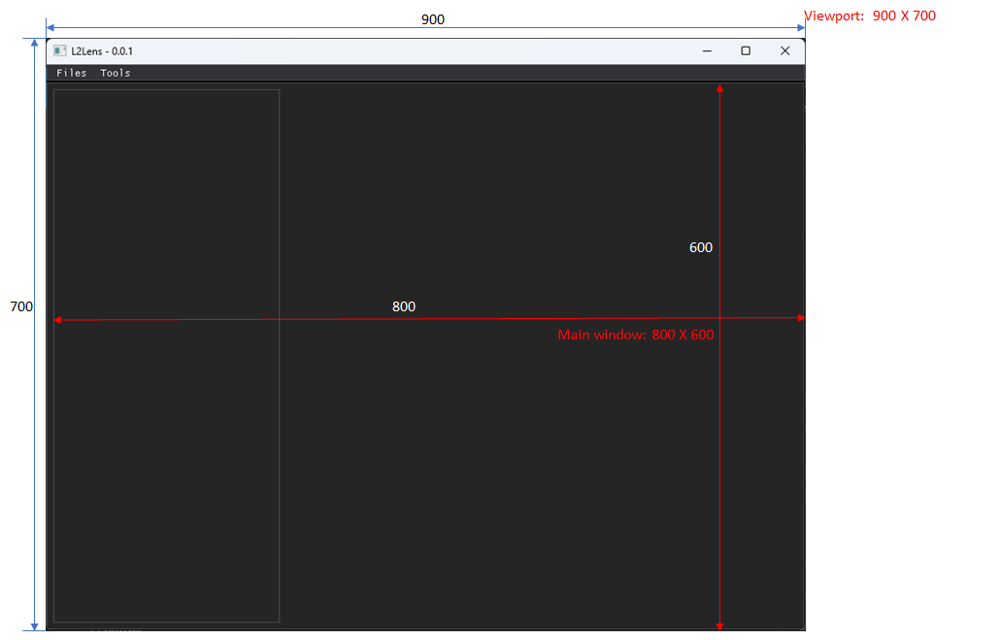

# DPG 的结构

DPG 应用包含有如下几部分的事情：

1. Setup
    - 一个app必须要创建/销毁`Context`，创建/展示`Viewport`和创建开始`DearPyGui`。
2. Context
    - 创建`Context`是必须的第一件事。
3. Viewport
    - 操作系统创建的窗口就是`Viewport`。
4. Render Loop
    - 负责显示组件，维持状态和事件响应的机制。
5. Items
    - 分为基本组件、图形组件和容器（window, groups, registies等）。
6. Primary Window
    - 主窗口。

## 必须的事

下面几个函数都是需要的：

- Create & Destroy context
- Create & Show Viewport
- Setup & Start DearPyGui


```
# 创建Context，任何DPG相关的命令都需要基于Context。比如如果你在app的初始化里面使用DPG相关的函数，那么也必须把这个Context的创建放在之前，否则无法初始化窗口。
dpg.create_context()

# 创建窗口
dpg.create_viewport(title='Custom Title')

# 创建GUI框架
dpg.setup_dearpygui()

# 展示窗口
dpg.show_viewport()

# 设置主窗口
dpg.set_primary_window("Primary Window", True)

# 运行GUI框架，开启事件循环机制，如果没有这一步窗口只会闪现，另一种方案：
# while dpg.is_dearpygui_running():
#    print("this will run every frame")
#    dpg.render_dearpygui_frame()
dpg.start_dearpygui()

# 销毁Context
dpg.destroy_context()
```

## 窗口布局

viewport代表了整个窗口，而windows表示里面的绘图区，比如：



参考：

- [2. DPG Structure Overview](https://dearpygui.readthedocs.io/en/latest/tutorials/dpg-structure.html)


