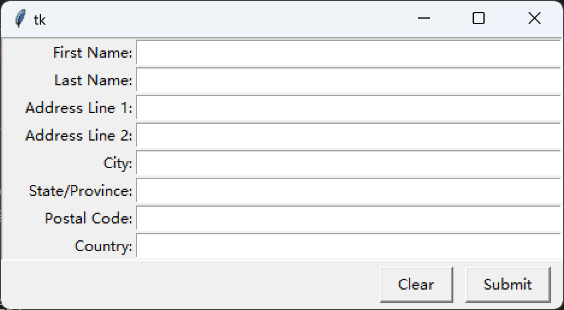
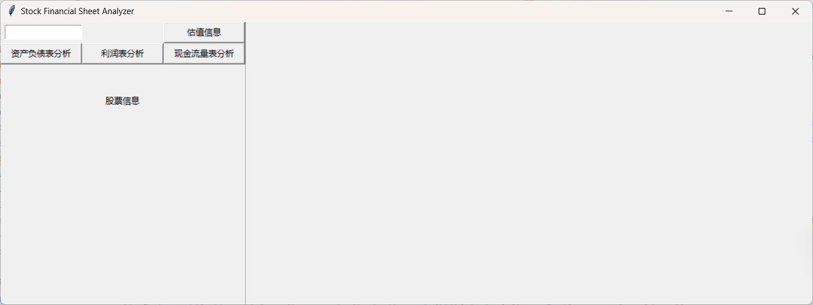

## 控件的类型

`tkinter`中的控件都被实现为不同的类，最基础的有下面几种：

- `Label`：显示文本的标签
- `Button`：按钮
- `Entry`：短文本输入框
- `Text`：长文本输入框
- `Frame`：用来对不同空间进行布局的矩形框


参考：

- [Basic Widgets](https://tkdocs.com/tutorial/widgets.html)
- [More Widgets](https://tkdocs.com/tutorial/morewidgets.html)

## `Label`

`Label`可以用来显示文本和图像。文本的显示会使用系统默认的字体和背景色，但可以通过参数来调整，支持`red`, `orange`, `yellow`, `green`, `blue`, `purple`。

也可以通过`width`和`height`来设置标签的高度和宽度，需要特别注意的是`Tkinter`使用了文本单位，并不是常见的英寸、厘米或者像素，这里的宽度和高度的基本单位分别对应了字符`0`的宽度和高度，所以尽管下面都设置为了10，但实际上标签的宽高并不相同：

```
label = tk.Label(
    text="Hello, Tkinter",
    foreground="white",  # shorthand: fg
    background="black",  # shorthand: bg
    width = 10,
    height = 10
)
```

这种设置的好处是空间的大小会和程序运行的系统对齐，看起来会更加协调。

`Label`中的文本默认居中对齐，如果要实现其他对齐方式可以通过`anchor`或者`justify`属性（多行情况）。


参考：

- [HTML color names](https://htmlcolorcodes.com/color-names/)
- [Python GUI Programming With Tkinter](https://realpython.com/python-gui-tkinter/)
- [How to justify text in label in Tkinter](https://stackoverflow.com/questions/37318060/how-to-justify-text-in-label-in-tkinter)

## `Button`

`Button`是一个可以点击的`Label`，所以它们有些许相似之处。

```
button = tk.Button(
    text="Click me!",
    width=25,
    height=5,
    bg="blue",
    fg="yellow",
)
```

## `Entry`

`Entry`是短文本框，用来获取用户的少量输入，比如名字或者邮件地址。

```
entry = tk.Entry(fg="yellow", bg="blue", width=50)
```

对应的主要操作有三个：

- `.get()`：检索文本
- `.delete()`：删除文本，传入字符索引，或切片，用`tk.END`代表结束
- `.insert(index, text)`：插入文本

## `Text`

`Text`是长文本框，用来获取用户的大量输入，默认的大小也比`Entry`大得多，它的主要操作类似`Entry`。

- `.get("<line>.<char>")`：检索文本，需要指定行号（编号从1开始），支持切片
- `.delete("<line>.<char>")`：删除文本，传入字符索引，或切片
- `.insert("<line>.<char>", text)`：插入文本


## `Frame`

`Frame`是一种容器，主要用来辅助空间的布局。最开始的时候仅仅是把空间装到`window`里默认显示在最上方，使用`Frame`你可以先将一些控件装入`Frame`，再通过它来调整布局。

可以通过给`Frame`的`relief`属性和`borderwidth `来配置边框效果：`tk.FLAT`,`tk.SUNKEN`,`tk.RAISED`,`tk.GROOVE`和`tk.RIDGE`。

注：`Frame`的大小默认仅仅包裹住在其中的所有控件就行了，如果你想实现下面这样的效果将两个按钮现实在后面，一定需要进行填充操作。



否则两个按钮就在中间了。

```
frame_button.pack(fill=tk.X, ipadx=5, ipady=5)
button_submit = tk.Button(master=frame_button, text="Submit")
button_submit.pack(side=tk.RIGHT, ipadx=10, padx=10)

button_clear = tk.Button(master=frame_button, text="Clear")
button_clear.pack(side=tk.RIGHT, ipadx=10)
```

参考：

- [Additional Resources](https://realpython.com/python-gui-tkinter/#additional-resources)

## `Separator`

第一次尝试使用分割线碰到无法垂直展示在整个窗口上的问题，原因在于窗口的布局使用了`grid()`的方式之后，布局`Separator`也只能使用这个方式，只不过它只能够对其到某个单元，如：

```
separator = ttk.Separator(master=window, orient='vertical')
separator.grid(row=1, column=1, sticky="nswe")
```


可以使用`rowspan=2`可以达到想要的效果：

```
separator.grid(row=0, column=1, rowspan=2, sticky="nswe")
```



参考：

- [](https://pythonguides.com/python-tkinter-separator/)