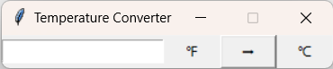
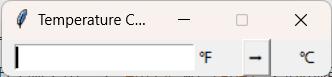

## 一个例子

在温度转换器这个例子中，我先使用了`.grid()`的方式来布局四个组件，效果如下：

```
window.rowconfigure(0, minsize=20, weight=1)
window.columnconfigure([0, 1, 2, 3], minsize=50, weight=1)
```



所有空间都是等距离的，但实际上第一个`entry`和`label`之间的距离要少一点，因为`label`是针对前面`entry`的注明。

所以这个时候需要分层设计：

1. 将第一个`entry`和`label`放在一个`Frame`里面
2. 在这个`Frame`里面分成1行2列的网格，并将`entry`右对齐，`label`左对齐
3. 将这个`Frame`和第3、4的组件重新按照1行3列的网格对其

于是有下面的效果：

```
frame_entry = tk.Frame(master=window)
entry_temperature = tk.Entry(master=frame_entry, width=20)
label_temperature = tk.Label(master=frame_entry, text="\N{DEGREE FAHRENHEIT}")
entry_temperature.grid(row=0, column=0, sticky="e")
label_temperature.grid(row=0, column=1, sticky="w")

button_covert = tk.Button(master=window, text="\N{RIGHTWARDS BLACK ARROW}", command=convert)
label_result = tk.Label(master=window, text="\N{DEGREE CELSIUS}")
frame_entry.grid(row=0, column=0, padx=10)
button_covert.grid(row=0, column=1, padx=10)
label_result.grid(row=0, column=2, padx=10)
```

