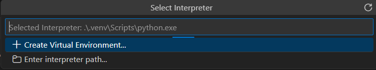

## jupyter

Jupyter Notebook，是在浏览器中操作的一种基于对话模式的程序执行环境，它是一款除了支持Python语言，还可以支持Julia和Ruby等多种语言的开源软件。

参考：

- [Jupyter Home](https://jupyter.org/)

## 魔法命令

魔法命令可以理解为一条可将Jupyter Notebook的功能进行扩展的捷径，只需在命令的前面加上“%”，执行即可。执行魔法命令会因为IPython的版本及操作系统等的不同而有所不同。

- `%time`命令确认代码的执行速度
- `%%time`可以对整个单元的处理时间进行测量
- `%timeit`测量行潜入的处理时间
- `%%timeit`测量单元的处理时间
- `%matplotlib inline`实现将inline参数传递给“%matplotlib”，并将绘制的图表显示在Jupyter Notebook的单元中
- `%whos`对所有变量一览表进行显示

# 问题

1，找不到解析器（251226）

不知道从什么时候开始，执行jupyter的时候一直找不到kernel，试了很久都不行。今天特意花了3个小时，发现还是没有搞定。我已经将问题缩小到最基本的python文件执行，依然有同样的问题：

问了AI，尝试了多种方式没有搞定，后面根据AI提示去浏览了插件问题列表，发现可能和插件升级有关（最新的`2025.20.1`符合之前可行的印象）：

https://github.com/Microsoft/vscode-python/issues/25652

然而，把插件切换到pre-release版本`2025.21.2025121801`，仍然有问题。所以，目前没有好的方案，只能够先用code-runner试试看。

2，重装的尝试

- windows完全卸载python, vscode
- 手动删除扩展残留目录（位于 %USERPROFILE%\.vscode\extensions，删除所有以 ms-python.python- 和 ms-python.debugpy- 开头的文件夹）。
- 删除注册表中Python相关的条目（删除了大部分，没有全部）。

重新安装python，安装vscode，测试最简单的项目，就可以了。

3，debug log

- Run Developer: Set log level command
- Select Python -> Select Trace
- Run Developer: Reload Window command
