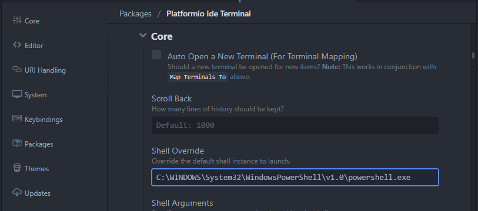

## terminal

ATOM默认的terminal是power shell，不过最近无法使用power shell，所以准备换一个。

ATOM装载插件是`Platformio Ide Terminal`，它默认的是Power shell，我下载了cmder，并将cmder.exe的路径填写其上，然后调出cmder.exe的命令行时，会另起一个窗口。

之后按照[Change terminal in Atom-editor's Platformio-Ide-Terminal on Windows](https://stackoverflow.com/questions/42277302/change-terminal-in-atom-editors-platformio-ide-terminal-on-windows)里面的信息，替换为`C:\Program Files\Git\bin\bash.exe`之后是正常的，这是因为cmder.exe本身是一个`termianl emulator`，并非`shell`。
