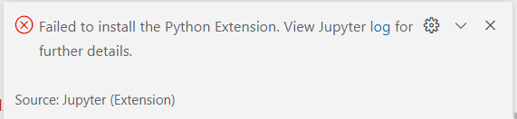

## 安装kernel

我在云服务器上面安装了Python3, 然后在vscode里面安装了Jupyter插件之后创建了一个Jupyter Notebook开始调试程序，但是发现没有办法找到对应的kernel，所以会提示安装插件，但是插件安装不成功：

网络上查找了似乎这个kernel需要自己安装，并且`ipython`就有这个内核，于是我先安装ipython。

但是安装ipython之后执行`ipython kernel install`来安装kernel，结果提示`ipykernel`找不到。

于是执行`pip3 install ipykernel`来安装`ipykernel`。好了之后发现还是不行，回到问题的原来查找“”发现[installing python and locating kernels should stop after certain amount of time](https://github.com/microsoft/vscode-jupyter/issues/10617)这里面提到可能没有在remote server上安装Python插件。

我一看确实如此，尽管自己在remote server上安装了Python 3.8.16，但是这里的Python插件是另一个东西。同理，vscode上面的`Jupyter插件`也只是一个插件，并非`Jupyter`。所以，在安装完Python插件之后会再次下载安装`Jupyter`，尽管我在前面已经安装了`Jupyter插件`。

总结一下，使用Jupyter来编程需要：

- 安装Python
- 安装Jupyter插件
- 安装Python插件
- 安装Jupyter

参考：

- [Jupyter Notebook Kernels: How to Add, Change, Remove](https://queirozf.com/entries/jupyter-kernels-how-to-add-change-remove)
- [ipython的简单介绍以及相关用法](https://zhuanlan.zhihu.com/p/75045335)
- [installing python and locating kernels should stop after certain amount of time](https://github.com/microsoft/vscode-jupyter/issues/10617)