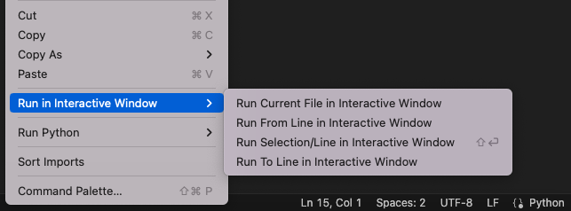
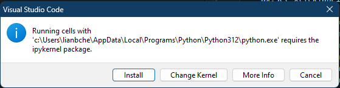

## 安装kernel

我在云服务器上面安装了Python3, 然后在vscode里面安装了Jupyter插件之后创建了一个Jupyter Notebook开始调试程序，但是发现没有办法找到对应的kernel，所以会提示安装插件，但是插件安装不成功：


网络上查找了似乎这个kernel需要自己安装，并且`ipython`就有这个内核，于是我先安装ipython。

但是安装ipython之后执行`ipython kernel install`来安装kernel，结果提示`ipykernel`找不到。

于是执行`pip3 install ipykernel`来安装`ipykernel`。好了之后发现还是不行，回到问题的原来查找“”发现[installing python and locating kernels should stop after certain amount of time](https://github.com/microsoft/vscode-jupyter/issues/10617)这里面提到可能没有在remote server上安装Python插件。

我一看确实如此，尽管自己在remote server上安装了Python 3.8.16，但是这里的Python插件是另一个东西。同理，vscode上面的`Jupyter插件`也只是一个插件，并非`Jupyter`。所以，在安装完Python插件之后会再次下载安装`Jupyter`，尽管我在前面已经安装了`Jupyter插件`。

总结一下，使用Jupyter来编程需要：

- 安装Python
- 安装Jupyter插件
- 安装Python插件
- 安装Jupyter


参考：

- [Jupyter Notebook Kernels: How to Add, Change, Remove](https://queirozf.com/entries/jupyter-kernels-how-to-add-change-remove)
- [ipython的简单介绍以及相关用法](https://zhuanlan.zhihu.com/p/75045335)
- [installing python and locating kernels should stop after certain amount of time](https://github.com/microsoft/vscode-jupyter/issues/10617)

## python interactive window

今天想在mac上连接云服务器调试代码，另一台电脑可以直接进入interactive 调试模式，也就是对于一个py文件，右键会有一个菜单：



但在mac上没有。之后搜索发现，尽管上同一台服务器，但是因为使用的vscode不同，因此需要重新在mac的vscode上安装`python`, `jupyter`等插件。

参考：

- [Python Interactive window](https://code.visualstudio.com/docs/python/jupyter-support-py)

## 更换kernel

因为当前3.9.9版本无法画图，提示错误。所以按照[](https://www.geeksforgeeks.org/how-to-update-python-on-windows/)里面的步骤重新从Python官方网站上安装了`3.12.1`版本。

再从[Manage Jupyter Kernels in VS Code](https://code.visualstudio.com/docs/datascience/jupyter-kernel-management)里面选择了新版本的Python，不过提示：



VSCODE安装没有成功，提示如下命令：

```
Running cells with 'c:\Users\lianbche\AppData\Local\Programs\Python\Python312\python.exe' requires the ipykernel package.
Run the following command to install 'ipykernel' into the Python environment. 
Command: 'c:/Users/lianbche/AppData/Local/Programs/Python/Python312/python.exe -m pip install ipykernel -U --user --force-reinstall
```

执行`c:/Users/lianbche/AppData/Local/Programs/Python/Python312/python.exe -m pip --proxy 1.1.1.1:8080 install ipykernel -U --user --force-reinstall`来安装，提示安装成功：

```
[notice] A new release of pip is available: 23.2.1 -> 24.0
[notice] To update, run: C:\Users\lianbche\AppData\Local\Programs\Python\Python312\python.exe -m pip install --upgrade pip
```

安装完执行Python，又提示“ModuleNotFoundError: No module named 'pandas'”，于是又仿照`c:/Users/lianbche/AppData/Local/Programs/Python/Python312/python.exe -m pip --proxy 1.1.1.1:8080 install pandas`来安装。

再安装了`matplotlib`就可以了。