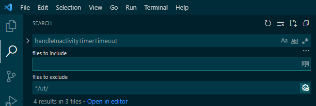

## VSCODE


### 搜索

搜索函数的时候可能将所有文件的匹配项都显示出来，不过有些时候我们需要过滤掉一些搜索路径，这个时候该如何处理？

`ctrl + shift + f`打开侧边的搜索框，点击右侧的“...”展开“Search details”便可以看到指定搜索的路径或者过滤的路径，分别填写即可。比如下面我在“files to exclude”填写的"*/ut/"便是过滤掉所有ut相关的路径：




### 快捷键

1）编辑

列编辑：shift + alt + 鼠标
control + shift + alt + 方向键

代码阅读：

- `ctrl + left`: 定义跳转
- `shift + f12`：搜索reference
- `ctrl + t`：全局符号搜索
- `ctrl + shift + o`: 本文件符号搜索
- `ctrl + p`：搜索文件
- `ctrl + shift + F`: 全局搜索字符串

- `alt + left`：后退
- `alt + right`：前进

- `Ctrl+Shift+P`：打开“Command Palette”来访问所有的命令

参考：

- [Search features in Visual Studio Code](https://dev.to/codevault/search-features-in-visual-studio-code-2a0c)

## Q&A

1）Windows上链接linux服务器显示“Bad owner or permissions”

在Windows上链接linux有如下错误提示：

```
PS C:\Users\lianbche> ssh lianbche@hzling105.china.nsn-net.net
Bad owner or permissions on C:\\Users\\lianbche/.ssh/config
```

[解决方案](https://github.com/cmderdev/cmder/issues/1763)为修改文件的权限，在属性里面进行设置：`Properties -> Security -> Advanced -> Disable Inheritance -> Remove all inherited permissions from this object`。

上一步设置之后会解决“Bad owner or permissions on”的问题，可以使用powershell直接ssh连接linux服务器，但是在vscode里面会提示新的错误：“EPERM: operation not permitted”，也就是在VsCode里面无法使用ssh连接服务器，其实答案也在上面解决方案的连接里面。

因为上一步“Disable Inheritance”的设置将config文件的所有权限清楚，导致VsCode无法正常使用Windows自带的openssh，解决方案是给文件分配自己可以操作的权限。
