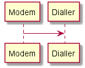

# plantuml 使用经验

## plantuml 用法

### 类图与序列图的冲突

使用plantUML绘图的时候如果使用如下代码可能无法达到目的，因为会默认按照时序图的样式展示：

```
Modem -> Dialler
```



此时可以直接通过声明类的方式来显示指定需要的是类图。

```
Modem -> Dialler

class Modem
class Dialler
```


