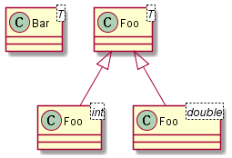

## 类图


## 问题

### 怎样表达模板类？

在C++里面经常会使用到模板，继承关系往往也因此变得更加复杂。那么怎样来表达继承下的模板类呢，在[Support for generics/templates](https://forum.plantuml.net/6253/support-for-generics-templates)找到了一篇回答。

```
@startuml
class Bar<T>
class "Foo<T>" as Foo_t
class "Foo<int>" as Foo_int
class "Foo<double>" as Foo_double
Foo_t <|-- Foo_int
Foo_t <|-- Foo_double
@enduml
```

可以得到：

。
