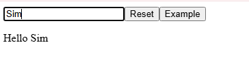

# 输入并展示

现在已经实现了一个输入框，输入什么内容就显示什么内容，效果如下：



实现上使用了状态组件`React.useState`来让函数组件也能够拥有状态：

```
function InputText() {
    const [inputText, setInputText] = React.useState("");

    function displayInput(event) {
        setInputText(event.target.value);
    }

    return (
        <>
        <input placeholder="type a name here" onChange={displayInput} />
        <p>Hello {inputText}</p>
        
        </>
    );
}

function DisplayAsYouTypeApp() {
    return (
        <>
        <InputText />
        </>
    );
}
```


# 新增`reset`按钮

下一步是需要新增一个`reset`按钮来清空`input`元素里面的内容，第一个版本是直接在`InputText()`里面新增按钮和`resetInput`函数，但是发现不能完成清空的操作：没有任何效果。

```
function resetInput(event) {
        setInputText('');
    }

return (
    <>
    <input placeholder="type a name here" onChange={displayInput} />
    <button onclick={resetInput}>Reset</button>
    <button>Example</button>
    <p>Hello {inputText}</p>
    
    </>
);
```

为什么没有任何效果？用`console.log`打印才发现，原来有语法错误：

- 在原生html里面，对于`button`按钮的事件属性是`onclick`（全小写）；
- 但是在React/JSX里面，对于`button`按钮的事件属性是`onClick`（驼峰写法）；

有这样的区别在于html是不区分大小写的，所以浏览器规定事件属性都是小写的形式。但React并不是直接操作html，而是用了一种JavaScript的扩展语法（JSX），所有的JSX都会被转换成JavaScript代码。而React规定事件都用驼峰命名法来避免与HTML属性混淆。

修改了上面的语法错误有效果，这个效果是清空了`<p>Hello {inputText}</p>`显示的内容，对于`input`元素里面的内容没有动。问了ChatGpt发现`input`元素是用`value`属性来控制它的文本显示的，所以改成下面这样就没问题了：

<input placeholder="type a name here" value={inputText} onChange={displayInput} />
