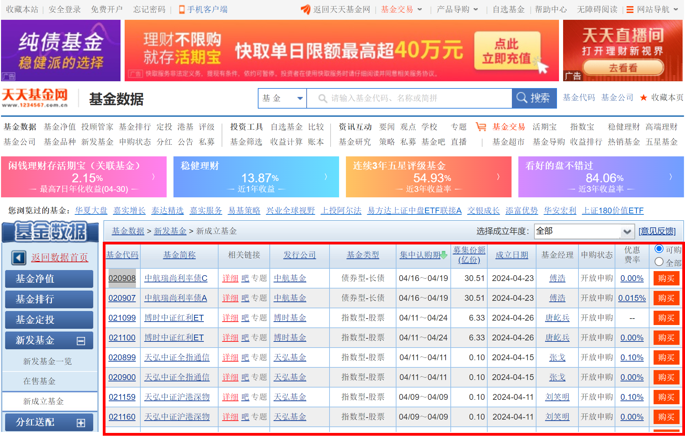
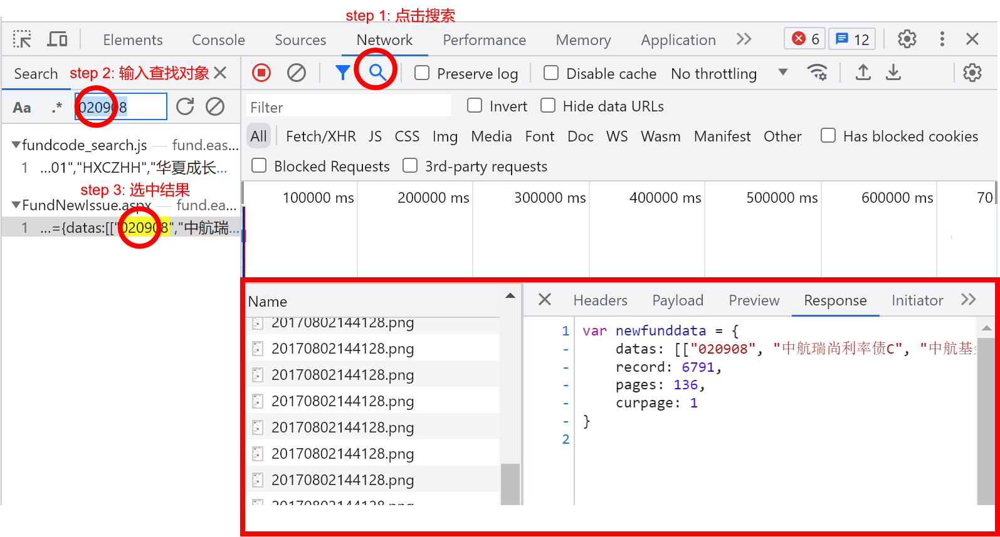
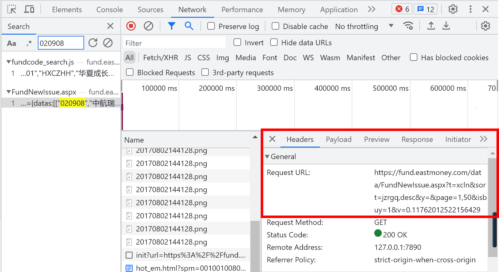

## 获取一些需要js加载的数据表

比如我要在天天基金网上面获得新成立的基金信息，对应的网址是`https://fund.eastmoney.com/data/xinfound.html`：



如果使用`requests.get('https://fund.eastmoney.com/data/xinfound.html')`是无法直接获取到这个表格的，因为它是由js动态加载出来的。

那么怎样才能获取呢？

### 第一步，找到该表格的请求地址

按`F12`打开开发人员调试模式，重新加载该页面，然后打开`Network`标签，利用搜索选中想要获得的元素：



### 第二步，查看请求头

点击`Headers`，可以看到我们想要获得的数据信息对应的URL为`https://fund.eastmoney.com/data/FundNewIssue.aspx?t=xcln&sort=jzrgq,desc&y=&page=1,50&isbuy=1&v=0.11762012522156429`，并不是前面的`https://fund.eastmoney.com/data/xinfound.html`。



所以，我们用`requests.get('https://fund.eastmoney.com/data/xinfound.html')`是无法获取到这个数据表。

### 第三步，构造请求头

下一步，我们需要按照上面的URL信息来构造一些参数，特别注意其中的参数`v`会动态变化，也就是每次请求的结果都不一样，但我们用某次成功的即可。

```
url = "https://fund.eastmoney.com/data/FundNewIssue.aspx"
params = {
    "t": "xcln",
    "sort": "jzrgq,desc",
    "y": "",
    "page": "1,50000",
    "isbuy": "1",
    "v": "0.4069919776543214",
}
r = requests.get(url, params=params)
data_text = r.text
```