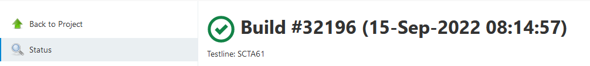

## 获取网页上简单的信息

想要获取网页上的日期信息：



```
res = requests.get(url, proxies=proxies, verify=False)
print(res.text)
```

得到的内容很多：

```
<!DOCTYPE html><html class=""><head resURL="/static/a48c6519" data-rooturl="" data-resurl="/static/a48c6519" data-extensions-available="true" data-unit-

test="false" data-imagesurl="/static/a48c6519/images" data-crumb-header="Jenkins-Crumb" data-crumb-value="252070a6adf24ed407695d7833f58fa9d2afd7c16f026ca9
5606ac4ee3f6d5b5">
```

参考：

- [Requests: HTTP for Humans](https://requests.readthedocs.io/en/latest/

## 如何消除warning打印

参考：

- [3 Ways to Fix InsecureRequestWarning in Python](https://www.howtouselinux.com/post/insecurerequestwarning-in-python-urllib3-requests)
