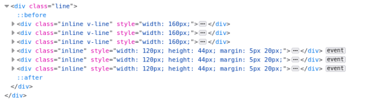

## [定位页面元素](https://selenium-python.readthedocs.io/locating-elements.html#locating-elements)

定位到页面元素的手段比较多，常见是就是下面这些方法：

```
find_element_by_id
find_element_by_name
find_element_by_xpath
find_element_by_link_text
find_element_by_partial_link_text
find_element_by_tag_name
find_element_by_class_name
find_element_by_css_selector
```

举个例子，对于下面的输入框元素我们可以通过多种方法来找到它。

```
<input type="text" name="passwd" id="passwd-id" />

element = driver.find_element_by_id("passwd-id")
element = driver.find_element_by_name("passwd")
element = driver.find_element_by_xpath("//input[@id='passwd-id']")
element = driver.find_element_by_css_selector("input#passwd-id")
```

XPath是专门应用在XML文档里面搜索节点的语言，XPath支持根据id, name来定位元素，即便某个元素没有id/name，也可以通过XPath进行绝对定位（通过绝对路径？）和相对定位（根据具有id/name的元素进行相对位置的定位），并且还可以支持根据attributes来定位元素。

可以通过F12打开浏览器的开发人员工具很快的定位到具体元素，比如在下图里面可以很快的拷贝到特定元素的XPth，比如我拷贝出“SING IN”按钮的XPath为`/html/body/main/section[1]/div[3]/div/a`。


*问题：如果定位不到对应元素，对应的返回值和常见的处理方法是怎样的呢？*

在[3.1. Interacting with the page](https://selenium-python.readthedocs.io/navigating.html#interacting-with-the-page)讲解定位元素时如果找不到那么会抛出`NoSuchElementException`异常。

> You can also look for a link by its text, but be careful! The text must be an exact match! You should also be careful when using XPATH in WebDriver. If there’s more than one element that matches the query, then only the first will be returned. If nothing can be found, a NoSuchElementException will be raised.


## 如何实现精准匹配？

比如在一个html页面里面有class为“inline v-line”和“inline”的两种元素，当使用`find_elements_by_class_name('inline')`来找到所有“inline”的元素的时候会连“inline v-line”一起找出来了：



也就是这里想实现精准匹配，翻遍了[Selenium with Python](https://selenium-python.readthedocs.io/index.html)，也google良久一直没有找到现成的方案。于是想到一种折中方案，也就是先找出所有前缀为“inline”的再过滤掉不需要的。但如果要进一步过滤通过`find_elements_by_class_name('inline')`找到的所有元素，必须要知道返回的元素所具有的属性，特别是“inline”和"inline v-line"对应的元素到底是什么才行，然而前面的文档也没有给出对应的定义。

重新阅读文档，才发现它并非官方文档，于是找到`Selenium`的[官方文档](https://www.selenium.dev/documentation/)。

1）发现一：`class name`无法进行精确匹配

在[Traditional Locators](https://www.selenium.dev/documentation/webdriver/elements/locators/#traditional-locators)找到`class name`的定位器定义，确认了该接口返回的并非精确匹配结果，也无法通过参数来设定精确匹配。

> Locates elements whose class name contains the search value (compound class names are not permitted)

2）发现二：[属性列表](https://www.selenium.dev/documentation/webdriver/elements/information/)，其实最初的文档也有，只不过没有留意

- `.tag_name`：元素对应的html标签名，比如`div`
- `.text`：元素对应的`title`属性
- `.get_attribute(name)`：传入`class`可以反向获取到“inline”或"inline v-line"

于是，就可以在获取到结果里面，通过`.get_attribute(name)`在进行一轮精确的匹配，如下所示：

```
elems = driverforcoop.find_elements_by_class_name("inline")
for elem in elems:
    if elem.get_attribute('class') == 'inline':
        elem.click()
```
