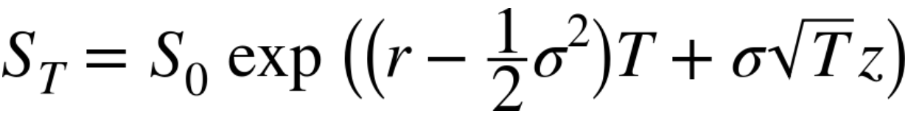
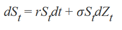

# Chapter 10. Stochastics

20世纪70，80年代现代金融发端，金融研究的主要目标是为特定的金融模型提出封闭式的解决方案，
但近年来研究重点已经转向为整个衍生品市场提供持续的评估参考，因此预测学和蒙特卡罗模拟逐渐
成为主流了。

本章包括如下方面：

- Random number generation
- Simulation
- Valuation
- Risk measures

## Random Numbers

我们使用numpy.random子库来生成随机数，比如我们直接调用`np.random.rand(10)`来生成10个
符合均匀分布且值处于[0,1)的随机数。并且能够定制出符合其他范围的随机数：

```
import numpy.random as npr

a = 5.
b = 10.
npr.rand(10) * (b - a) + a
```

在金融领域使用标准正态分布一直以来饱受评议，但在分析和数学应用上依然会使用不同类型的分布。
如下是根据以下几种分布所展示的例子：

- Standard normal（标准正态分布），均值0，标准差1。
- Normal （正态分布）分布，均值100，标准差20。
- Chi square （卡方分布），0.5度的直率。
- Poisson （泊松分布），lambda为1。

```
sample_size = 500
rn1 = npr.standard_normal(sample_size)
rn2 = npr.normal(100, 20, sample_size)
rn3 = npr.chisquare(df=0.5, size=sample_size)
rn4 = npr.poisson(lam=1.0, size=sample_size)
```


## Simulation

Monte Carlo simulation (MCS，蒙特卡洛模拟)是金融领域应用最广的技术之一，它具有很好的扩
展性，但其代价是需要执行大量的运算。

蒙特卡洛方法，也称蒙特卡洛模拟模拟，其遵循如下大致步骤：

- 定义可能的输入范围
- 基于概率分布生成该范围的随机值
- 对这些输入的值进行计算
- 汇总所有计算结果

参考：

- [Monte Carlo method](https://en.wikipedia.org/wiki/Monte_Carlo_method)

### RANDOM VARIABLES

如下Black-Scholes-Merton公式（莫顿定价模型）用来模拟未来指数的走势。



其中：

- ST 表示未来T时刻的index level。
- r 固定无风险短期利率。
- o 固定波动（回报的标准差）。
- z 符合标准正态分布的随机数。

使用10000个随机数进行模拟，可以得到:


### SCHOTRASTIC PROCESSES

随机过程是一系列随机变量，在模拟某个过程时我们期望能够从反复的随机变量中找到一些相同点，
然而金融领域随机过程的应用展示了“马尔科夫性质（markov property）”，即明天的值仅与今天
的状态有关，而与更远的历史数据关联不大。所以这个过程也是“无记忆”的。

1）Geometric Brownian motion / 几何布朗运动

如下给定的随机微分方程（stochastic differential equation，SDE），Zt是标准的布朗运动，
St是对数正态分布。



如上的公式可以根据欧拉scheme离散化后为如下公式，其中delta-t为固定的离散化间隔，Zt服从标
准正态分布的随机数。


转换为代码执行结果为：


