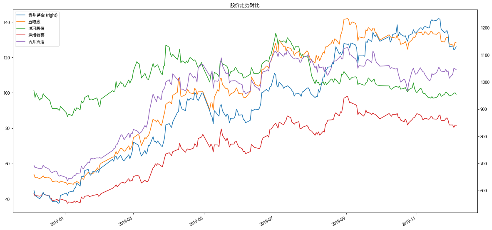

# 第一周周记：获取多只股票股价

早些天在分析洋河股份的时候，想要对比白酒行业内排名前五家上市企业的股价/市盈率走势对比，
当前尽管可以从网络上获取每只股票的交易数据，也可以从券商或者提供金融服务的产品终端上获取
各自的走势信息，但它们都无法没有满足我的需求，于是想到了前段时间注册的聚宽。

由于目前在自学Python，在聚宽的研究环境上捣鼓两天之后发现获取信息非常方便，结合Python三
方库pandas的支持，能够很好地将获取到的数据图形化。

本周一看到`freemars`发布了[《来聚宽的是不是大部分都是程序员？》](https://www.joinquant.com/view/community/detail/d9f52b5eac7c091b980e19e0de65e28c#79993)有所感触，于是想到自己目前
正在学习，可以尝试把自己在聚宽上碰到的各种各样的问题记录下来，以周记的形式提供。希望有些
基础的知识点对于其他新人可以有一些帮助。但是，由于我当前侧重在企业价值分析，而非使用纯粹
的量化策略，所以笔记是否有用也不好说。

## 原版代码及解释

如下是自己写作的“获取一段时间多只股票走势图”的第一个代码版本，原文链接在[这里](https://www.joinquant.com/view/community/detail/687b74ef4962485237b3161516d8a093)。我将针
对这部分的代码注释放在后面。

```
import pandas as pd

stock_list = ['贵州茅台', '五粮液', '洋河股份', '泸州老窖', '古井贡酒']
stocks_df = get_all_securities()
stock_code_list = [stocks_df[stocks_df['display_name'] == stock].index.item() for stock in stock_list]

multi_stock_price = {}
for i in range(len(stock_list)):
    stock_code = stock_code_list[i]
    stock_name = stock_list[i]
    stock_price = get_price(stock_code, start_date, end_date, 'daily', 'close')
    multi_stock_price[stock_name] = stock_price['close']

df = pd.DataFrame(multi_stock_price)
df.plot(figsize = (20, 10))
```

效果图如下：



**代码片段一：**

```
import pandas as pd
```

如上的import语句是Python里导入模块的基本语法，表示要使用pandas库，同时简化使用时的名称。
pandas可以方便进行数据处理，特别对于二维表格形式的数据的处理且能够提供数据可视化（生成可
视化图形）支持。

**代码片段二：**

```
stock_list = ['贵州茅台', '五粮液', '洋河股份', '泸州老窖', '古井贡酒']
stocks_df = get_all_securities()
stock_code_list = [stocks_df[stocks_df['display_name'] == stock].index.item() for stock in stock_list]
```

这里是我想要用来获取走势的企业名称，由于我们在使用聚宽提供的函数来获取数据时需要给定的是
股票的代码，但是股票代码我们一般记不住，所以有这一步将“股票名称”转换为“聚宽上对应的股票
代码”。

聚宽提供了一个函数[get_all_securities()](https://www.joinquant.com/help/api/help?name=Stock#%E8%8E%B7%E5%8F%96%E8%82%A1%E7%A5%A8%E6%A6%82%E5%86%B5)用来获取聚
宽平台支持的所有证券数据，包括支持的股票列表和指数列表。

函数返回的结果是DataFrame类型，这个类型是pandas里面定义的数据类型，它其实就是一个二维表
数据，里面包含了“股票名称”和“股票代码”，比如下面是调用`get_all_securities()`返回的前面
几行结果：

    display_name   name  start_date    end_date   type
    000001.XSHE         平安银行   PAYH  1991-04-03  2200-01-01  stock
    000002.XSHE          万科A    WKA  1991-01-29  2200-01-01  stock
    000004.XSHE         国农科技   GNKJ  1990-12-01  2200-01-01  stock
    000005.XSHE         世纪星源   SJXY  1990-12-10  2200-01-01  stock
    000006.XSHE         深振业A   SZYA  1992-04-27  2200-01-01  stock
    000007.XSHE          全新好    QXH  1992-04-13  2200-01-01  stock
    000008.XSHE         神州高铁   SZGT  1992-05-07  2200-01-01  stock
    ......

第1列是DataFrame结构的“索引(index)”，第1行是DataFrame结构的“行名(columns)”，其他的都
是“值(value)”，这些都是DataFrame里面专有的称谓，我们要做的事情相当于是找到对应股票名称
所在的行，然后取出它对应的索引名称，也就得到了想要的股票代码了，最后那一句就是完成这部分
功能。要从DataFrame里面获取想要的信息对于非程序员来说需要提前了解两个知识点：

1. Python里面的list类型，以及for循环
2. DataFrame的index和value获取方式

不过这篇总结里没法描述得太细致，所以另外在开篇介绍。


**代码片段三：**

```
start_date = '2018-12-05'
end_date = '2019-12-05'

multi_stock_price = {}
for i in range(len(stock_list)):
    stock_code = stock_code_list[i]
    stock_name = stock_list[i]
    stock_price = get_price(stock_code, start_date, end_date, 'daily', 'close')
    multi_stock_price[stock_name] = stock_price['close']
```

获取某股票的股价需要使用聚宽平台提供的函数[get_price()](https://www.joinquant.com/help/api/help?name=Stock#%E8%B4%A2%E5%8A%A1%E6%95%B0%E6%8D%AE%E5%88%97%E8%A1%A8)，使用这个
函数时需要传入一些参数，比如时间、频率、股价类型等等。如上代码里面调用`get_price()`的那
句代码是获取某只股票从2018-12-05到2019-12-05（参数start_date和end_date）的以天为单位
（参数daily）的收盘价（参数close）。这个函数的返回结果也是DataFrame类型，如下：

    close
    2018-12-05   601.20
    2018-12-06   583.16
    2018-12-07   578.43
    2018-12-10   568.81
    2018-12-11   574.48
    2018-12-12   580.40
    2018-12-13   592.97
    2018-12-14   584.31
    2018-12-17   581.90
    ......

由于我们这里需要获取多只股票的信息，所以使用了for循环来分次获取每只股票的收盘价，然后分
别保存下来，保存的结构是字典，这里需要额外两个知识点：

1. `multi_stock_price = {}`是声明这个变量为字典类型，它是Python里面的基本数据结构，后
  面那个大括号很重要。
2. 另外在保存的时候使用的是`stock_price[close]`，这个意思是取用DataFrame里面的一列，
列的类型是Series，是DataFrame里面专门用来定义列的类型。

*注：这些基本知识点需要自己学习，我也打算将其作为技术学习笔记，慢慢的写出来。*

之所以用字典来保存是因为它能够很方便用来创建最终的DataFrame，以方便我们做图。尤其地，这
里把字典的“键”可以用股票名称来代替，做图时显示的标签也可以直接显示。


**代码片段四：**

```
df = pd.DataFrame(multi_stock_price)
df.plot(figsize = (20, 10))
```

这两句就是根据保存的字典来生成DataFrame，同时调用DataFrame的`plot`函数做图，里面的`figsize`
是用来设定显示图形的大小。

## 更新的版本

我将第一个版本的代码分享在社区之后，得到了宽友@jqz1226的评论，尤其值得感谢的他提供了不同
的思路来改进我的版本。在@jqz1226改进的版本中，如上的“代码片段三”可以直接从原先的9行缩减
到3行，如下：

```
start_date = '2018-12-05'
end_date = '2019-12-05'

multi_stock_price = get_price(stock_code_list, start_date, end_date, 'daily', 'close', panel=True)
```

之所以做到这样是因为`get_price()`函数可以接收股票列表做为参数，之前我是单只股票逐个获取
而他改进之后是批量获取。

这个版本尽管简单，但在理解上增加了难度，因为这里引入了Pandas里面另外一种数据类型：Panel，
这个类型可以看成是一个三维表，超过二维数据你无法通过`print()`函数将其打印出来，你只能够
看到如下结果：

    <class 'pandas.core.panel.Panel'>
    Dimensions: 1 (items) x 244 (major_axis) x 5 (minor_axis)
    Items axis: close to close
    Major_axis axis: 2018-12-05 00:00:00 to 2019-12-05 00:00:00
    Minor_axis axis: 600519.XSHG to 000596.XSHE

这个结果的意思是说当前打印的类型是Panel，是一个“1 X 244 X 5”三维的数据，每一维度值的范
围是多少。所以，此时取用值进行画图的时候用法有所不同：

```
start_date = '2018-12-05'
end_date = '2019-12-05'

multi_stock_price = get_price(stock_code_list, start_date, end_date, 'daily', 'close', panel=True)
multi_stock_price['close'].columns = stock_list
multi_stock_price['close'].plot(figsize = (20, 10), secondary_y = ['贵州茅台'], title = '股价走势对比')
```

除了这个“批量获取股价”的改进之外，另外一个改进是针对“代码片段二”的改进，即使用如下这句替
换掉原版中的for循环。这个改进确实能够带来效率的提升，但是有个小问题：也就是这么创建的股票
代码列表与股票名称列表里面的条目的顺序可能是错乱的，因此在绘图的时候你需要重新进行对齐，
所以在我的工具箱中暂时没有使用这项替换。

```
list(stocks_df[stocks_df['display_name'].isin(stock_list)].index)
```

## 收获知识点

总结一下，本周收获的知识点：

- 在调用`get_price()`的时候可以传入股票列表。
- 从“股票名称”转换到“股票代码”可以有至少两种实现方法。
- 可以使用`get_trade_days()`获取滤除非交易时间段的时间序列。

如上的这几个新的知识点都是在@jqz1226 的指导下收获的，致谢。


## 待学习的主题

1.如上提到的使用`get_price()`时传入股票列表所返回的Pandas中的三维数据类型Panel在Pandas 0.25.0
之后就过时了，所以不建议继续使用。在调用该函数的时候也可以直接设定`panel=Fase`，这个时
候获取到的结果也是DataFrame，但我们需要将其进行进一步处理来满足需求，这个主题我会在下周
学习。

```
multi_stock_price = get_price(stock_code_list, start_date, end_date, 'daily', 'close', panel=False)
```

2.宽友 @jqz1226 在[《再谈获取多只股票的市盈率—极速版》](https://www.joinquant.com/view/community/detail/24517)改进过我另外一篇[价值研究笔记之获取多只股票的市盈率](https://www.joinquant.com/view/community/detail/97ac84a17f7e9da63be455ac8df30971)，迭代出
两个新的版本，其中使用到了新的`get_fundamentals_continuously()`, `get_valuation`以及
Padans的数据透视表，这些都是我还没有学习到的内容，因此将进一步学习。
